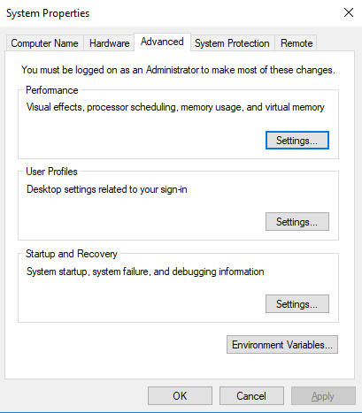
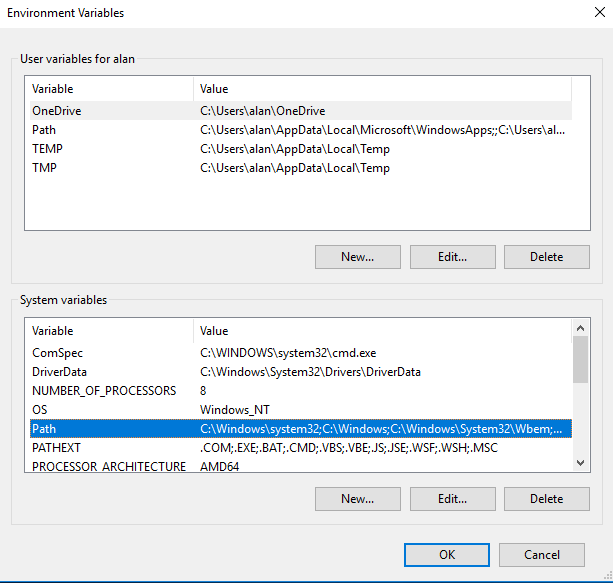
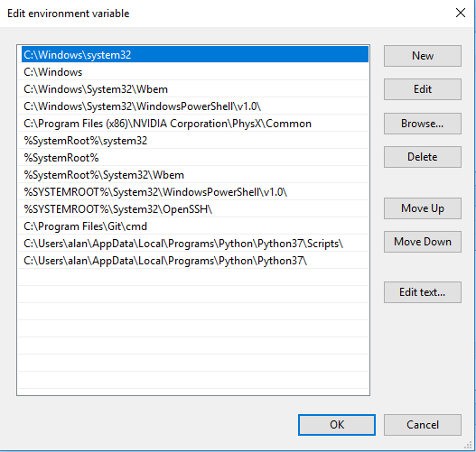
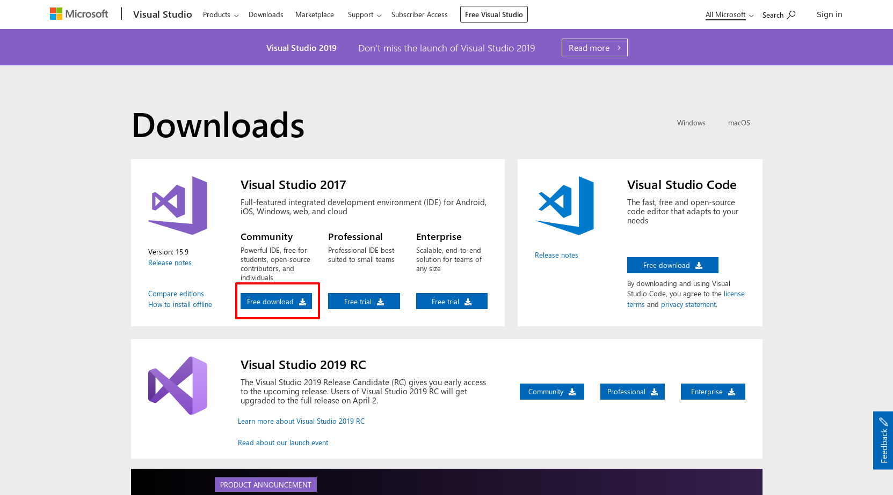
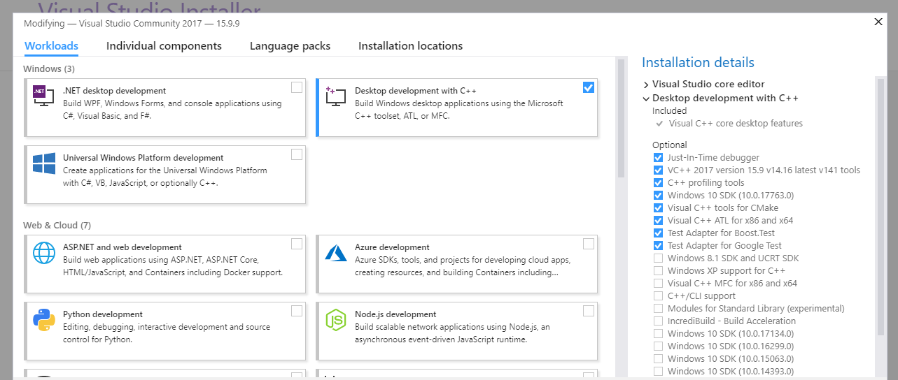

# Installation Guide

Before you start following the tutorials, you will need to install PySyft on your computer.

Here are the PySyft installation instructions for [Linux](#linux), [Mac OS](#mac-os), and [Windows](#windows).

--------------------------------------------------------------------------------

Authors:

- Alan Aboudib - Twitter: [@alan_aboudib](https://twitter.com/alan_aboudib)

--------------------------------------------------------------------------------

## Linux

Installing PySyft on Linux is really straight forward. Here are the steps:

### 1. Make sure you have Python >= 3.6

### 2. Install PyTorch 1.0

Get the installation command [here](https://pytorch.org/get-started/locally/) (use the pip option) and run it in the terminal.

### 3. Clone the PySyft repo from Github

`git clone https://github.com/OpenMined/PySyft.git`

### 4. Enter the cloned repo

`cd PySyft`

### 5. Install PySyft

`python setup.py install`

### 6. Test your installation

`python setup.py test`

--------------------------------------------------------------------------------

## Mac OS

### 1. Install Python

In order to install python on MacOs, you first need to install **Homebrew** the famous package manager.

Start by opening a terminal and type the following:

```bash
xcode-select --install
 /usr/bin/ruby -e "$(curl -fsSL https://raw.githubusercontent.com/Homebrew/install/master/install)"
```

This will install **Homebrew**. Then, install python (version 3.6 or above) by running:

`brew install python3`

### 2. Install PyTorch 1.0

You should first get the installation command [here](https://pytorch.org/get-started/locally/) (use the pip option)

Then run that command in the open terminal.

### 3. Clone the PySyft repo from Github

`git clone https://github.com/OpenMined/PySyft.git`

### 4. Install PySyft

First, you need to enter the PySyft folder you cloned earlier:

`cd PySyft`

Then, run this to install the PySyft package:

`python setup.py install`

You can test your installation by running:

`python setup.py test`

--------------------------------------------------------------------------------

## Windows

### 1. Install Python

PySyft requires python version 3.6 or above.

Here is the link to install python [www.python.org/downloads](https://www.python.org/downloads)

### 2. Add **python** and **pip** to the `PATH` environment variable

First, you need to find the folder path to which `python.exe` and `pip3` were installed.

In my case it is:

> C:\Users\alan\AppData\Local\Programs\Python\Python37

for the former, and:

> C:\Users\alan\AppData\Local\Programs\Python\Python37\Scripts

for the latter. So I will add both paths to the PATH environment variable.

In order to do that, go to **Run** and type `sysdm.cpl` and press **Enter**. The following window should open:



Click on the `Environment Variables...` button in the bottom-right corner. The following window should appear:



Select the **Path** row in the `System varibles` section as in the above screenshot and click on `Edit...`

In the window that opens, click on `New` and add the installation paths for `python.exe` and `pip`. Here is an example:



Click on `OK`.

### 3. Install PyTorch 1.0

You should first get the installation command [here](https://pytorch.org/get-started/locally/) (use the pip option)

Then open the command prompt by going to **Run** and typing **cmd**, type or paste the pytorch installation command you got from the above link and press **Enter**.

### 4. Install Git

Here is the download link for Git on windows: [git-scm.com/download/win](https://git-scm.com/download/win)

### 5. Install Microsoft Build tools

Go to the [download page](https://visualstudio.microsoft.com/downloads/#build-tools-for-visual-studio-2017) and click on `Free download` under **Community** in the Visual Studio download section. This is illustrated in the following screenshot:



After the download is finished, run the downloaded package. You will eventually get the following window:



Select `Desktop development with C++` and click on `Install` at the bottom-right corner of the page. (In the above screenshot you see a `Close` button instead since I have already installed it.)

Wait until the the install has finished.

### 6. Clone the PySyft repo from Github

`git clone https://github.com/OpenMined/PySyft.git`

### 7. Install PySyft

First, you need to enter the PySyft folder you cloned earlier:

`cd PySyft`

Then

`python setup.py install`

This will install PySyft and its requirements to your system. You should see no errors.

You can also test your installation by running:

`python setup.py test`

--------------------------------------------------------------------------------

## Troubleshooting

If installation is not working for you, please tell us about your issue on our slack channel ([slack.openmined.org](https://slack.openmined.org))

We will do our best to help!!
