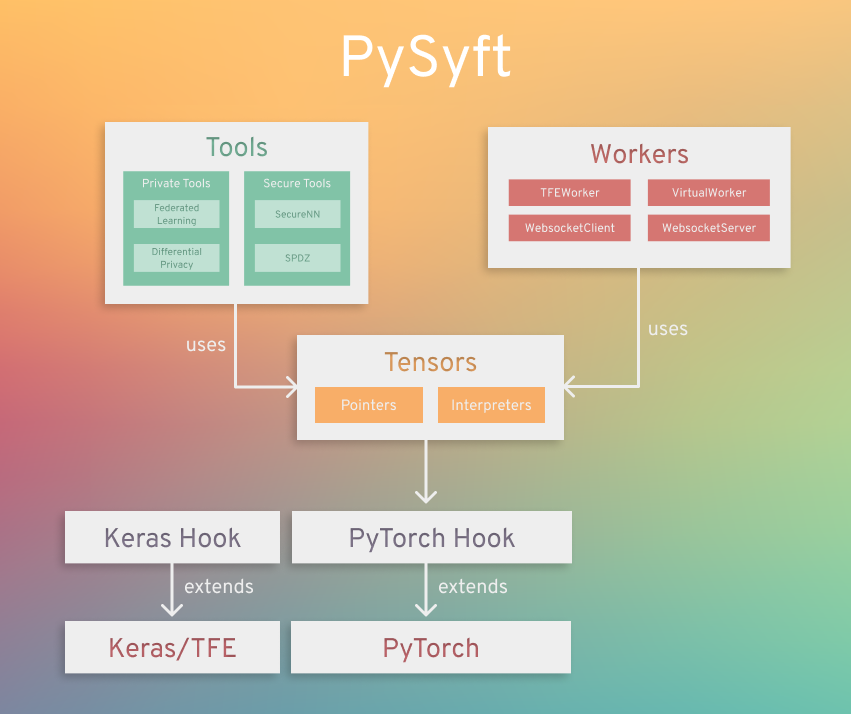

# Introduction


[](https://codecov.io/gh/openmined/PySyft)
[](https://mybinder.org/v2/gh/OpenMined/PySyft/master)
[](https://openmined.slack.com/messages/team_pysyft)
[](https://app.fossa.io/projects/git%2Bgithub.com%2Fmatthew-mcateer%2FPySyft?ref=badge_small)


PySyft is a Python library for secure and private Deep Learning. PySyft decouples private data from model training, using
[Federated Learning](https://ai.googleblog.com/2017/04/federated-learning-collaborative.html),
[Differential Privacy](https://en.wikipedia.org/wiki/Differential_privacy),
and Encrypted Computation (like
[Multi-Party Computation (MPC)](https://en.wikipedia.org/wiki/Secure_multi-party_computation)
and  [Homomorphic Encryption (HE)](https://en.wikipedia.org/wiki/Homomorphic_encryption))
within the main Deep Learning frameworks like PyTorch and TensorFlow. Join the movement on
[Slack](http://slack.openmined.org/).

## PySyft in Detail

A more detailed explanation of PySyft can be found in the
[white paper on Arxiv](https://arxiv.org/abs/1811.04017)

PySyft has also been explained in videos on YouTube:
 - [Introduction to Privacy Preserving AI using PySyft by @iamtrask](https://www.youtube.com/watch?v=NJBBE_SN90A)
 - [Introduction to PySyft codebase by @andreiliphd](https://www.youtube.com/watch?v=1Zw08_4ufHw)
 - [Differential Privacy & Federated Learning explained using PySyft by Jordan Harrod](https://www.youtube.com/watch?v=MOcTGM_UteM)

## Pre-Installation

Optionally, we recommend that you install PySyft within the
[Conda](https://docs.conda.io/projects/conda/en/latest/user-guide/overview.html)
virtual environment, for its simplicity in installation. If you are using
Windows, we suggest installing [Anaconda and using the Anaconda
Prompt](https://docs.anaconda.com/anaconda/user-guide/getting-started/) to
work from the command line.

```bash
conda create -n pysyft python=3.7
conda activate pysyft # some older version of conda require "source activate pysyft" instead.
conda install jupyter notebook==5.7.8 tornado==4.5.3
```
**Note:** Use Python 3.6-3.7. Tensorflow does not support Python 3.8 hence it might lead to installation errors.

Another alternative is to use python venvs. Those are our preferred
environments for development purposes. We provide a direct install
instructions in our makefile.

```bash
make venv
```

## Installation

> PySyft supports Python >= 3.6 and PyTorch 1.4

```bash
pip install 'syft[udacity]'
```

This will auto-install the PyTorch and TF Encrypted
dependencies, which are required for running the tutorials
from [Udacity's "Secure & Private AI" course](https://www.udacity.com/course/secure-and-private-ai--ud185)  (recommended).

You can install syft without these dependencies with the usual
`pip install syft`, but you will need to install framework
dependencies (i.e. PyTorch, TensorFlow, or TF Encrypted)
yourself. If you feel you've received an unexpected
installation error related to PyTorch or TF Encrypted, please
open an issue on Github or reach out to `#team_pysyft` in
Slack.

You can also install PySyft from source on a variety of operating systems by following this [installation guide](https://github.com/OpenMined/PySyft/blob/dev/INSTALLATION.md).

## Documentation
Latest official documentation is hosted here: [https://pysyft.readthedocs.io/](https://pysyft.readthedocs.io/en/latest/index.html#)

## Run Local Notebook Server

All the examples can be played with by running the command

```bash
make notebook
```

This assumes you want to use a local virtual environment. It installs it
independently to the conda environment in case you installed one, or any
other virtual environment you might have set up.

Once the jupyter notebook launches on your browser select the pysyft
kernel.

## Use the Docker image

Instead of installing all the dependencies on your computer,
you can run a notebook server (which comes with Pysyft
installed) using [Docker](https://www.docker.com/). All you
will have to do is start the container like this:

```bash
docker container run openmined/pysyft-notebook
```

You can use the provided link to access the jupyter notebook (the link is only accessible from your local machine).

> **_NOTE:_**
> If you are using Docker Desktop for Mac, the port needs to be forwarded to localhost. In that case run docker with:
> ```bash $ docker container run -p 8888:8888 openmined/pysyft-notebook ```
> to forward port 8888 from the container's interface to port 8888 on localhost and then access the notebook via http://127.0.0.1:8888/?token=...


You can also set the directory from which the server will serve notebooks (default is /workspace).

```bash
docker container run -e WORKSPACE_DIR=/root openmined/pysyft-notebook
```

You could also build the image on your own and run it locally:

```bash
cd docker-images/pysyft-notebook/
docker image build -t pysyft-notebook .
docker container run pysyft-notebook
```

More information about how to use this image can be found [on docker hub](https://hub.docker.com/r/openmined/pysyft-notebook)

## Try out the Tutorials

A comprehensive list of tutorials can be found
[here](https://github.com/OpenMined/PySyft/tree/master/examples/tutorials)

These tutorials cover how to perform techniques such as
federated learning and differential privacy using PySyft.

## High-level Architecture



## Start Contributing

The guide for contributors can be found [here](https://github.com/OpenMined/PySyft/tree/master/CONTRIBUTING.md). It covers all that you need to know to start contributing code to PySyft in an easy way.

Also join the rapidly growing community of 7000+ on [Slack](http://slack.openmined.org). The slack community is very friendly and great about quickly answering questions about the use and development of PySyft!

## Troubleshooting

We have written an installation example in [this colab notebook](https://colab.research.google.com/drive/14tNU98OKPsP55Y3IgFtXPfd4frqbkrxK), you can use it as is to start working with PySyft on the colab cloud, or use this setup to fix your installation locally.

## Organizational Contributions

We are very grateful for contributions to PySyft from the following organizations!

[](https://udacity.com/) | [](https://github.com/coMindOrg/federated-averaging-tutorials) | [](http://ark.hn) | [](https://dropoutlabs.com/)
--------------------------------------------------------------|--------------------------------------------------------------|---------------------------------------------------------------------------|---------------------------------------------------------------------------

## Support
For support in using this library, please join the **#lib_pysyft** Slack channel. If you’d like to follow along with any code changes to the library, please join the **#code_pysyft** Slack channel. [Click here to join our Slack community!](https://slack.openmined.org)

## Disclaimer

Do NOT use this code to protect data (private or otherwise) - at present it is very insecure. Come back in a couple of months.

## License

[Apache License 2.0](https://github.com/OpenMined/PySyft/blob/master/LICENSE)

[](https://app.fossa.io/projects/git%2Bgithub.com%2Fmatthew-mcateer%2FPySyft?ref=badge_large)
