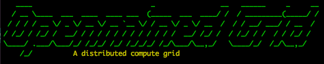

## Modes

Grid currently has two modes.

`--tree` -- experimental

Tree is the federated learning mode.  The long term goal is to have node workers store data
locally, and train public models to make them better.

`--compute`

Compute mode lets users offer compute to train models.  Data scientists can easily publish models from
a jupyter notebook and train them remotely.  Grid also offers easy utilities to try n number of
configurations concurrently.

# Launching a Worker

### Start the IPFS Peer-to-Peer Filesystem

Grid worker daemon requires an IPFS daemon to be running with pubsub support
turned on.

```sh
./bin/start_ipfs
```

Make sure you have installed all dependencies

```sh
pip3 install -r requirements.txt

python3 setup.py install
```

You can then run the worker daemon. If you want to run in ``compute`` mode run
```s./bin/
./bin/start_worker --compute
```

and if you want to run in ``tree`` mode, run

```s./bin/
./bin/start_worker --tree
```

Finally, to run the notebooks - in a different tab start Jupyter by running:
```sh
jupyter notebook
```

navigate to `notebooks/pubsub/` and open `Keras Grid Client and Worker.ipynb` and
follow along in that notebook.

# Troubleshooting

### Connect Error

If you see this connect error `ERROR: could not connect to IPFS.  Is your daemon running with pubsub support at 127.0.0.1 on port 5001` make sure you run the following command:

```
ipfs daemon --enable-pubsub-experiment
```

### Trouble Running Experiment

If you have any troubles running an experiment such as the other peers not learning about your jobs make sure you're connected to the peer. You can check if you're connected to the peer by running:

```
ipfs pubsub peers | grep <ipfs address>
```

And then to connect to the peer if you're not connected:

`ipfs swarm connect <ipfs_address>`

The swarm connect IPFS address should look something like this `/p2p-circuit/ipfs/QmXbV8HZwKYkkWAAZr1aYT3nRMCUnpp68KaxP3vccirUc8`. And can be found in the output of the daemon when you start it.
