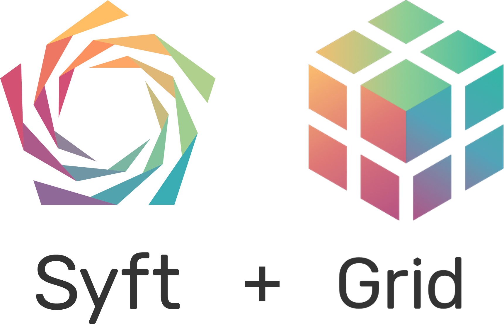

<h1 align="center">

  <br>
  
  <br>
  Code for computing on data<br /> you do not own and cannot see
  <br>

</h1>

<div align="center"> <a href="https://pypi.org/project/syft/"></a> <a href="https://pypi.org/project/syft/"></a> <br /> <a href="https://github.com/OpenMined/PySyft/actions/workflows/syft-version_tests.yml"></a> <a href="https://openmined.slack.com/messages/support"></a>
<br /><br />

<div align="center"><a href="#"></a></div>

</div>

# Syft + Grid provides secure and private Deep Learning in Python

Syft decouples private data from model training, using
[Federated Learning](https://ai.googleblog.com/2017/04/federated-learning-collaborative.html),
[Differential Privacy](https://en.wikipedia.org/wiki/Differential_privacy),
and Encrypted Computation (like
[Multi-Party Computation (MPC)](https://en.wikipedia.org/wiki/Secure_multi-party_computation)
and [Homomorphic Encryption (HE)](https://en.wikipedia.org/wiki/Homomorphic_encryption))
within the main Deep Learning frameworks like PyTorch and TensorFlow. Join the movement on
[Slack](http://slack.openmined.org/).

---

Most software libraries let you compute over the information you own and see inside of machines you control. However, this means that you cannot compute on information without first obtaining (at least partial) ownership of that information. It also means that you cannot compute using machines without first obtaining control over those machines. This is very limiting to human collaboration and systematically drives the centralization of data, because you cannot work with a bunch of data without first putting it all in one (central) place.

The Syft ecosystem seeks to change this system, allowing you to write software which can compute over information you do not own on machines you do not have (total) control over. This not only includes servers in the cloud, but also personal desktops, laptops, mobile phones, websites, and edge devices. Wherever your data wants to live in your ownership, the Syft ecosystem exists to help keep it there while allowing it to be used privately for computation.

## Stable Release

The current stable release is `0.6.0` which is available on:

- [PyPI](https://pypi.org/project/syft/)
- [Docker Hub](https://hub.docker.com/u/openmined)

For many use cases you can simply use:

```
$ pip install syft
```

If you are doing the [Private AI Series](https://courses.openmined.org/) or you are an external party developing against Syft and Grid please use the [`syft_0.6.0`](https://github.com/OpenMined/pysyft/tree/0.6.0) branch.

## Development Branch

This is the `dev` branch and to accommodate our need to experiment with new ideas and implementations we will be moving a few things around during the early stages of `0.7.0`. Currently the core `syft` library and code will remain fairly stable, while we do some much needed quality improvements and refactors to the `grid` codebase and its tooling for deployment and orchestration of nodes.
During the process of development we will be moving examples from the `/packages/syft/examples` folder down to the `/notebooks` folder and ensuring they are working and tested with the latest `dev` code.

## Mono Repo 🚝

This repo contains multiple sub-projects which work together.

```
OpenMined/PySyft
├── README.md     <-- You are here 📌
├── notebooks     <-- Notebook Examples and Tutorials
└── packages
    ├── grid      <-- Grid - A network aware, persistent & containerized node running Syft
    └── syft      <-- Syft - A package for doing remote data science on private data
```

## Syft

To read more about what Syft is please consult the current [`0.6.0` Documentation](https://openmined.github.io/PySyft/).

## Grid

To read more about what Grid is please consult the old [PyGrid README](https://github.com/OpenMined/PyGrid) until we finish writing the new one.

## Dev Requirements

- docker
- tox
- python 3.7+

### Docker

You will need `docker` and `docker-compose` to do development on the `monorepo` tooling.

- [Get Docker for macOS](https://docs.docker.com/docker-for-mac/install/)
- [Get Docker for Windows](https://docs.docker.com/docker-for-windows/install/)
- [Get Docker for Ubuntu](https://docs.docker.com/engine/install/ubuntu/)

### Dev Compose File

Run the [FastAPI](https://fastapi.tiangolo.com/) Dev environment using:

```
$ cd packages/grid
$ source .env && docker compose up
```

## Rebuilding Docker Containers

```
$ cd packages/grid
$ docker compose build
```

### Tox

You will need `tox` to run some of our build and test tools.

```
$ pip install tox
```

### List Build Commands

```
$ tox -l
```

You should see the following:

```
syft.jupyter
syft.lint
syft.test.fast
syft.test.libs
syft.test.security
```

These commands can be run like so:

```
$ tox -e syft.lint
```

## Single VM Deployment

We are providing a simple way to deploy all of our stack inside a single VM so that no
matter where you want to run everything you can do so easily by thinking in terms of a
single machine either bare metal or VM and have it provisioned and auto updated.

To develop against this locally you will want the following:

- vagrant
- virtualbox
- ansible
- hagrid <-- in packages/hagrid

## HAGrid Install

You can install HAGrid with pip:

```
$ pip install hagrid
```

### MacOS Instructions

```
$ brew install vagrant virtualbox ansible
```

Hagrid the Grid deployment tool:

```
$ cd packages/hagrid
$ pip install -e .
```

## Vagrant

Vagrant allows us to create and manage VMs locally for development. During the startup
process of creating the VM the ansible provisioning scripts will be applied automatically
to the VM. If you change the Vagrantfile which describes how the VM is defined you will
need to either `vagrant reload` or destroy and re-create it.

Making changes to the VM state should be done through the `ansible` scripts so that
the state of the box is idempotent and re-running the ansible provisioning scripts
should always result in the same working grid node state.

To allow rapid development we mount the PySyft source repo into the VM at the path:
`/home/om/PySyft` which is where it would be if it was cloned down on a real remote VM.

The configuration is done via a `Vagrantfile` which is written in ruby.

## Vagrant Networking

### Vagrant IP

The VM will be accessible on the IP `10.0.1.2` which is defined in the `Vagrantfile`.

### Vagrant Landrush Plugin

The Landrush plugin for vagrant gives us an automatic dns service so we can access our
local VM as though it were a real live domain on the internet.

```
$ vagrant plugin install landrush
```

With this enabled you can access the box on:
`http://node.openmined.grid`

## Starting VM

NOTE: You may need your sudo password to enable the landrush DNS entry on startup.

```
$ cd packages/grid
$ vagrant up --provision
```

## Provisioning the VM

You want to do this any time you are testing out your `ansible` changes.

```
$ cd packages/grid
$ vagrant provision
```

If you want to do a quick deploy where you skip the system provisioning you can run:

```
$ ANSIBLE_ARGS='--extra-vars "deploy_only=true"' vagrant provision
```

## Connecting to Vagrant VM

```
$ cd packages/grid
$ vagrant ssh
```

## TLS and Certificates

You can enable TLS in HAGrid by passing in the --tls param:

```
$ hagrid launch domain to docker:8081+ --tls
```

This will go looking for a certificate and private key here:

```
packages/grid/traefik/certs/key.pem
packages/grid/traefik/certs/cert.pem
```

These files and their settings are defined in:

```
packages/grid/traefik/dynamic-configurations/certs.yaml
```

During development you will need to generate ones which match localhost and then
enable --test mode so that these invalid self-signed certificates are accepted by various
code and libraries.

First, get the tool `mkcert`.

### MacOS

```
$ brew install mkcert
```

### Generate Dev Cert

```
cd PySyft
export GRID=$(pwd)/packages/grid && export CAROOT=$GRID/tls && export CERTS=$GRID/traefik/certs
mkcert -cert-file="$CERTS/cert.pem" -key-file="$CERTS/key.pem" '*.openmined.grid' docker-host localhost 127.0.0.1 ::1
```

This will have created the certificate and private key as well as placed the root signing
certificate (think fake SSL authority who can charge for SSL certs) in the following dir:

```
packages/grid/tls/rootCA-key.pem
packages/grid/tls/rootCA.pem
```

To ensure that tailscale will accept these certs we mount the file into the tailscale
container like so:

```
version: "3.8"
services:
  tailscale:
    volumes:
      - ./tls/rootCA.pem:/usr/local/share/ca-certificates/rootCA.pem

```

The startup script runs `update-ca-certificates` so that the tailscale container is now
aware of this fake authority and will accept the fake cert you have created for it.

### Install Cert on Host

If you wish to visit web pages with `localhost:8081` or `network1.openmined.grid` and
have the TLS certificate warning disappear you need to install the certificate with:

```
$ mkcert -install
```

### Ignoring TLS Certs

Alternatively as we do in the integration tests you can pass it as an environment variable
to programming languages like Python like so:

```
REQUESTS_CA_BUNDLE=packages/grid/tls/rootCA.pem pytest tests/integration ...
```

When you do this, python will also accept these certificates in libraries like requests.
Alternatively you can also tell requests to ignore invalid certificates with the `verify`
kwarg like so:

```python
import requests
request.get(url, verify=False)
```

To make this more convenient we have added an ENV called `IGNORE_TLS_ERRORS` which we
set using the `--test` param in `hagrid` like so:

```
$ hagrid launch test_network_1 network to docker:9081 --tail=false --tls --test
```

You can check for this with `sy.util.verify_tls()` like so:

```python
import requests
import syft as sy

request.get(url, verify=sy.util.verify_tls())

```

It is important not to run `IGNORE_TLS_ERRORS=true` in production.

### Ports

Normally web traffic is served over port `80` for `http` and port `443` for `https`.
Naturally during development we need to use multiple ports for multiple stacks and bind
them to `localhost` and use things like `docker-host` to resolve this global address
space from within any isolated containers. Currently what we do is if the `port` you
supply to `hagrid` is `80` then we assume you are running in production and want port
`443` for `https`. If you use any other port we will automatically find a port from
`444` onwards and this port will be included in the `http` -> `https` 301 redirect in
traefik proxy. Because of this most browsers and network libraries will simply follow
this redirect so you can continue to use the normal `http` ports for everything.

### Redirects

The Grid API inside Syft detects if a url and port combination provided gets redirected
to `https` and will change the `base_url` which should mean that login credentials are
sent over `https` not `http` where possible.

### VPN

Due to the fact that TLS Certificates are only valid for domains and not IPs and the
VPN is currently configured to use IPs only, we do not redirect or serve `https` over
the VPN. The traffic being sent by `wireguard` over the VPN is already encrypted so
there should be no need for `TLS`. The way this works is, when Grid is using `TLS` we
forward external port `80` traffic to port `81` and then use this for the 301 redirect
to the `TLS` port `443+`. If traffic arrives on port `80` inside the cluster it does not
get redirected which allows the VPN IPs to respond via `http`.

### Deploying Custom Certs

To install certs via `hagrid` simply supply the two cert files as arguments:

```
$ hagrid launch domain to azure --tls --upload_tls_key=/path/to/certs/key.pem --upload_tls_cert=/path/to/certs/cert.pem
```

Alternatively if your machine is already setup without TLS you can simply reprovision with:

```
$ hagrid launch node_name domain to 123.x.x.x --tls --upload_tls_key=/path/to/certs/key.pem --upload_tls_cert=/path/to/certs/cert.pem
```

## Deploy to Cloud

### Azure 1-click Quickstart Template

[](https://portal.azure.com/#create/Microsoft.Template/uri/https%3A%2F%2Fraw.githubusercontent.com%2FOpenMined%2FPySyft%2Fdev%2Fpackages%2Fgrid%2Fquickstart%2Ftemplate.json)

### HAGrid Deployment

Create a VM on your cloud provider with Ubuntu 20.04 with at least:

- 2x CPU
- 4gb RAM
- 40gb HDD

Generate or supply a private key and note down the username.

Run the following:

```
$ hagrid launch node --type=domain --host=104.42.26.195 --username=ubuntu --key_path=~/.ssh/key.pem
```

### Deploy vs Provision

If you want to later skip the setup process of installing packages and docker engine etc you can pass in --mode=deploy which will skip those steps.

### Use a Custom PySyft Fork

If you wish to use a different fork of PySyft you can pass in --repo=The-PET-Lab-at-the-UN-PPTTT/PySyft --branch=ungp_pet_lab

## Switching to the OpenMined user

```
$ sudo su - om
```

## Cloud Images

We are using Packer to build cloud images in a very similar fashion to the dev Vagrant box.

To build images you will need the following:

- packer
- vagrant
- virtualbox
- ansible

### MacOS Instructions

```
$ brew install packer vagrant virtualbox ansible
```

## Build a Local Vagrant Box

Go to the following directory:

```
cd packages/grid/packer
```

Run:

```
./build_vagrant.sh
```

What this does is first build the base image, by downloading a Ubuntu .iso and automating
an install to a virtual machine. After the base image is created, the same ansible
provisioning scripts that we use in HAGrid and the Vagrant Dev environment above are
run against the image and finally a few shell scripts are executed to update some
Ubuntu packages and clean out a lot of unused stuff to squeeze the image size down.

To verify it worked you can start the Vagrant file like this:

```
cd packages/grid/packer
vagrant up
```

This system will start and automatically have the stack running and available on the local
ip http://10.0.1.3/ you can also SSH into this box using the credentials in the Vagrantfile.

## Azure Cloud Image

To create the azure cloud image you need to have the `az` cli tool and make sure you are authenticated.

Install the CLI tool:

```
$ pip install az
```

Authenticate your CLI tool:

```
$ az login
```

You will need to use a resource group and create a storage account within that resource group.

Create a resource group called: `openmined-images`

```
$ az group create -n openmined-images -l westus
```

Create an app to use within the packer file:

```
$ az ad sp create-for-rbac --name openmined-images > azure_vars.json
```

This will create a file called `azure_vars.json` which will look something like this:

```json
{
  "appId": "21b92977-8ad0-467c-ae3a-47c864418126",
  "displayName": "openmined-images",
  "name": "21b92977-8ad0-467c-ae3a-47c864418126",
  "password": "xxxxxxxxxxxxxxxxxxxxxxxxxxxxxxxxxx",
  "tenant": "e3f9defa-1378-49b3-aed7-3dcacb468c41"
}
```

You need to know your `subscription_id`:

```bash
$ SUBSCRIPTION_ID=$(az account show --query id | tr -d '"')
```

You can now build the image:

```bash
$ ./build_azure.sh ${SUBSCRIPTION_ID}
```

### Create a Shared Image Gallery

Create a Shared image gallery within Azure.

## Kubernetes

We provide an option to deploy the stack using kubernetes.
To test and run this locally we use `minikube` and `devspace`.

## Local Dev

- docker
- hyperkit
- minikube
- devspace
- kubectl
- kubectx

## MacOS

### Hyperkit

Ingress is not working on Mac and Docker and the issue is being tracked here: https://github.com/kubernetes/minikube/issues/7332

Until then we will use the hyperkit backend.

Install hyperkit

```
$ brew install hyperkit
```

### Docker

See above about using `hyperkit` on mac until the ingress issue is fixed.

We will be using docker however you do not need to `enable kubernetes` in your docker desktop app.
If its enabled, disable it and click `Apply & Restart`.

Instead we will use `minikube` which will create and manage all the k8s resources we require as a normal container in docker engine.

```
$ brew install minikube
```

### Minikube

minikube is a mini master k8s node that you can run on your local machine in something like docker.
To use minikube you need it to be running:

```
$ minikube config set driver hyperkit
$ minikube start --disk-size=40g
$ minikube addons enable ingress
```

If you ever need to reset minikube you can do:

```
$ minikube delete --all --purge
```

Once minikube is running you should see the container in docker.

```
$ docker ps
CONTAINER ID   IMAGE                                 COMMAND                  CREATED        STATUS              PORTS                                                                                                                                  NAMES
57f73851bf08   gcr.io/k8s-minikube/kicbase:v0.0.25   "/usr/local/bin/entr…"   46 hours ago   Up About a minute   127.0.0.1:57954->22/tcp, 127.0.0.1:57955->2376/tcp, 127.0.0.1:57957->5000/tcp, 127.0.0.1:57958->8443/tcp, 127.0.0.1:57956->32443/tcp   minikube
```

### Kubectl

kubectl is the CLI tool for kubernetes. If you have ran minikube it should have configured your kubectl to point to the local minikube cluster by default.

You should be able to run something like:

```
$ kubectl get all
NAME                 TYPE        CLUSTER-IP   EXTERNAL-IP   PORT(S)   AGE
service/kubernetes   ClusterIP   10.96.0.1    <none>        443/TCP   45h
```

### k8s Namespaces

Think of a namespace as a grouping of resources and permissions which lets you easily create and destroy everything related to a single keyword.

```
$ kubectl get namespaces
NAME                   STATUS   AGE
default                Active   45h
kube-node-lease        Active   45h
kube-public            Active   45h
kube-system            Active   45h
kubernetes-dashboard   Active   45h
```

All k8s have a default namespace and the other ones here are from kubernetes and minikube.

We will use the namespace `openmined` to make it clear what belongs to the Grid stack and what is something else.

```
$ kubectl create namespace openmined
```

```
$ kubectl get all -n openmined
No resources found in openmined namespace.
```

### Kubectx

kubectx is a package of other helpful utilities which can help you do things like set a default namespace.

```
$ brew install kubectx
```

Now we can use a tool like `kubens` to change the default namespace to openmined.

```
$ kubens openmined
Context "minikube" modified.
Active namespace is "openmined".
```

Now when we use commands without `-n` we get openmined by default.

```
$ kubectl get all
No resources found in openmined namespace.
```

### Helm Charts

The most popular way to deploy applications to k8s is with a tool called Helm. What helm aims to do is to provide another layer of abstraction over kubernetes yaml configuration with hierarchical variables, templates and a package definition which can be hosted over HTTP allowing custom applications to depend on other prefabricated helm charts or to provide consumable packages of your code as a helm chart itself.

### devspace

To make development and deployment of our kubernetes code easier we use a tool called `devspace` which aims to be like a hot reloading dev optimised version of `docker compose` but for kubernetes. https://devspace.sh/

Additionally `devspace` allows us to deploy using helm by auto-generating the values and charts from the devspace.yaml which means the single source of truth can be created which includes both production helm charts and kubernetes yaml configuration as well as local dev overrides.

```
$ brew install devspace
```

### Deploy to local dev

First check that you have the right namespace:

```
$ devspace list namespaces
Name                   Default   Exists
default                false     true
kube-node-lease        false     true
kube-public            false     true
kube-system            false     true
kubernetes-dashboard   false     true
openmined              *true*      true
```

Now run the `dev` command with `devspace`:

To run a network with headscale VPN:

```
$ cd packages/grid
$ devspace dev -b -p network
```

To run a domain without the headscale VPN:

```
$ cd packages/grid
$ devspace dev -b -p domain
```

### Connect VPN in dev

You can run the connect VPN settings using all the opened ports with:

```
$ cd packages/grid
$ python3 vpn/connect_vpn.py http://localhost:8088 http://localhost:8087 http://headscale:8080
```

### Destroy the local deployment

```
$ devspace purge
```

### Delete persistent volumes

The database and the VPN containers have persistent volumes.
You can check them with:

```
$ kubectl get persistentvolumeclaim
```

And then delete PostgreSQL with something like:

```
$ kubectl delete persistentvolumeclaim app-db-data-db-0
```

### Check which images / tags are being used

This will show all the unique images and their tags currently deployed which is useful
when debugging which version is actually running in the cluster.

```
$ kubectl get pods --all-namespaces -o jsonpath="{.items[*].spec.containers[*].image}" | tr -s '[[:space:]]' '\n' | sort | uniq -c
```

### Restart a container / pod / deployment

Get all the deployments

```
$ kubectl get deployments
NAME             READY   UP-TO-DATE   AVAILABLE   AGE
backend          1/1     1            1           18m
backend-stream   1/1     1            1           18m
backend-worker   1/1     1            1           18m
frontend         1/1     1            1           18m
queue            1/1     1            1           19m
```

Restart the backend-worker

```
$ kubectl rollout restart deployment backend-worker
```

### Deploy to Google Kubernetes Engine (GKE)

Configure kubectl context with GKE:

```
$ gcloud container clusters get-credentials --region us-central1-c staging-cluster-1
```

Check that you have the correct context

```
$ kubectx
```

Configure your Google Container Registry (GCR):

```
$ gcloud auth configure-docker
```

Check your settings with print

```
$ devspace print -p domain --var=CONTAINER_REGISTRY=gcr.io/reflected-space-315806/
```

You should see that you are creating a domain and that the container registry variable
changes the image name to:

```
images:
  backend:
    image: gcr.io/reflected-space-315806/openmined/grid-backend
```

This will tell `devspace` to publish to the GCR for your active GCP project.

Create the openmined namespace

```
$ kubectl create namespace openmined
```

Tell devspace to use the openmined namespace

```
$ devspace use namespace openmined
```

Deploy to GKE:

```
$ devspace deploy -p domain --var=CONTAINER_REGISTRY=gcr.io/reflected-space-315806/
```

Access a container directly:

```
$ devspace enter
```

Attach to container stdout:

```
$ devspace attach
```

Use port forwarding to access an internal service:

```
$ kubectl port-forward deployment/tailscale :4000
```

## Publish

### HAGrid

#### PyPI

To publish hagrid to pypi create a virtualenv in the `/packages/hagrid` directory.

```
$ cd packages/hagrid
```

Use a tool like `pipenv` or manually create and source like so:

```
$ python3 -m venv ./venv
$ source .venv/bin/activate
```

Install some tools:

```
$ pip install --upgrade bandit safety setuptools wheel twine tox
```

Bump the version inside `/packages/hagrid/hagrid/__init__.py`

Build a wheel:

```
$ ./build_wheel.sh
```

Check with twine:

```
$ twine check `find -L ./ -name "*.whl"`
```

Upload with twine:

```
$ twine upload dist/hagrid-x.x.x-py3-none-any.whl
```

#### Docker

```
$ cd packages/hagrid
```

Build and tag the images:

```
$ ./build_docker.sh
```

Publish to docker hub:

```
$ docker push openmined/hagrid:latest
$ docker push openmined/hagrid:x.x.x
```

## Join Slack

Also, join the rapidly growing community of 12,000+ on [Slack](http://slack.openmined.org).
The Slack community is very friendly and great about quickly answering questions about the use and development of PySyft!

## Disclaimer

This software is in beta. Use at your own risk.

## Support

For support in using this library, please join the **#support** Slack channel. [Click here to join our Slack community!](https://slack.openmined.org)

## Organizational Contributions

We are very grateful for contributions to Syft and Grid from the following organizations!

|                                                                                                                                                                     |                                                                                                                                                                                                              |                                                                                                                                                                                         |
| ------------------------------------------------------------------------------------------------------------------------------------------------------------------- | ------------------------------------------------------------------------------------------------------------------------------------------------------------------------------------------------------------ | --------------------------------------------------------------------------------------------------------------------------------------------------------------------------------------- |
| [](https://udacity.com/)               | [](https://github.com/coMindOrg/federated-averaging-tutorials) | [](http://ark.hn)                                                                                          |
| [](https://dropoutlabs.com/) | [](https://genbu.ai/)                                          | [](https://www.bitdefender.com/) |

## License

[Apache License 2.0](https://github.com/OpenMined/PySyft/blob/main/packages/syft/LICENSE)

```

```
