<div align="left"> <a href="https://pypi.org/project/syft/"></a> <a href="https://pypi.org/project/syft/"></a> <a href="https://hub.docker.com/u/openmined"></a> <a href="https://github.com/OpenMined/PySyft/actions/workflows/nightlies.yml"></a> <a href="https://slack.openmined.org/"></a> <a href="https://docs.openmined.org/en/latest/index.html"></a>
<br /><br /></div>

<picture>
  <source media="(prefers-color-scheme: dark)" srcset="docs/img/title_syft_dark.png">
  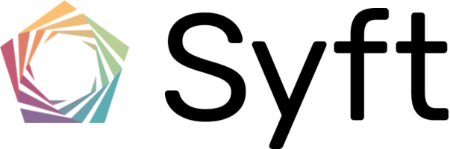
</picture>

<h3> Data Science on data you are not allowed to see</h3>

PySyft enables a new way to do data science, where you can use non-public information, without seeing nor obtaining a copy of the data itself. All you need is to connect to a <a href="https://docs.openmined.org/en/latest/components/datasite_server.html">Datasite</a>! 

Datasites are like websites, but for data. Designed with the principles of <a href="https://arxiv.org/abs/2012.08347">structured transparency</a>, it enables data owners to control how their data is protected and data scientists to use data responsibly.

PySyft supports any statistical analysis or machine learning, offering support for running directly Python code - even using third-party Python libraries.

<h4> Supported on:</h4>

✅ Linux
✅ macOS 
✅ Windows
✅ Docker
✅ Kubernetes


# Quickstart

Try out your <a href="https://docs.openmined.org/en/latest/index.html">first query against a live demo Datasite! </a>


## Install Client

```bash
$ pip install -U syft[data_science]
```

More instructions are available <a href="https://docs.openmined.org/en/latest/quick_install.ipynb">here</a>.

## Launch Server

Launch <a href="https://docs.openmined.org/en/latest/deployment/deployment-doc-1-2-intro-req.html">a development server </a> directly in your Jupyter Notebook:

```python
import syft as sy

sy.requires(">=0.9,<0.9.1")

server = sy.orchestra.launch(
    name="my-datasite",
    port=8080,
    create_producer=True,
    n_consumers=1,
    dev_mode=False,
    reset=True, # resets database
)
```

or from the command line:
```bash
$ syft launch --name=my-datasite --port=8080 --reset=True

Starting syft-datasite server on 0.0.0.0:8080
```

Datasite servers can be deployed as a single container using Docker or directly in Kubernetes. Check out our <a href="https://docs.openmined.org/en/latest/deployment/deployment-doc-1-2-intro-req.ipynb">deployment guide.</a>

## Launch Client

Main way to use a Datasite is via our Syft client, in a Jupyter Notebook. Check out our <a href="https://docs.openmined.org/en/latest/components/syft-client.ipynb"> PySyft client guide</a>:

```python
import syft as sy

sy.requires(">=0.9,<0.9.1")

datasite_client = sy.login(
    port=8080,
    email="info@openmined.org",
    password="changethis"
)
```

## PySyft - Getting started 📝 

Learn about PySyft via our getting started guide:

- <a href="https://docs.openmined.org/en/latest/getting_started/introduction.html">PySyft from the ground up</a>
- <a href="https://docs.openmined.org/en/latest/getting_started/part1_dataset_and_assets.html"> Part 1: Datasets & Assets</a>
- <a href="https://docs.openmined.org/en/latest/getting_started/part2_datasite_access.html"> Part 2: Client and Datasite Access</a>
- <a href="https://docs.openmined.org/en/latest/getting_started/part3_research_study.html"> Part 3: Propose the research study</a>
- <a href="https://docs.openmined.org/en/latest/getting_started/part4_review_code_request.html"> Part 4: Review Code Requests</a>
- <a href="https://docs.openmined.org/en/latest/getting_started/part5_retrieving_results.html"> Part 5: Retrieving Results</a>


# PySyft In-depth

📚 Check out <a href="https://docs.openmined.org/en/latest/index.html">our docs website</a>.

Quick PySyft components links:
- <a href="https://docs.openmined.org/en/latest/components/datasite_server.html">DataSite Server</a>

- <a href="https://docs.openmined.org/en/latest//components/syft_client.html">Syft Client</a>

- <a href="https://docs.openmined.org/en/latest/components/datasets.html">Datasets API (`.datasets`)</a>

- <a href="https://docs.openmined.org/en/latest/components/users-api.html">Users API (`.users`)</a>

- <a href="https://docs.openmined.org/en/latest/components/projects_api.html">Projects API (`.projects`)</a>

- <a href="https://docs.openmined.org/en/latest/components/requests_api.html">Request API (`.requests`)</a>

- <a href="https://docs.openmined.org/en/latest/components/code-api.html">Code API (`.code`)</a>

- <a href="https://docs.openmined.org/en/latest/components/syft_policies.html">Syft Policies API (`.policy`)</a>

- <a href="https://docs.openmined.org/en/latest/components/settings_api.html">Settings API (`.settings`)</a>

- <a href="https://docs.openmined.org/en/latest/components/notifications.html">Notifications API (`.notifications`)</a>

- <a href="https://docs.openmined.org/en/latest/components/syncing_api.html">Sync API (`.sync`)</a>


## Why use PySyft?

In a variety of domains across society, data owners have **valid concerns about the risks associated with sharing their data**, such as legal risks, privacy invasion (*misuing the data*), or intellectual property (*copying and redistributing it*).

Datasites enable data scientists to **answer questions** without even seeing or acquiring a copy of the data, **within the data owners's definition of acceptable use**. We call this process <b> Remote Data Science</b>.

This means that the **current risks** of sharing information with someone will **no longer prevent** the vast benefits such as innovation, insights and scientific discovery. With each Datasite, data owners are able to enable `1000x more accesible data` in each scientific field and lead, together with data scientists, breakthrough innovation.

Learn more about our work on <a href="https://openmined.org/">our website</a>.


## Support

For questions about PySyft, reach out via `#support` on <a href="https://slack.openmined.org/">Slack</a>.

## Syft Versions

:exclamation: PySyft and Syft Server must use the same `version`. 

### Latest Stable
`0.8.8` (Stable) - <a href="https://docs.openmined.org/en/latest/index.html">Docs</a>
- Install PySyft (Stable): `pip install -U syft`


### Latest Beta
`0.9.0` (Beta) - `dev` branch 👈🏽 
- Install PySyft (Beta): `pip install -U syft --pre`

**Deprecated**:

- `0.8.7` - <a href="https://github.com/OpenMined/PySyft/tree/0.8.7/notebooks/api/0.8">API</a>
- `0.8.6` - <a href="https://github.com/OpenMined/PySyft/tree/0.8.6/notebooks/api/0.8">API</a>
- `0.8.5-post.2` - <a href="https://github.com/OpenMined/PySyft/tree/0.8.5-post.2/notebooks/api/0.8">API</a>
- `0.8.4` - <a href="https://github.com/OpenMined/PySyft/tree/0.8.4/notebooks/api/0.8">API</a>
- `0.8.3` - <a href="https://github.com/OpenMined/PySyft/tree/0.8.3/notebooks/api/0.8">API</a>
- `0.8.2` - <a href="https://github.com/OpenMined/PySyft/tree/0.8.2/notebooks/api/0.8">API</a>
- `0.8.1` - <a href="https://github.com/OpenMined/PySyft/tree/0.8.1/notebooks/api/0.8">API</a>
- `0.8.0` - <a href="https://github.com/OpenMined/PySyft/tree/0.8/notebooks/api/0.8">API</a>
- `0.7.0` - <a href="https://github.com/OpenMined/courses/tree/introduction-to-remote-data-science-dev">Course 3 Updated</a>
- `0.6.0` - <a href="https://github.com/OpenMined/courses/tree/introduction-to-remote-data-science">Course 3</a>
- `0.5.1` - <a href="https://github.com/OpenMined/courses/tree/foundations-of-private-computation">Course 2</a> + M1 Hotfix
- `0.2.0` - `0.5.0`

# Community

OpenMined is a growing community of over 15000 engineers, educators, scientists, product managers and privacy-aware individuals. 

<table border="5" bordercolor="grey">
<tr>
<th align="center" valign="top">

<div align="center">

<picture>
  <source media="(prefers-color-scheme: dark)" srcset="docs/img/panel_slack_title_dark.png">
  
</picture>

<a href="https://slack.openmined.org/">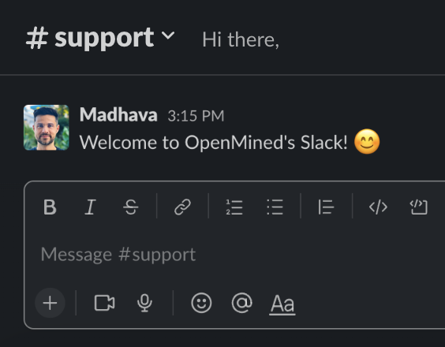</a>

</div>
</th>
<th align="center" valign="top">

<div align="center">

<picture>
  <source media="(prefers-color-scheme: dark)" srcset="docs/img/panel_title_videos_papers.png">
  
</picture>

<p align="left"><sub><sup>
🎥 <a href="https://www.youtube.com/watch?v=qVf0tPBzr2k">PETs: Remote Data Science Unleashed - R gov 2021</a><br />
🎥 <a href="https://youtu.be/sCoDWKTbh3s?list=PL_lsbAsL_o2BQKXG7mkGFA8LSApCnhljL">Introduction to Remote Data Science - PyTorch 2021</a><br />
🎥 <a href="https://youtu.be/kzLeTz_vIeQ?list=PL_lsbAsL_o2BtOz6KUfUI_Zla6Rg5dmyc">The Future of AI Tools - PyTorch 2020</a><br />
🎥 <a href="https://www.youtube.com/watch?v=4zrU54VIK6k&t=1s">Privacy Preserving AI - MIT Deep Learning Series</a><br />
🎥 <a href="https://www.youtube.com/watch?v=Pr4erdusiW0">Privacy-Preserving Data Science - TWiML Talk #241</a><br />
🎥 <a href="https://www.youtube.com/watch?v=NJBBE_SN90A">Privacy Preserving AI - PyTorch Devcon 2019</a><br />
📖 <a href="https://arxiv.org/pdf/2110.01315.pdf">Towards general-purpose infrastructure for protect...</a><br />
📖 <a href="https://arxiv.org/pdf/2104.12385.pdf">Syft 0.5: A platform for universally deployable ...</a><br />
📖 <a href="https://arxiv.org/pdf/1811.04017.pdf">A generic framework for privacy preserving deep ...</a>
</sup></sup></p>
</div>
</th>
<th align="center" valign="top">

<div align="center">

<picture>
  <source media="(prefers-color-scheme: dark)" srcset="docs/img/panel_padawan_title_dark.png">
  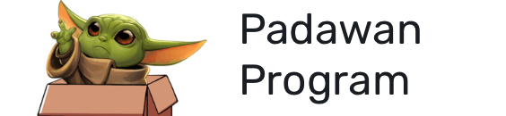
</picture>

<a href="https://blog.openmined.org/work-on-ais-most-exciting-frontier-no-phd-required/">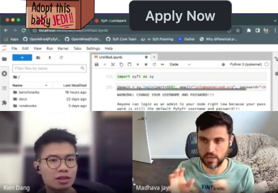</a>

</div>
</th>
</tr>
</table>

# Courses

<table border="5" bordercolor="grey">
<tr>
<th align="center">

<div align="center">
<a href="https://courses.openmined.org/courses/our-privacy-opportunity">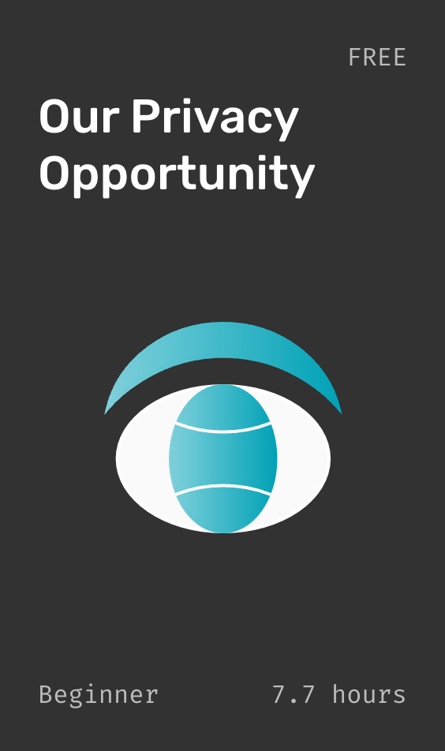</a>
</th>
<th align="center">

<div align="center">
<a href="https://courses.openmined.org/courses/foundations-of-private-computation">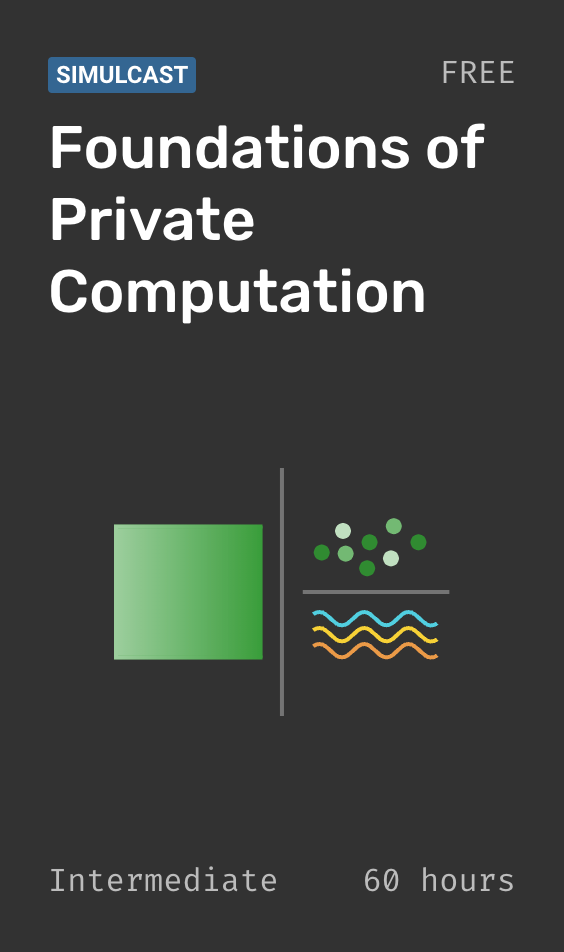</a>
</div>
</th>
<th align="center">

<div align="center">
<a href="https://courses.openmined.org/courses/introduction-to-remote-data-science">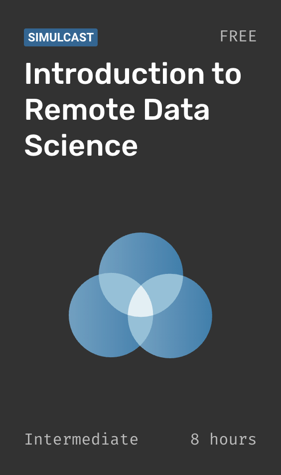</a>
</div>
</th>
</tr>
</table>

# Contributors

OpenMined and Syft appreciates all contributors, if you would like to fix a bug or suggest a new feature, please reach out via Github or Slack!

<picture>
  <source media="(prefers-color-scheme: dark)" srcset="docs/img/contributors_dark.jpg">
  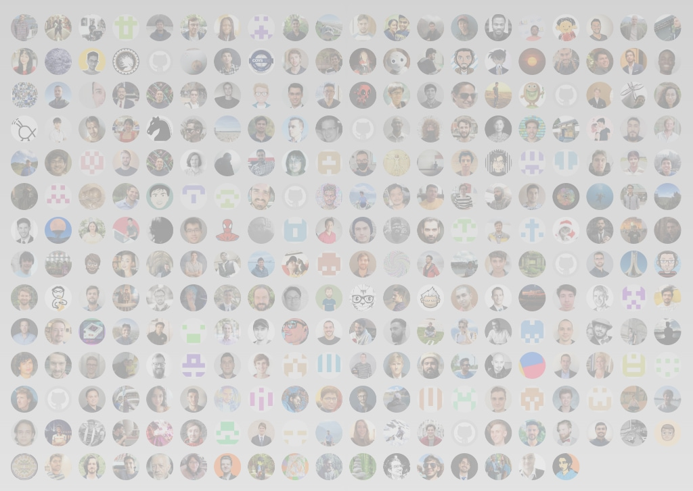
</picture>

# Supporters

<table border="0">
<tr>
<th align="center">
<a href="https://sloan.org/">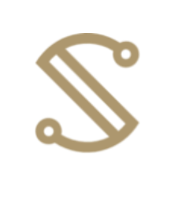</a>
</th>
<th align="center">
<a href="https://opensource.fb.com/"></a>
</th>
<th align="center">
<a href="https://pytorch.org/">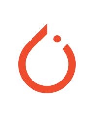</a>
</th>
<th align="center">
<a href="https://www.dpmc.govt.nz/">
<picture>
  <source media="(prefers-color-scheme: dark)" srcset="docs/img/logo_nz_dark.png">
  
</picture>
</a>
</th>
<th align="center">
<a href="https://twitter.com/"></a>
</th>
<th align="center">
<a href="https://google.com/"></a>
</th>
<th align="center">
<a href="https://microsoft.com/"></a>
</th>
<th align="center">
<a href="https://omidyar.com/">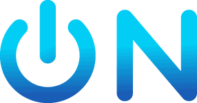</a>
</th>
<th align="center">
<a href="https://www.udacity.com/"></a>
</th>
<th align="center">
<a href="https://www.centerfordigitalhealthinnovation.org/">

<picture>
  <source media="(prefers-color-scheme: dark)" srcset="docs/img/logo_cdhi_dark.png">
  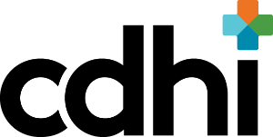
</picture>

</a>
</th>
<th align="center">
<a href="https://arkhn.org/">
<picture>
  <source media="(prefers-color-scheme: dark)" srcset="docs/img/logo_arkhn.png">
  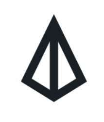
</picture>
</a>
</th>
</tr>
</table>


# License

[Apache License 2.0](LICENSE)<br />
<a href="https://www.flaticon.com/free-icons/person" title="person icons">Person icons created by Freepik - Flaticon</a>

<!-- 🥇 -->
