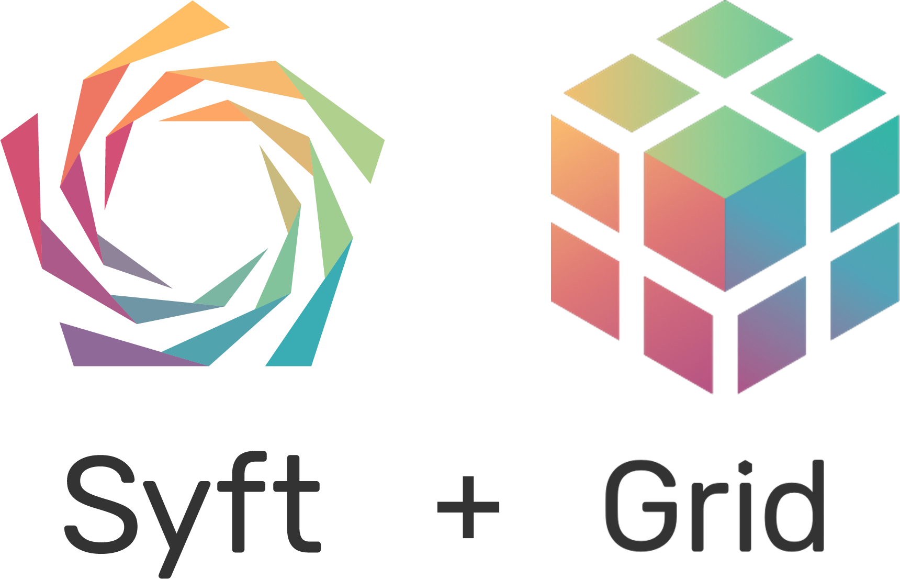

<h1 align="center">

  <br>
  <a href="http://duet.openmined.org/"></a>
  <br>
  Code for computing on data<br /> you do not own and cannot see
  <br>

</h1>

<div align="center"> <a href="https://pypi.org/project/syft/"></a> <a href="https://pypi.org/project/syft/"></a> <br /> <a href="https://github.com/OpenMined/PySyft/actions/workflows/syft-version_tests.yml"></a> <a href="https://openmined.slack.com/messages/support"></a>
<br /><br />

<div align="center"><a href="#"></a></div>

</div>

# Syft + Grid provides secure and private Deep Learning in Python

Syft decouples private data from model training, using
[Federated Learning](https://ai.googleblog.com/2017/04/federated-learning-collaborative.html),
[Differential Privacy](https://en.wikipedia.org/wiki/Differential_privacy),
and Encrypted Computation (like
[Multi-Party Computation (MPC)](https://en.wikipedia.org/wiki/Secure_multi-party_computation)
and [Homomorphic Encryption (HE)](https://en.wikipedia.org/wiki/Homomorphic_encryption))
within the main Deep Learning frameworks like PyTorch and TensorFlow. Join the movement on
[Slack](http://slack.openmined.org/).

---

Most software libraries let you compute over the information you own and see inside of machines you control. However, this means that you cannot compute on information without first obtaining (at least partial) ownership of that information. It also means that you cannot compute using machines without first obtaining control over those machines. This is very limiting to human collaboration and systematically drives the centralization of data, because you cannot work with a bunch of data without first putting it all in one (central) place.

The Syft ecosystem seeks to change this system, allowing you to write software which can compute over information you do not own on machines you do not have (total) control over. This not only includes servers in the cloud, but also personal desktops, laptops, mobile phones, websites, and edge devices. Wherever your data wants to live in your ownership, the Syft ecosystem exists to help keep it there while allowing it to be used privately for computation.

## Stable Release

The current stable release is `0.5.0` which is available on:

- [PyPI](https://pypi.org/project/syft/)
- [Docker Hub](https://hub.docker.com/u/openmined)

For many use cases you can simply use:

```
$ pip install syft
```

If you are doing the [Private AI Series](https://courses.openmined.org/) or you are an external party developing against Syft and Grid please use the [`syft_0.5.0`](https://github.com/OpenMined/pysyft/tree/syft_0.5.0) branch.

## Development Branch

This is the `dev` branch and to accommodate our need to experiment with new ideas and implementations we will be moving a few things around during the early stages of `0.6.0`. Currently the core `syft` library and code will remain fairly stable, while we do some much needed quality improvements and refactors to the `grid` codebase and its tooling for deployment and orchestration of nodes.
During the process of development we will be moving examples from the `/packages/syft/examples` folder down to the `/notebooks` folder and ensuring they are working and tested with the latest `dev` code.

## Mono Repo 🚝

This repo contains multiple sub-projects which work together.

```
OpenMined/PySyft
├── README.md     <-- You are here 📌
└── packages
    ├── grid      <-- Grid - A network aware, persistent & containerized node running Syft
    ├── notebooks <-- Notebook Examples and Tutorials
    └── syft      <-- Syft - A package for doing remote data science on private data
```

## Syft

To read more about what Syft is please consult the current [`0.5.0` README](packages/syft/README.md).

## Grid

To read more about what Grid is please consult the old [PyGrid README](https://github.com/OpenMined/PyGrid) until we finish writing the new one.

## Dev Requirements

- docker
- tox
- python 3.7+

### Docker

You will need `docker` and `docker-compose` to do development on the `monorepo` tooling.

- [Get Docker for macOS](https://docs.docker.com/docker-for-mac/install/)
- [Get Docker for Windows](https://docs.docker.com/docker-for-windows/install/)
- [Get Docker for Ubuntu](https://docs.docker.com/engine/install/ubuntu/)

### Dev Compose File

Run the [FastAPI](https://fastapi.tiangolo.com/) Dev environment using:

```
$ cd packages/grid
$ source .env && docker compose up
```

## Rebuilding Docker Containers

```
$ cd packages/grid
$ docker compose build
```

### Tox

You will need `tox` to run some of our build and test tools.

```
$ pip install tox
```

### List Build Commands

```
$ tox -l
```

You should see the following:

```
syft.jupyter
syft.lint
syft.test.fast
syft.test.libs
syft.test.duet
syft.test.security
```

These commands can be run like so:

```
$ tox -e syft.lint
```

## Join Slack

Also, join the rapidly growing community of 12,000+ on [Slack](http://slack.openmined.org).
The Slack community is very friendly and great about quickly answering questions about the use and development of PySyft!

## Disclaimer

This software is in beta. Use at your own risk.

## Support

For support in using this library, please join the **#support** Slack channel. [Click here to join our Slack community!](https://slack.openmined.org)

## Organizational Contributions

We are very grateful for contributions to Syft and Grid from the following organizations!

|                                                                                                                                                                     |                                                                                                                                                                                                              |                                                                                                                                                                                         |
| ------------------------------------------------------------------------------------------------------------------------------------------------------------------- | ------------------------------------------------------------------------------------------------------------------------------------------------------------------------------------------------------------ | --------------------------------------------------------------------------------------------------------------------------------------------------------------------------------------- |
| [](https://udacity.com/)               | [](https://github.com/coMindOrg/federated-averaging-tutorials) | [](http://ark.hn)                                                                                          |
| [](https://dropoutlabs.com/) | [](https://genbu.ai/)                                          | [](https://www.bitdefender.com/) |

## License

[Apache License 2.0](https://github.com/OpenMined/PySyft/blob/main/packages/syft/LICENSE)
