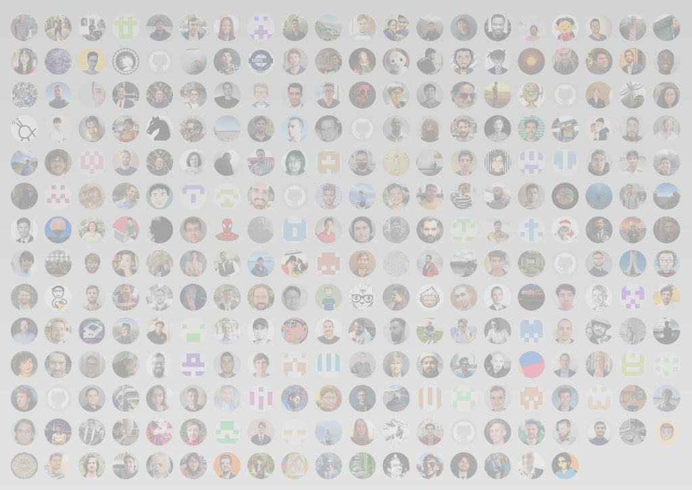
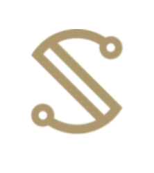
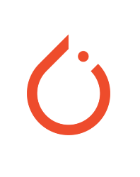
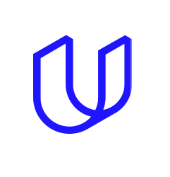
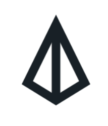

<picture>
  <source media="(prefers-color-scheme: dark)" srcset="docs/img/Syft-Logo-Light.svg">
  
</picture>

[](https://github.com/OpenMined/syft-client/actions/workflows/unit-tests.yml)
[](https://github.com/OpenMined/syft-client/actions/workflows/integration-tests.yml)
[](https://pypi.org/project/syft-client/)
[](https://github.com/OpenMined/syft-client)
[](https://github.com/OpenMined/syft-client/blob/main/pyproject.toml)

# Syft-client (PySyft v2)

Syft client lets data scientists submit computations which are ran by data owners on private data — all through cloud storage their organizations already use (Google Drive, Microsoft 365, etc.). No new infrastructure required.

## Docs

- [Workflow](docs/workflow.md) — End-to-end privacy-preserving data analysis workflow
- [API Reference](docs/API.md) — All public client methods and properties
- [Authentication & Setup](docs/auth.md) — Google Cloud OAuth setup for local/Jupyter usage
- [Background Services](packages/syft-bg/README.md) — Email notifications, auto-approval, and TUI dashboard
- [Connections](docs/connections.md) — How the Google Drive transport layer works
- [Permissions](packages/syft-permissions/docs/permission-user-docs.md) - Permissions for syft-client
- [Enclaves](packages/syft-enclave) - Enclaves with syft-client

## Features

- **Privacy-preserving** — Private data never leaves the data owner's machine; only approved results are shared
- **Transport-agnostic** — Works over Google Drive today, extensible to any file-based transport
- **Offline-first** — Full functionality even when peers are offline; changes sync when connectivity resumes
- **Peer-to-peer with explicit auth** — Data owners must approve each collaborator before any data flows
- **Isolated job execution** — Jobs run in sandboxed Python virtual environments with controlled access to private data
- **Dataset sharing with mock/private separation** — Data scientists explore mock data, then submit jobs that run on the real thing

## Quick Start

```
uv pip install syft-client
```

```python
import syft_client as sc
```

```python
# Login (colab auth, for non-colab pass token_path)
do = sc.login_do(email="do@org.com")
ds = sc.login_ds(email="ds@org.com")

# Peer request & approve
ds.add_peer("do@org.com")
do.approve_peer_request("ds@org.com")

# Create & sync dataset
do.create_dataset(
    name="census",
    mock_path="mock.txt",
    private_path="private.txt",
    users=["ds@org.com"],
)
do.sync(); ds.sync()
datasets = ds.datasets.get_all()
```

Write an `analysis.py` that reads the dataset and produces a result in our case this is just the length of the data. Inside a job, `resolve_dataset_file_path` automatically resolves to the **private** data:

```python
# analysis.py
import json
import syft_client as sc

data_path = sc.resolve_dataset_file_path("census")
with open(data_path, "r") as f:
    data = f.read()

with open("outputs/result.json", "w") as f:
    json.dump({"length": len(data)}, f)
```

Submit the job and retrieve results:

```python
# Submit job
ds.submit_python_job(
    user="do@org.com",
    code_path="analysis.py",
)
ds.sync(); do.sync()

# Data owner Approves & runs job
do.jobs[0].approve()
do.process_approved_jobs(share_outputs_with_submitter=True)
do.sync(); ds.sync()
result = open(ds.jobs[-1].output_paths[0]).read()
```

## Packages

| Package                                         | Description                                   |
| ----------------------------------------------- | --------------------------------------------- |
| [`syft-datasets`](packages/syft-datasets)       | Dataset management and sharing                |
| [`syft-job`](packages/syft-job)                 | Job submission and execution                  |
| [`syft-permissions`](packages/syft-permissions) | Permission system for Syft datasites          |
| [`syft-perms`](packages/syft-perms)             | User-facing permission API for Syft datasites |
| [`syft-bg`](packages/syft-bg)                   | Background services TUI dashboard for SyftBox |
| [`syft-notebook-ui`](packages/syft-notebook-ui) | Jupyter notebook display utilities            |

## Development

```bash
# Install in development mode
uv pip install -e .

# Run tests
just test-unit          # Unit tests (fast, mocked)
just test-integration   # Integration tests (slow, real API)
```

---

Built by [OpenMined](https://openmined.org) — building open-source technology for privacy-preserving data science and AI.

## Support

For questions about PySyft, reach out via `#support` on <a href="https://slack.openmined.org/">Slack</a>.

# Community

Supported by the OpenMined Foundation, the OpenMined Community is an online network of over 17,000 technologists, researchers, and industry professionals keen to _unlock 1000x more data in every scientific field and industry_.

<a href="https://join.slack.com/t/openmined/shared_invite/zt-2hxwk07i9-HO7u5C7XOgou4Z62VU78zA"></a>

# Contributors

OpenMined and Syft appreciates all contributors, if you would like to fix a bug or suggest a new feature, please reach out via <a href="https://github.com/OpenMined/PySyft/issues">Github</a> or <a href="https://join.slack.com/t/openmined/shared_invite/zt-2hxwk07i9-HO7u5C7XOgou4Z62VU78zA/">Slack</a>!

<picture>
  <source media="(prefers-color-scheme: dark)" srcset="docs/img/contributors_dark.jpg">
  
</picture>

# About OpenMined

OpenMined is a non-profit foundation creating technology infrastructure that helps researchers get answers from data without needing a copy or direct access. Our community of technologists is building Syft.

<a href="https://donate.stripe.com/fZe03H0aLdAO59e9AA
"></a>

# Supporters

<table border="0">
<tr>
<th align="center">
<a href="https://sloan.org/"></a>
</th>
<th align="center">
<a href="https://opensource.fb.com/"></a>
</th>
<th align="center">
<a href="https://pytorch.org/"></a>
</th>
<th align="center">
<a href="https://www.dpmc.govt.nz/">
<picture>
  <source media="(prefers-color-scheme: dark)" srcset="docs/img/logo_nz_dark.png">
  
</picture>
</a>
</th>
<th align="center">
<a href="https://twitter.com/"></a>
</th>
<th align="center">
<a href="https://google.com/"></a>
</th>
<th align="center">
<a href="https://microsoft.com/"></a>
</th>
<th align="center">
<a href="https://omidyar.com/"></a>
</th>
<th align="center">
<a href="https://www.udacity.com/"></a>
</th>
<th align="center">
<a href="https://www.centerfordigitalhealthinnovation.org/">

<picture>
  <source media="(prefers-color-scheme: dark)" srcset="docs/img/logo_cdhi_dark.png">
  
</picture>

</a>
</th>
<th align="center">
<a href="https://arkhn.org/">
<picture>
  <source media="(prefers-color-scheme: dark)" srcset="docs/img/logo_arkhn.png">
  
</picture>
</a>
</th>
</tr>
</table>

# License

[Apache License 2.0](LICENSE)<br />
<a href="https://www.flaticon.com/free-icons/person" title="person icons">Person icons created by Freepik - Flaticon</a>
