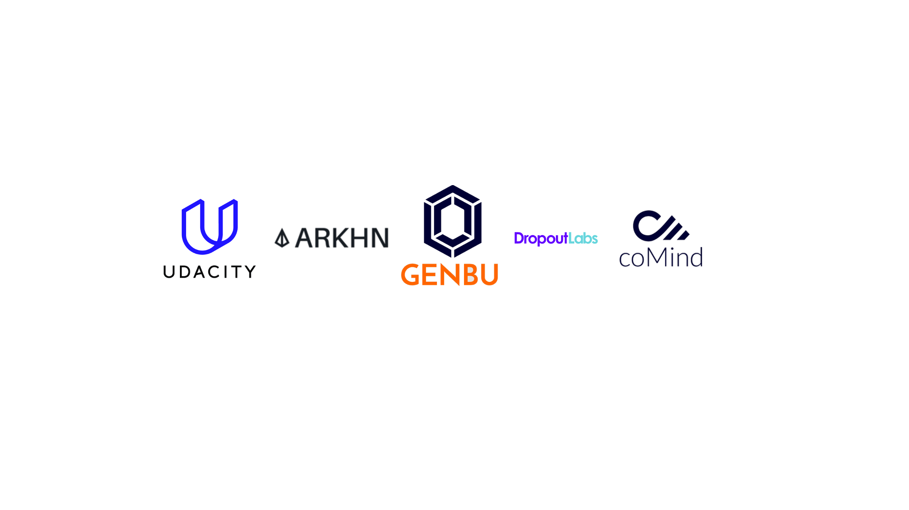

<div align="left"> <a href="https://pypi.org/project/syft/"></a> <a href="https://pypi.org/project/syft/"></a> <a href="https://github.com/OpenMined/PySyft/actions/workflows/syft-version_tests.yml"></a>
 <a href="https://github.com/OpenMined/PySyft/actions/workflows/nightlies-run.yml"></a>
<a href="https://openmined.slack.com/messages/support"></a><br /><br /></div>
<h1>OpenMined: Syft</h1>

Remote Data Science - Code for `computing on data`, you `do not own` and `cannot see`

<div align="left">
    
</div>

<br />

# Ouickstart

Few things to remember:
- `PySyft` = Privacy-Preserving Library
- `PyGrid` = Networking and Management Platform
- `HAGrid` = Deployment and Command Line Tool

<p align="left"></p>

```bash
# install our CLI tool
$ pip install hagrid
# launch a jupyter notebook tutorial
$ hagrid quickstart
```

# What is Syft?


`Syft` is OpenMined's `open source` library that provides `secure` and `private` Deep Learning in Python. Syft decouples `private data` from model training, using techniques like [Federated Learning](https://ai.googleblog.com/2017/04/federated-learning-collaborative.html), [Differential Privacy](https://en.wikipedia.org/wiki/Differential_privacy), and [Encrypted Computation](https://en.wikipedia.org/wiki/Homomorphic_encryption). This is done within main Deep Learning `frameworks` such as `PyTorch` and `TensorFlow` so that you as a `Data Scientist` can maintain your current workflow while using these new `privacy-enhancing techniques`.

### But what does it mean to use PySyft? How to incorporate these privacy-enhancing techniques into your work? 
Ultimately, `PySyft` sets the foundation of a framework for a `Data Scientist` to ask `questions` about a `dataset` and, within the `privacy limits` set by the `data owner`, get `answers` to those `questions`, all without needing a direct `copy or access` to the data itself. We call this process `Remote Data Science`. It means in a wide variety of `domains` across society, current `tradeoffs` between the `benefits` of sharing information with someone (innovation, insights, scientific discovery, etc.) and the `risks` that they might `misuse` it (privacy invasion, IP theft, blackmail, etc.) will be broken.

No more cold calls to get `access` to a dataset. No more weeks of `wait times` to get a `result` on your `query`. It also means `1000x more data` in every domain. PySyft opens the doors to a streamlined Data Scientist `workflow`, all with the individual's `privacy` at its heart.

# Using Syft as a Data \_\_\_\_

<table>
<tr>
<th align="center">

<p>👩🏽‍🔬 Scientist (Coming Soon)</p>
</th>
<th align="center">

<p>👨🏻‍💼 Owner (Coming Soon)</p>
</th>
<th align="center">

<p>👷 Engineer (Coming Soon)</p>
</th>
</tr>
<tr>
<td valign="top">
<!-- REMOVE THE BACKSLASHES -->
    
- Install Syft
- Connect to a Domain
- Search for Datasets
- Train Models
- Train Models 
- Retrieve Secure Results

</td>
<td valign="top">
<!-- REMOVE THE BACKSLASHES -->

- Deploy a Domain Server
- Upload Private Data
- Create User Account
- Manage Privacy Budget
- Join a Network
- PETs Streamline Data Policies

</td>
<td valign="top">
<!-- REMOVE THE BACKSLASHES -->

- Add Deployment Targets
- Deploy to SingleVM
- Deploy to Cloud
- Setup Dev Mode
- Customize Networking
- Modify PyGrid UI


</td>
</tr>
</table>

# Important Terms

<table>
<tr>
<th align="center">

<p>👨🏻‍💼 Data Owners</p>
</th>
<th align="center">

<p>👩🏽‍🔬 Data Scientists</p>
</th>
</tr>
<tr>
<td valign="top">
<!-- REMOVE THE BACKSLASHES -->

    
Provide `datasets` which they would like to make available for `study` by an `outside party` they may or may not `fully trust` has good intentions.

</td>
<td valign="top">
<!-- REMOVE THE BACKSLASHES -->

End `users` who desire to perform `computations` or `answer` a specific `question` using one or more data owners' `datasets`.

</td>
</tr>
<tr>
<th align="center">

<p>🏰 Domain Server</p>
</th>
<th align="center">

<p>🔗 Network Server</p>
</th>
</tr>
<tr>
<td valign="top">
<!-- REMOVE THE BACKSLASHES -->

Manages the `remote study` of the data by a `Data Scientist` and allows the `Data Owner` to manage the `data` and control the `privacy guarantees` of the subjects under study. It also acts as a `gatekeeper` for the `Data Scientist's` access to the data to compute and experiment with the results.

</td>
<td valign="top">
<!-- REMOVE THE BACKSLASHES -->

Provides services to a group of `Data Owners` and `Data Scientists`, such as dataset `search` and bulk `project approval` (legal / technical) to participate in a project. A network server acts as a bridge between it's members (`Domains`) and their subscribers (`Data Scientists`) and can provide access to a collection of `domains` at once.</td>

</tr>
<tr>
</table>

The steps performed by the respective personas are shown below:

<div>
    
    
</div>

# Deployment

'_List with all platforms that are clickable and lead to their respective separate pages_'


Syft provides multiple easy and straightforward options to deploy all of its stacks.

1. [Deploy to Single VM]()
1. [Deploy to Cloud]()
1. [Deploy to Kubernetes]()

# Call for Contributors
OpenMined and Syft appreciates all contributors, and if you would like to fix a bug or suggest a new feature, please see our [Contribution guidelines](https://openmined.github.io/PySyft/developer_guide/index.html).

If you are still looking for some help in understanding Syft, learn more about the Syft library using the below resources:

<table>
<tr>
<th align="center">

<p><a href="https://courses.openmined.org/courses">Courses 📖</a></p>
</th>
<th align="center">

<p><a href="https://openmined.github.io/PySyft/index.html">Documentation 📝</a></p>
</th>
<th align="center">

<p><a href='https://blog.openmined.org/'>Blogs 📋</a></p>
</th>
</tr>
<tr>
<th align="center">

<p><a href='https://blog.openmined.org/work-on-ais-most-exciting-frontier-no-phd-required/'>Padawan Program 👨‍💻</a></p>
</th>
<th align="center">

<p><a href="https://openmined.github.io/PySyft/resources/index.html">Extra Resource 💁</a></p>
</th>
<th align="center">

<p><a href='https://communityinviter.com/apps/openmined/openmined/'>Slack (14,500+ members)</a></p>
</th>
</tr>
</table>

# Disclaimer

Syft is under active development and is not yet ready for total pilots on private data without our assistance. As early access participants, please contact us via [Slack](https://communityinviter.com/apps/openmined/openmined/) or email if you would like to ask a question or have a use case that you would like to propose.

# Organisational Contributors

Syft exists because of all the great people who contributed to this project. We are very grateful for contributions to Syft and Grid from the following organizations!

  <br>
  
  </br>

# License

[Apache License 2.0](https://github.com/OpenMined/PySyft/blob/main/packages/syft/LICENSE)