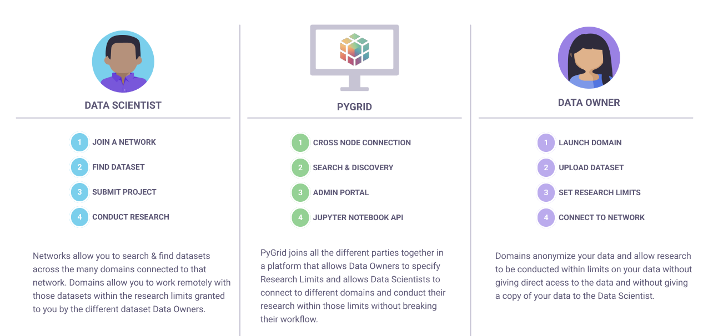

<h1 align="center">

   
  
   
  Answer questions using unseen data owned by others
   
  
</h1>

     
 

  

# Ouickstart
'*Getting started guide for Installation and User-Personas(Tutorials)*'

# What is PySyft?
'*We can combine what and why by stating our thesis and how these technologies come together to achieve that goal*'

PySyft allows you to perform private and secure Deep Learning by making it possible for one person to answer a question using data owned by another without ever seeing or acquiring a copy of that data. We call this process Remote Data Science. It means in a wide variety of domains across society, current tradeoffs between the benefits of sharing information with someone (innovation, insights, scientific discovery, etc.) and the risks that they might misuse it (privacy invasion, IP theft, blackmail, etc.) will be broken. 

For example, PySyft can improve your product based on customers' private data without them needing to disclose their sensitive information. Researchers will make medical advances without patients disclosing medical information. It also means 1000x more data in every domain. PySyft achieves this using [Federated Learning](https://ai.googleblog.com/2017/04/federated-learning-collaborative.html) and [Encrypted Computation](https://en.wikipedia.org/wiki/Homomorphic_encryption) and is currently under development. 

<h5 align="center">
    
</h5>
 

Data Owners provide (digital) datasets which they would like to make available for study by an outside party they may or may not fully trust has good intentions.

Domain server manages the remote study of the data by a Data Scientist and allows the Data Owner to handle the data and incoming requests from the Data Scientist. It also acts as a gatekeeper for the Data Scientist's access to the data to compute and experiment with the results.

Network server provides services to the network of Data Owners and Data Scientists, such as dataset search and bulk project approval (legal/technical) to participate in a project. It acts as a bridge between the members (Domains) and its subscribers (End Users) and can provide access to a collection of domains at once.

Data Scientists are end users who desire to perform computations or answer a specific question using data owned by someone else. They can see a list of datasets hosted on the Domains and can request to get the results.

The steps performed by the respective personas are shown below:

<h5 align="center"> 
    
</h5>

# Deployment
'*List with all platforms that are clickable and lead to their respective separate pages*'

PySyft provides multiple easy and straightforward options to deploy all of its stacks.  
1. [Deploy to Single VM]()
1. [Deploy to Cloud]()
1. [Deploy to Kubernetes]()

# Call for Contributors
'*Link to Resources, Contributing, Padawan program, Courses, Documentation, Blogs and slack*'

OpenMined and PySyft appreciates all contributors, and if you would like to fix a bug or suggest a new feature, please see our [Contribution guidelines](https://openmined.github.io/PySyft/developer_guide/index.html). 

If you are still looking for some help in understanding PySyft, learn more about the PySyft library using the below resources:

1. [Study Resources](https://openmined.github.io/PySyft/resources/index.html)
1. [Padawan Program](https://www.youtube.com/watch?v=SWekBc0wnxY&list=PLriDu8kWH9JRXWlCib9ufqSJqK1qhmSrB&index=2)
1. [PySyft Courses](https://courses.openmined.org/courses)
1. [Official Documentation](https://openmined.github.io/PySyft/index.html)
1. [Blogs](https://blog.openmined.org/) 

Nevertheless, introduce yourself to our continually growing [Slack](https://communityinviter.com/apps/openmined/openmined/) Community with 14,500+ members, and one of us will be happy to help you with your questions.

# Organisational Contributors

'*Thank the organisations that have been contributing in terms of developers but w way smaller logos*'

PySyft exists because of all the great people who contributed to this project.