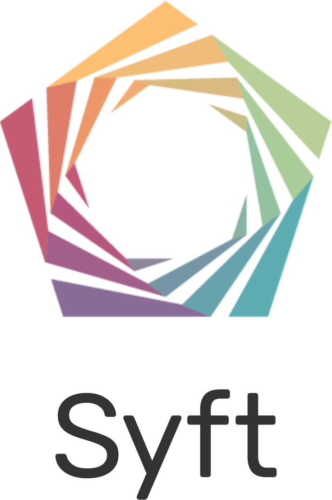

<h1 align="center">

   
  
   
  A World Where Every Good Question is Answered
  
</h1>

     
 

  

# What is PySyft?

Syft decouples private data from model training using [Federated Learning](https://ai.googleblog.com/2017/04/federated-learning-collaborative.html), [Differential Privacy](https://en.wikipedia.org/wiki/Differential_privacy), and Encrypted Computation (like [Multi-Party Computation (MPC)](https://en.wikipedia.org/wiki/Secure_multi-party_computation) and [Homomorphic Encryption (HE)](https://en.wikipedia.org/wiki/Homomorphic_encryption)) within the leading Deep Learning frameworks like PyTorch and TensorFlow.

It allows you to perform private and secure Deep Learning by allowing you to write software which can compute over information you do not own on machines you do not have (total) control over. This includes servers in the cloud, personal desktops, laptops, mobile phones, websites, and edge devices. Wherever your data wants to live in your ownership, the Syft ecosystem exists to help keep it there while allowing it to be used privately for computation.

<h5 align="center">
    
</h5>
 
 
<h5 align="center"> 
    
</h5>

