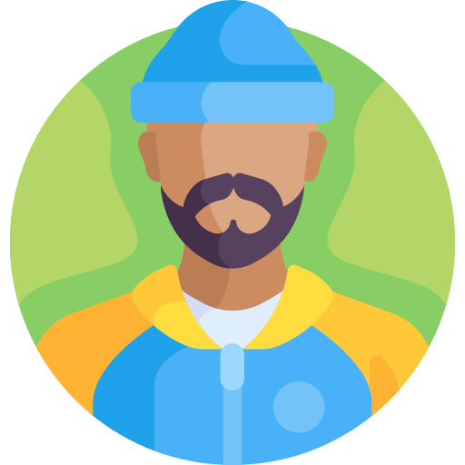
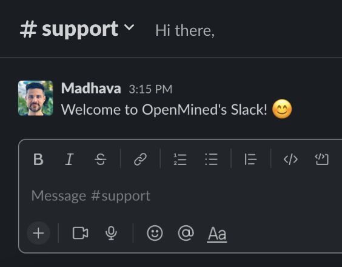
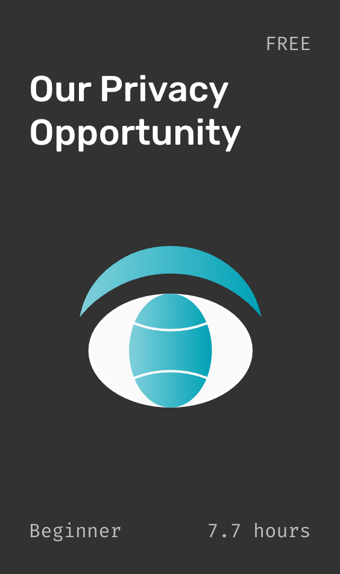
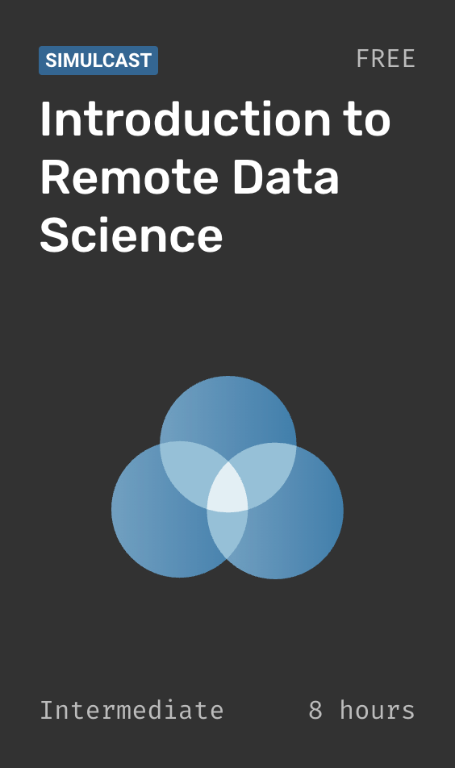

    
 
 
  

Remote Data Science - Code for `computing on data`, you `do not own` and `cannot see`

 

# Quickstart

✅ `Linux` ✅ `macOS` ✅ `Windows`†‡

1. Install our handy python cli tool:  
   🛵 `pip install hagrid`
2. Then run our interactive jupyter quickstart tutorial:  
   💻 `hagrid quickstart`

- In the tutorial you will learn how to install and deploy:  
  `PySyft` = our `torch`-like 🐍 Python Library  
  `PyGrid` = our 🐳 `docker` / `k8s` Data Platform

- During quickstart we will deploy `PyGrid` to localhost with 🐳 `docker`, however 🛵 HAGrid can deploy to `k8s` or a 🐧 `ubuntu` VM on `azure` / `gcp` / `ANY_IP_ADDRESS` by using 🔨 `ansible`†

3. Read our 📚 <a href="https://openmined.github.io/PySyft/">Docs</a>
4. Ask Questions ❔ in `#support` on <a href="https://slack.openmined.org/">Slack</a>

# Install Notes

- HAGrid Requires: 🐍 `python` 🐙 `git` - Run: `pip install hagrid`  
  †`ansible` is not supported on `Windows` preventing some remote deployment targets
- PySyft Requires: 🐍 `python 3.7+` - Run: `pip install syft`  
  ‡`Windows` users must run this first: `pip install jaxlib===0.3.7 -f https://whls.blob.core.windows.net/unstable/index.html`
- PyGrid Requires: 🐳 `docker` / `k8s` or 🐧 `ubuntu` VM - Run: `hagrid launch ...`

# Versions

`0.8.0 beta` - `dev` branch 👈🏽 
`0.7.0` - Stable  
`0.6.0` - <a href="https://github.com/OpenMined/courses/tree/introduction-to-remote-data-science">Course 3</a>  
`0.5.1` - <a href="https://github.com/OpenMined/courses/tree/foundations-of-private-computation">Course 2</a> + M1 Hotfix  
`0.2.0` - `0.5.0` Deprecated

PySyft and PyGrid use the same `version` and its best to match them up where possible. We release weekly betas which can be used in each context:
PySyft: `pip install syft --pre`
PyGrid: `hagrid launch ... tag=latest`
Quickstart: `hagrid quickstart --pre`

HAGrid is a cli / deployment tool so the latest version of `hagrid` is usually the best.

# What is Syft?

`Syft` is OpenMined's `open source` stack that provides `secure` and `private` Data Science in Python. Syft decouples `private data` from model training, using techniques like [Federated Learning](https://ai.googleblog.com/2017/04/federated-learning-collaborative.html), [Differential Privacy](https://en.wikipedia.org/wiki/Differential_privacy), and [Encrypted Computation](https://en.wikipedia.org/wiki/Homomorphic_encryption). This is done with a `torch`-like interface and integration with `Deep Learning` frameworks so that you as a `Data Scientist` can maintain your current workflow while using these new `privacy-enhancing techniques`.

### Why should I use Syft?

`Syft` allows a `Data Scientist` to ask `questions` about a `dataset` and, within `privacy limits` set by the `data owner`, get `answers` to those `questions`, all without obtaining a `copy` of the data itself. We call this process `Remote Data Science`. It means in a wide variety of `domains` across society, the current `risks` of sharing information (`copying` data) with someone such as, privacy invasion, IP theft and blackmail will no longer prevent the ability to utilize the vast `benefits` such as innovation, insights and scientific discovery.

No more cold calls to get `access` to a dataset. No more weeks of `wait times` to get a `result` on your `query`. It also means `1000x more data` in every domain. PySyft opens the doors to a streamlined Data Scientist `workflow`, all with the individual's `privacy` at its heart.

# Tutorials

<table border="5" bordercolor="grey">
<tr>
<th align="center">

Data Owner

</th>
<th align="center">

Data Scientist

</th>
<th align="center">

Data Engineer

</th>
</tr>
<tr>
<td valign="top">
<!-- REMOVE THE BACKSLASHES -->

- <a href="#">Deploy a Domain Server</a>
- <a href="#">Upload Private Data</a>
- <a href="#">Create Accounts</a>
- <a href="#">Manage Privacy Budget</a>
- <a href="#">Join a Network</a>
- Learn how PETs streamline Data Policies

</td>
<td valign="top">
<!-- REMOVE THE BACKSLASHES -->

- <a href="#">Install Syft</a>
- <a href="#">Connect to a Domain</a>
- <a href="#">Search for Datasets</a>
- Train Models
- Retrieve Secure Results
- Learn Differential Privacy

</td>
<td valign="top">
<!-- REMOVE THE BACKSLASHES -->

- <a href="#">Setup Dev Mode</a>
- Deploy to Azure
- Deploy to GCP
- Deploy to Kubernetes
- Customize Networking
- Modify PyGrid UI
</td>
</tr>
</table>

# Terminology

<table border="5" bordercolor="grey">
<tr>
<th align="center">

👨🏻‍💼 Data Owners

</th>
<th align="center">

👩🏽‍🔬 Data Scientists

</th>
</tr>
<tr>
<td valign="top">
<!-- REMOVE THE BACKSLASHES -->

Provide `datasets` which they would like to make available for `study` by an `outside party` they may or may not `fully trust` has good intentions.

</td>
<td valign="top">
<!-- REMOVE THE BACKSLASHES -->

Are end `users` who desire to perform `computations` or `answer` a specific `question` using one or more data owners' `datasets`.

</td>
</tr>
<tr>
<th align="center">

🰠Domain Server

</th>
<th align="center">

🔗 Network Server

</th>
</tr>
<tr>
<td valign="top">
<!-- REMOVE THE BACKSLASHES -->

Manages the `remote study` of the data by a `Data Scientist` and allows the `Data Owner` to manage the `data` and control the `privacy guarantees` of the subjects under study. It also acts as a `gatekeeper` for the `Data Scientist's` access to the data to compute and experiment with the results.

</td>
<td valign="top">
<!-- REMOVE THE BACKSLASHES -->

Provides services to a group of `Data Owners` and `Data Scientists`, such as dataset `search` and bulk `project approval` (legal / technical) to participate in a project. A network server acts as a bridge between it's members (`Domains`) and their subscribers (`Data Scientists`) and can provide access to a collection of `domains` at once.</td>

</tr>
<tr>
</table>

# Community

<table border="5" bordercolor="grey">
<tr>
<th align="center" valign="top">

</th>
<th align="center" valign="top">

- <a href="https://www.youtube.com/watch?v=qVf0tPBzr2k">PETs: Remote Data Science Unleashed - R gov 2021</a> - <a href="https://youtu.be/sCoDWKTbh3s?list=PL_lsbAsL_o2BQKXG7mkGFA8LSApCnhljL">Introduction to Remote Data Science - PyTorch Dev 2021</a> - <a href="https://youtu.be/kzLeTz_vIeQ?list=PL_lsbAsL_o2BtOz6KUfUI_Zla6Rg5dmyc">The Future of AI Tools - PyTorch Dev 2020</a> - <a href="https://www.youtube.com/watch?v=4zrU54VIK6k&t=1s">Privacy Preserving AI - MIT Deep Learning Series</a> - <a href="https://www.youtube.com/watch?v=Pr4erdusiW0">Privacy-Preserving Data Science - TWiML Talk #241</a> - <a href="https://www.youtube.com/watch?v=NJBBE_SN90A">Privacy Preserving AI - PyTorch Devcon 2019</a>

</th>
<th align="center" valign="top">

</th>
</tr>
</table>

# Courses

<table border="5" bordercolor="grey">
<tr>
<th align="center">

</th>
<th align="center">

</th>
<th align="center">

</th>
</tr>
</table>

# Contributors

OpenMined and Syft appreciates all contributors, if you would like to fix a bug or suggest a new feature, please see our [guidelines](https://openmined.github.io/PySyft/developer_guide/index.html).    

# Supporters

# Open Collective

`OpenMined` is a registered `501(c)(3)` in the United States of America. We are funded by our gracious supporters on <a href="https://opencollective.com/openmined">Open Collective</a>.   

# Disclaimer

Syft is under active development and is not yet ready for pilots on private data without our assistance. As early access participants, please contact us via [Slack](https://slack.openmined.org/) or email if you would like to ask a question or have a use case that you would like to discuss.

# License

[Apache License 2.0](https://github.com/OpenMined/PySyft/blob/main/packages/syft/LICENSE) 
<a href="https://www.flaticon.com/free-icons/person" title="person icons">Person icons created by Freepik - Flaticon</a>
