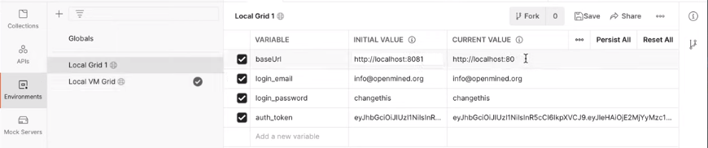
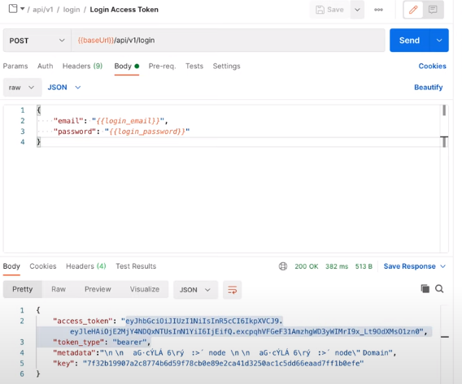
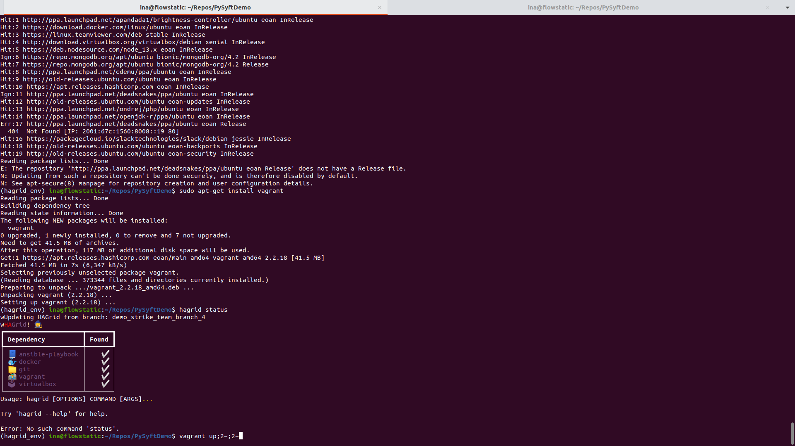

.. _glossary:

========
Glossary
========

.. toctree::
   :maxdepth: 3

General terms
==============

Data Consortium
~~~~~~~~~~~~~~~~~~~~~
A legal agreement under which multiple data owners delegate legal authority (IRB authority) to a central party, such that a data scientist need only enter into legal contract with that central party in order to perform analysis across all relevant participating domains in the ``data consortium``.

Differential Privacy
~~~~~~~~~~~~~~~~~~~~~
While the textbook definition can be found here_, within the context of remote data science, ``differential privacy`` is a set of algorithms which empower a data owner to limit the probability that a data scientist will be able to use their statistical results to reverse engineer the data owner's def. of too much information about the underlying data that generated those results. In a nutshell, its aim is to prevent a Data Scientist from identifying any individual from the dataset through reverse-engineering.

Domain Node
~~~~~~~~~~~~~~~~~~~~~
A ``computer system`` (or collection of computer systems) which manages the remote study of a data owner's data by a data scientist. It is responsible for allowing the `Data Owner` to manage the data, as well as incoming ``requests`` from data scientists and for gatekeeping the data scientist's access to data, compute, and experimental results stored within the data owner's compute infrastructure.

Network Node
~~~~~~~~~~~~~~~~~~~~~
A server which exists outside of any data owner's institution, providing services to the network of data owners and data scientists such as dataset search and bulk project approval (simultaneous legal/technical approval to participate in a project across groups of domains and data scientists at a time). A Network acts as a bridge between between its members and subscribers. The members are ``Domains`` while subscribers are the ``end users`` (e.g. Data Scientist) who explore and perform analysis on the datasets hosted by the members.
A network is used to provide access to a collection of domains at once i.e. if a user agrees to a ``Network Agreement``, then they automatically agree to the conditions to the Domains enlisted in that Network.

Privacy Budget
~~~~~~~~~~~~~~~~~~~~~
A collection of quantitative measures through which a data owner can pre-determine the degree of information access they grant to a data scientist so that that limit is automatically enforceable through automated systems.
In our specific setup the privacy budget is measured against data subjects, not datasets. Therefore, the ``epsilon value`` indicates how much can be learned from any one data subject.

.. note::
  Consider there are 500 patients and 10 data scientists. This means there are actually 5000 ``epsilons`` measuring the ``epsilon`` relationships between each patient and each data scientist, and our ``privacy budget`` simply says that a data scientist can’t learn more than ``x`` amount of epsilon about any particular medical patient in the data.

PySyft
~~~~~~~~~~~~~~~~~~~~~
An open-source platform that enables remote data science experiments by combining ``federated learning`` and ``differentialy privacy`` techniques.

PyGrid
~~~~~~~~~~~~~~~~~~~~~
``PyGrid`` is a ``peer-to-peer network`` of data owners and data scientists who can collectively train AI models using ``PySyft``. ``PyGrid`` is also the central server for conducting both model-centric and data-centric ``federated learning``. You may control PyGrid via our user-interface, ``PyGrid Admin``.

HaGrid
~~~~~~~~~~~~~~~~~~~~~
``Hagrid`` (HAppy GRID!) is a ``command-line tool`` that speeds up the deployment of ``PyGrid``, the software providing a peer-to-peer network of data owners and data scientists who can collectively train models.

Remote Data Science
~~~~~~~~~~~~~~~~~~~~~
A sub-field of data science wherein a data scientist is able to extract insights from a dataset owned by a data owner, but only those insights which the data owner explicitly decides to allow, whose preferences are enforced by information-restricting technologies such as cryptography, information security, and distributed systems.

Personas
=========

Data Owner
~~~~~~~~~~~~~~~~~~~~~
Within the field of remote data science, a data owner is someone who has a (digital) dataset which they would like to make available for study by an outside party whom they may or may not fully trust to have good intentions.

Domain Owner
~~~~~~~~~~~~~~~~~~~~~
A user of ``PyGrid`` who has deployed a domain node.

Network Owner
~~~~~~~~~~~~~~~~~~~~~
Within the field of remote data science, a network owner provides technical and legal services helping to connect data scientists with data owners (domains) by helping them find each other (dataset search) and by helping them enter into bulk legal agreements through the hosting of a network-level data consortium to which such data owners and data scientist may apply.

Data Scientist
~~~~~~~~~~~~~~~~~~~~~
Within the context of remote data science, a data scientist is a persona which desires to answer a specific question using data owned by someone else. This user is required to sign a ``Data Access Agreement`` if you have required one in the ``Domain Settings Configurations``.

Domain Compliance Officer
~~~~~~~~~~~~~~~~~~~~~~~~~~~
All the personas in an institution that are in charge of making sure that the utilization of data at an institution occurs within legal boundaries and under their supervision and with their liability/responsibility.

Network Compliance Officer
~~~~~~~~~~~~~~~~~~~~~~~~~~~
All the personas in an institution that are in charge of making sure that the access and utilization of data between their network's domains and members (data scientists) fall within the bounds outlined in the network's legal agreements.

User roles
============

Default roles
~~~~~~~~~~~~~~

Data Scientist
""""""""""""""
This role is for users who will be performing computations on your datasets. They may be users you know directly or those who found your domain through search and discovery. By default this user can see a ``list of your datasets`` and can request to get results. This user will also be required to sign a ``Data Access Agreement`` if you have required one in the ``Domain Settings Configurations``.

Default permissions:

* Can Make Data Requests

Compliance Officer
""""""""""""""""""""
This role is for users who will help you manage requests made on your node. They should be users you trust. They are not able to change ``Domain Settings`` or edit roles but they are by default able to accept or deny ``user requests`` on behalf of the ``domain node``.

Default permissions:

* Can Triage Data Requests
* Can Manage Privacy Budgets
* Can Manage Users

Admin
""""""
This role is for users who will help you manage your node. This should be users you trust. The main difference between this ``user`` and a ``Compliance Officer`` is that this user by default not only can manage requests but can also edit ``Domain Settings.`` This is the highest level permission outside of an Owner.

Default permissions:

* Every permission except for "Manage infrastructure"

Owner
""""""""
There is only one Owner account assigned to any one domain node. The owner account is the highest level permission and is a requirement for deploying a domain node. If you should ever want to transfer ownership of your domain node to someone, please contact us at support@openmined.org.

Default permissions:

* All
* Cannot disable permissions by default

Domain membership roles
~~~~~~~~~~~~~~~~~~~~~~~~~~

Guest
""""""""""""""
The lowest level of ``network membership``, a guest domain is listed within a network node's registry and its datasets are searchable/discoverable by all users of the network, but the network has no legal relationship to the domain nor any authority to grant data scientists access to its data. As such, upon discovering a domain on the network, such a data scientist must apply directly to the domain for access by creating an account on such a domain and signing a legal agreement (a "data-sharing agreement") directly with its corresponding data owner.

Member
""""""""""""""
The highest level of ``network membership``, a full domain member is greater than a guest member because, beyond its listing within a network node's registry, the domain has entered into a legal relationship with the network owner such that the network owner can unilaterally give its full data scientists access to data hosted by the domain. Note that this does not mean that the network can control access to all potential users of the ``registered domain``, because the domain's membership in the network is non-exclusive (domains can register in multiple networks and also accept direct data-scientist users on the side). A network node only has authority to give its own full data scientists access to any full domain within its registry.

.. _here: https://www.cis.upenn.edu/~aaroth/Papers/privacybook.pdf
