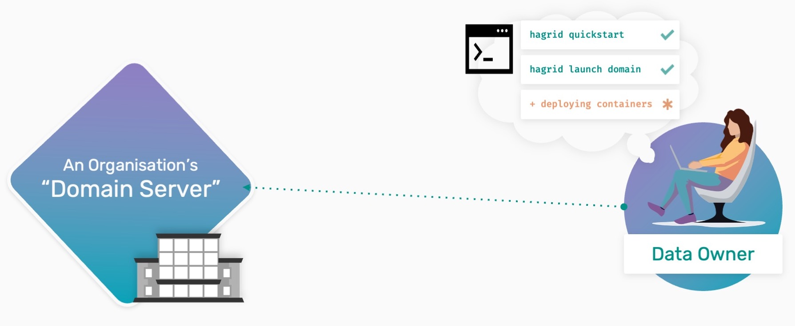

Deploying your own Domain Server
===============================================

**Data Owner Tutorials**

◻️ 00-deploy-domain 👈

◻️ 01-upload-data

.. note::
   **TIP:** To run this tutorial interactively in Jupyter Lab on your own machine type:

::

   pip install -U hagrid
   hagrid quickstart data-owner

Data owners are defined by those with ``datasets`` 💾 they want to make available for
study by an outside party.

This tutorial will help you understand how a Data Owner can
``launch`` their own Domain Server to securely host private datasets.

   **Note:** Throughout the tutorials, we also mean Domain Servers whenever we refer to Domain Node. Both mean the same and are used interchangeably.

Why do Data Owners Deploy Domain Servers?
-----------------------------------------

The concept of Remote Data Science starts with a server-based model
that we call ``Domain Server``. It allows people/data owners 👨 to load
their ``private`` data into these servers and create an account with
a username and password for Data Scientists💻.

The advantage of using a Domain Server is that you can catalyze the impact your dataset can have by allowing...

#. a Data Scientist to only get ``answers`` to the types of ``questions`` you allow them to
#. and by allowing them to get those answers without needing to directly ``access`` or have a copy of your data

|00-deploy-domain-00|

This means that by having your organization retain governance over the information they steward without
needing to share direct ``copies`` of data to collaborators, domain servers create an opportunity for more
collaboration and more research to happen without losing ``control`` of your data and risking things like IP.

Steps To Deploy a Domain
------------------------

How collaboration gets streamlined will be covered in our tutorials about connecting to a ``"Network Node."`` We will discuss
how control is maintained in our tutorials about ``"How to assign a Privacy Budget."`` For this tutorial, however,
let's start by learning how to deploy a domain server.

📒 Overview of this tutorial:

* **Installing** the required software
* **Running** the servers
* **Checking** the status of deployed server

|00-deploy-domain-01|

Few things to make a note of before starting:

- **PySyft** = Privacy-Preserving Library
- **PyGrid** = Networking and Management Platform
- **HAGrid** = Deployment and Command Line Tool

Step 1: Install wizard
~~~~~~~~~~~~~~~~~~~~~~~

To simplify the installation process, we have an `install wizard` that will help you
setup the latest versions of `hagrid` and `syft` on your machine.

You can go to the install wizard at any time by running the below command:

::

   hagrid quickstart

.. warning::
   The next step will show you how to launch a domain node. If
   you run into any ``issue`` running the above installation wizard, consider
   looking for the ``error`` you are getting on our
   `GitHub-Issue <https://github.com/OpenMined/PySyft/issues>`__ page.
   Still not able to figure out the problem, don’t worry. We are here to
   help you. Join the OpenMined
   `slack <https://communityinviter.com/apps/openmined/openmined/>`__
   community and explain your problem in the ``#general`` channel, and
   any one of us might be able to help you.

Step 2: Launching a Domain Server
~~~~~~~~~~~~~~~~~~~~~~~~~~~~~~~~~

Great work, people!! Once you have installed all the dependencies, it is
time to use ``HAGrid`` to launch your Domain Node.

To launch a domain node, there are three things that you
need to know:

1. **What type of node do you need to deploy?**
There are two different types of nodes: Domain Node and Network Node. By
default, HAGrid launches the ``primary`` node that is our Domain Node.

2. **Where are you going to launch this node to?**
We need to specify that we want to launch it to the ``docker container`` at
port ``8081``.

3. **What is the name of your Domain Node going to be?**
For that, don’t forget to specify the ``DOMAIN_NAME`` to your
preference.

After completing the Install Wizard, run the cell below to launch your very first domain node.

::

   In:

   # edit DOMAIN_NAME and run this cell

   DOMAIN_NAME = "My Domain"

   !hagrid launch {DOMAIN_NAME} to docker:8081 --tag=latest

While this command runs, you will see various ``volumes`` and
``containers`` being created. Once this step is complete, move on to
the next step, where we will learn to monitor the health of
our Domain Node.

Step 3: Checking your Domain Server
~~~~~~~~~~~~~~~~~~~~~~~~~~~~~~~~~~~

One exciting benefit of HAGrid is that it makes it easier for your organization/ IT department
to ``monitor`` & ``maintain`` the status of your system as you move forward with other steps.
Let's do a quick health check to ensure the Domain is up and running.

::

   In:

   # run this cell
   !hagrid check localhost:8081

   Out:

   Detecting External IP...
   ┏━━━━━━━━━━━┳━━━━━━━━━━━━━━━━━━━━━━━━━━━━━┳━━━━┓
   ┃ PyGrid    ┃ Info                        ┃    ┃
   ┡━━━━━━━━━━━╇━━━━━━━━━━━━━━━━━━━━━━━━━━━━━╇━━━━┩
   │ host      │ 20.31.143.254               │ ✅ │
   │ UI (βeta) │ http://20.31.143.254/login  │ ✅ │
   │ api       │ http://20.31.143.254/api/v1 │ ✅ │
   │ ssh       │ hagrid ssh 20.31.143.254    │ ✅ │
   │ jupyter   │ http://20.31.143.254:8888   │ ✅ │
   └───────────┴─────────────────────────────┴────┘

If your output is similar to the above image, voila!! A
``Domain`` ``Node`` was just ``born``. When it’s ready, you will see the
following in the output:

-  **host:** ``IP address`` of the launched Domain Node.
-  **UI (Beta):** Link to an ``admin portal`` that allows you to
   control Domain Node from a web browser.
-  **api:** ``Application layer`` that we run in our notebooks to make
   the experience more straightforward and intuitive.
-  **Ssh:** ``Key`` to get into virtual machine.
-  **jupyter:** Notebook ``environment`` you will use to upload your
   datasets.

Congratulations 👏 You have now successfully deployed a Domain Server!
~~~~~~~~~~~~~~~~~~~~~~~~~~~~~~~~~~~~~~~~~~~~~~~~~~~~~~~~~~~~~~~~~~~~~~

Now what?
---------

Once you, as a Data Owner, have deployed your Domain Node representing your theoretical organization's
private data server, the next step is to :doc:`Upload Private Data to a Domain Server <01-upload-data>` for research or project use.

   In our following tutorial, we will see how you as a Data Owners can preprocess the data, mark it with correct
   metadata and upload it to the Domain Node you've just deployed.

