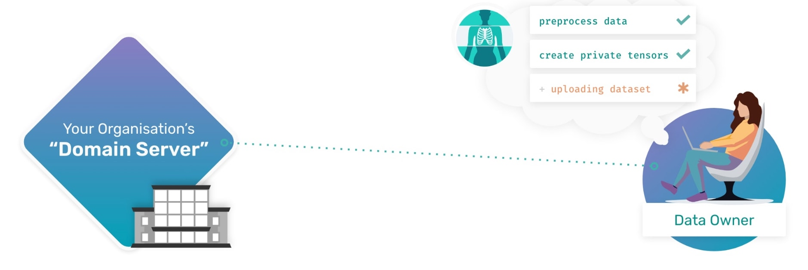
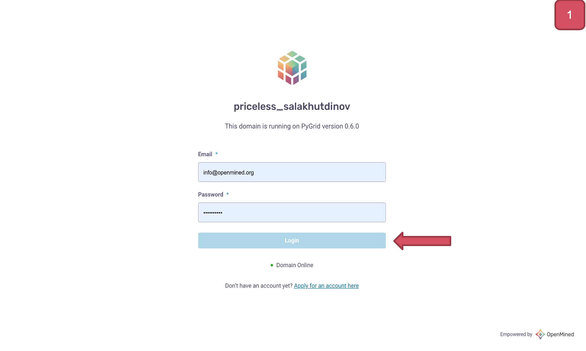

Uploading Private Data to a Domain Server
============================================================

**Data Owner Tutorials**

☑️ 00-deploy-domain

◻️ 01-upload-data👈

.. note:: 
   **TIP:** To run this tutorial interactively in Jupyter Lab on your own machine type:

:: 
   
   pip install -U hagrid
   hagrid quickstart data-owner

Welcome back to another Data Owner tutorial. In the last tutorial,
you learned :doc:`How to Deploy a Domain Server <00-deploy-domain>` that represents
your organization’s private data servers. But right now,
the node you just deployed is empty.

After today’s tutorial, you will learn how to ``upload data`` to your new 
``domain node``, which involves annotating and doing ETL before
uploading it to our Domain Node/server.

   **Note:** Throughout the tutorials, we also mean Domain Servers
   whenever we refer to Domain Node. Both mean the same and are used
   interchangeably.

Step to Upload Private Data
---------------------------

📒 Overview of this tutorial:  

#. **Preprocessing** of Data 
#. **Marking** it with correct metadata 
#. **Uploading** data to Domain Server

|01-upload-data-00|

Step 1: Import Syft
~~~~~~~~~~~~~~~~~~~

To utilize the privacy-enhancing features offered in PyGrid and to 
communicate with your domain node, you must first ``import`` OpenMined's 
``private`` deep learning library: PySyft.

Lets import Syft by running the below cell:

::

   In:

   # run this cell
   try:
      import syft as sy
      print("Syft is imported")
   except:
      print("Syft is not installed. Please use the 🧙🏽‍♂️ Install Wizard above.")

   Out: Syft is imported

.. _step2:

Step 2: Log into Domain
~~~~~~~~~~~~~~~~~~~~~~~~~~~~

By default, only the Domain node ``Admin`` can upload data, 
so to upload your data, you will need to first login as the admin. 
(*Upload data permissions can be customized after logging into the domain node.*)

To login to your Domain node, you will need to define which Domain you are logging into and who you are. In this case, it will take the form of:

* IP Address of the domain host
* Your user account Email and Password

   **WARNING:** Change the default username and password below to a more secure and private combination of your preference. 

::

   In:

   # run this cell
   try:
      domain_client = sy.login(
         port=8081,
         email="info@openmined.org",
         password="changethis"
      )
   except Exception as e:
      print("Unable to login. Please check your domain is up with `!hagrid check localhost:8081`")

   Out:

   Connecting to 20.253.155.183... done! Logging into openmined... done!

Lovely :) You have just logged in to your Domain.

.. note::
   Steps to change the default admin credentials for Domain Owner are shown below 👇

|01-upload-data-01|

Step 3: Prepare Dataset
~~~~~~~~~~~~~~~~~~~~~~~

For this tutorial, we will use a simple dataset of four peoples ``ages``.

::

   In:

   # run this cell
   try:
      import pandas as pd
      data = {'ID': ['011', '015', '022', '034'],
            'Age': [40, 39, 9, 8]}

      dataset = pd.DataFrame(data)
      print(dataset.head())
   except Exception:
      print("Install the latest version of Pandas using the command: !pip install pandas")

   Out:

   ID  Age
   011   40
   015   39
   022    9
   034    8

.. _step4:

Step 4: Annotate Data for Automatic DP
~~~~~~~~~~~~~~~~~~~~~~~~~~~~~~~~~~~~~~

Now that we have our dataset, we can begin annotating it with 
privacy-specific metadata called Auto DP metadata. Auto DP 
metadata allows the PySyft library to protect and adjust the 
visibility different Data Scientists will have into any one of 
our data subjects. ``Data Subjects`` are the entities whose privacy 
we want to protect. So, in this case, they are the individual 
family members.

.. note:: 
   In order to protect the ``privacy`` of the people within our dataset we 
   first need to specify who those people are. In this example we have 
   created a column with unique ``ID’s`` for each person in this dataset.

Important steps:
^^^^^^^^^^^^^^^^

-  ``data subjects`` are entities whose privacy we want to protect
-  each feature needs to define the appropriate ``minimum`` and
   ``maximum`` ranges
-  when defining min and max values, we are actually defining the
   ``theoretical`` amount of values that could be learned about that
   aspect.
-  To help obscure the variables someone may learn about these datasets 
   we then need to set an appropriate ``lower_bound`` to the ``lowest`` possible persons age ``(0)``, 
   and the ``upper_bound`` to the ``highest`` possible (mostly) persons age ``(100)``.

::

   In: 

   # run this cell
   data_subjects = sy.DataSubjectArray.from_objs(dataset["ID"])

   age_data = sy.Tensor(dataset["Age"]).annotate_with_dp_metadata(
      lower_bound=0, upper_bound=100, data_subjects=data_subjects
   )

..

   **Note:** If your project has a training set, validation set and test
   set, you must annotate each data set with Auto DP metadata.

.. _step5:

Step 5: Upload the Dataset
~~~~~~~~~~~~~~~~~~~~~~~~~~~

Once you have prepared your data, it’s time to upload it to the Domain
node. To help Data Scientists later ``search`` and ``discover`` our
datasets, we will add details like a ``name`` and a ``description`` of
what this dataset represents.

   **Note:** If your project has a train, validation and test set, you
   need to add them as assets. In this case, it is just our age column.

::

   In:

   # run this cell
   domain_client.load_dataset(
      name="Family_Age_Dataset",
      assets={
         "Age_Data": age_data,
      },
      description="Our dataset contains the Ages of our four Family members with unique ID's. There are 2 columns and 4 rows in our dataset."
   )

   Out: 

   Dataset is uploaded successfully !!!

Step 6: Check the Dataset
~~~~~~~~~~~~~~~~~~~~~~~~~~~
To ``check`` the dataset you uploaded to the Domain Node, go ahead and
run the below command, and it will list ``all`` the datasets on this
Domain with their Names, Descriptions, Assets, and Unique IDs.

::

   In:

   # run this cell
   domain_client.datasets

Awesome 👏 !! You have uploaded the dataset onto your Domain Server!
~~~~~~~~~~~~~~~~~~~~~~~~~~~~~~~~~~~~~~~~~~~~~~~~~~~~~~~~~~~~~~~~~~~~~~

By uploading the dataset onto the Domain Node, Data Owners are opening
up the possibilities of different Data Scientists being able to study it
without downloading it and without the Data Owners doing any
experiment-specific work while Data Scientists are studying their
private data.

What’s Next? 
------------
Alright, so we have walked through :doc:`How to deploy a
Domain Node <00-deploy-domain>` and :doc:`How to prepare and upload a dataset to that Domain
Node <01-upload-data>` so that Data Scientists can study our datasets without being
able to download them.

   In the following tutorial, we will see how Data Scientists can find
   datasets and work across all the different Domain nodes.

