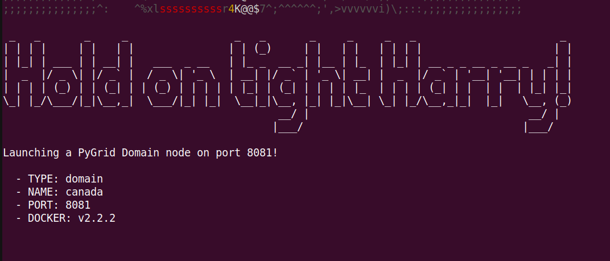
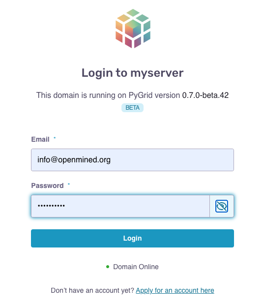
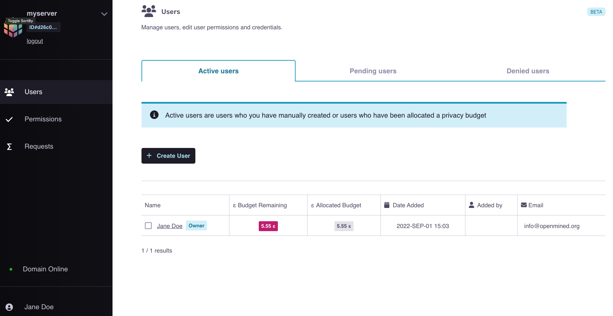

02 - How to create a Data Scientist account and configure your domain server with a privacy budget (How to create accounts and assign privacy budgets)
======================================================================================================================================================

.. note:: 
   To run all the steps in this tutorial interactively, we prefer using the below command.

::

   hagrid quickstart https://github.com/OpenMined/PySyft/tree/dev/notebooks/quickstart/data-owner/02-create-account-configure-pb.ipynb

Data Owners can ``create`` user accounts for Data Scientists to use their domain nodes. 
When the data owner creates a new user account, they can initially ``assign`` them some 
privacy budget or set it as zero.

Today's tutorial will help you understand how to create user accounts, 
manage access to your domain and uploaded datasets, and why it is crucial. 

Step to Create User Account and Assign Privacy Budget
------------------------------------------------------
Before creating user accounts, you have to:

#. Login to your Domain Node
#. Annotate dataset with appropriate DP metadata
#. Upload dataset 

.. note:: 
   The above prerequisite steps are covered in the previous tutorials :doc:`How to deploy a
   Domain Node <00-deploy-domain>` and :doc:`How to upload private data to the Domain
   Node <01-upload-data>`. It is highly recommended to execute these steps before implementing this tutorial.

The steps covered in this tutorial include: 

#. **Defining** account credentials
#. **Assigning** privacy budget
#. **Submitting** credentials to your Domain Node

|02-create-account-configure-pb-00|

Step 1: Create a User Account
~~~~~~~~~~~~~~~~~~~~~~~~~~~~~
To create a Data Scientists account for someone within your team or organization, you need to specify four things:

#. **Name**: Name of the individual
#. **Email**: Associated email address of the individual
#. **Password**: Password they would need to login into your domain
#. **Budget**: The privacy budget is the limiter that blocks data scientists from knowing too much about any data subject and a collection of quantitative measures through which a data owner can pre-determine the degree of information access they grant to a data scientist. 

   **Note:** For this exercise, we give our researchers complete ``visibility`` by assigning a high budget of 9999. 
   We will get into the details around the privacy budget and how to limit it in step 2 ⬇️.

.. WARNING:: 
   Change the default username and password below to a more secure and private combination of your preference.

::

   In:

   # run this cell
   data_scientist_details = domain_client.create_user(
      name="ABC",
      email="abc@xyz.net",
      password="changethis",
      budget=9999
   )

   Out: 

   User created successfully!

Step 2: Assign Privacy Budget
~~~~~~~~~~~~~~~~~~~~~~~~~~~~~
In our specific setup, the privacy budget is measured against data subjects, not datasets. 
Therefore, the ``epsilon-ε`` value indicates how much can be learned from any data subject.

.. note:: 
   Consider there are 500 patients and 10 data scientists. This means there are 
   5000 ``epsilons`` measuring the epsilon relationships between each patient and each 
   data scientist, and our ``privacy budget`` simply says that a data scientist can’t 
   learn more than ``x`` amount of epsilon about any particular medical patient in the data.

When we use the ``hagrid launch`` command to start our private data server, we define the ``port`` where we want to 
launch the server. By default, the port is launched at ``8081``. 

|02-create-account-configure-pb-01|

We will use this port number to visit the following ``UI`` interface at the ``URL``:

::

   http://localhost:<port_number>

   e.g.

   http://localhost:8081

|02-create-account-configure-pb-02|

The default email and password for the domain are:

* **email:** info@openmined.org
* **password:** changethis

Once we're logged in, we will have the following view:

|02-create-account-configure-pb-03|

From the UI, we can ``view`` and ``control`` the following:

* **Users:** Shows a list of users that are signed to the domain. We can create, edit or delete a user from this interface.
* **Permissions:** This is a list of the different sets of roles a user can have. Each role has a set of permissions that the DO (Data Owner) can modify as per their norms.
* **Requests:** This list two types of requests Data Requests and Privacy Budget Upgrade requests.
   
   * **Data Requests:** If users want complete access to a data/variable, they can request so from the DO. Such requests will be listed here, and the DO can manually decide which ones to approve or reject.
   * **Privacy Budget Requests:** These requests pertain to the Privacy budget upgrade requested by a DS. The DO can decide if they want to assign the given privacy budget to the user or deny their requests.

Step 3: Submit Credentials
~~~~~~~~~~~~~~~~~~~~~~~~~~
Lastly, we will submit the credentials of the newly created user account to our ``domain node``. 

:: 

   In: 

   # run this cell then copy the output
   submit_credentials(data_scientist_details)

   print("Please give these details to the Data Scientist 👇🏽")
   print(data_scientist_details)

   Out:

   Data Scientist credentials successfully submitted.
   Please give these details to the Data Scientist 👇🏽
   {'name': 'ABC', 'email': 'abc@xyz.net', 'password': 'changethis', 'url': '20.253.155.183'}

You can give these details to Data Scientists so they can ``finish`` setting up their account, 
which can involve changing email and password if necessary. 

Now our domain node is available for the data scientists to use 👏
------------------------------------------------------------------

.. |02-create-account-configure-pb-00| image:: ../../_static/personas-image/data-owner/02-create-account-configure-pb-00.jpg
  :width: 95%

