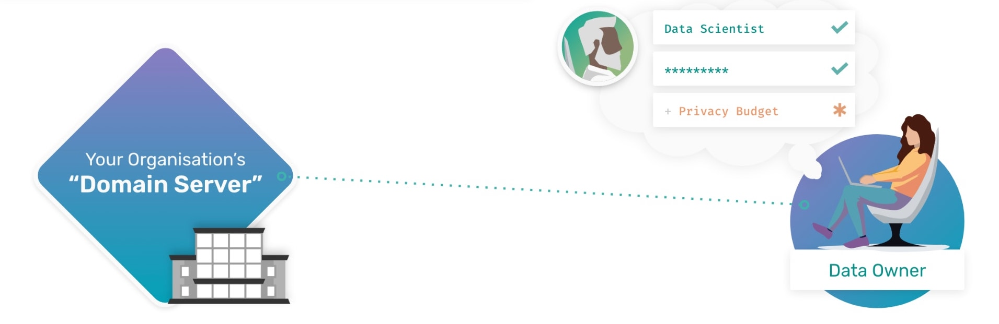
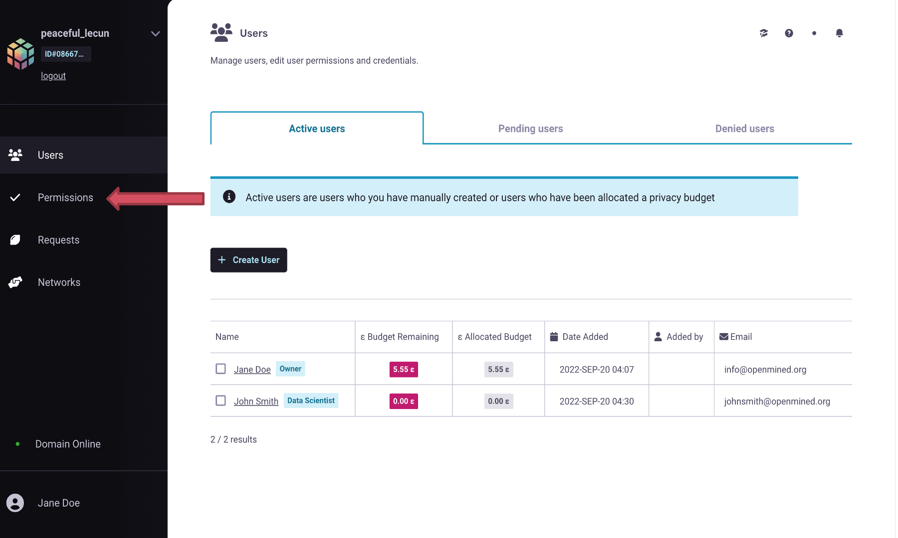
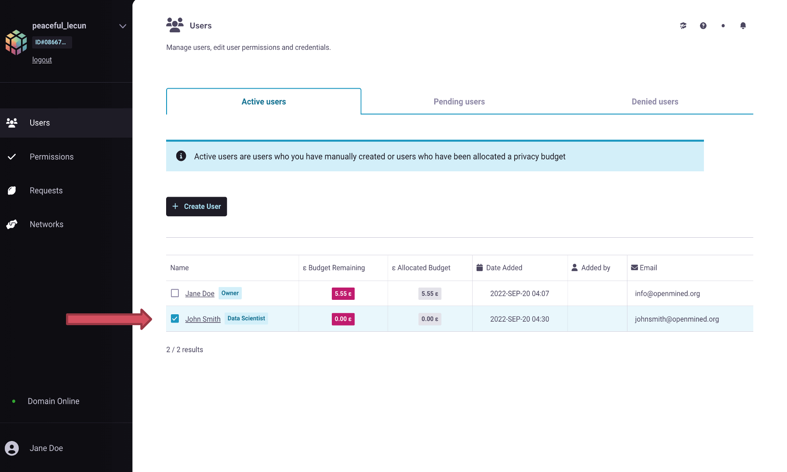
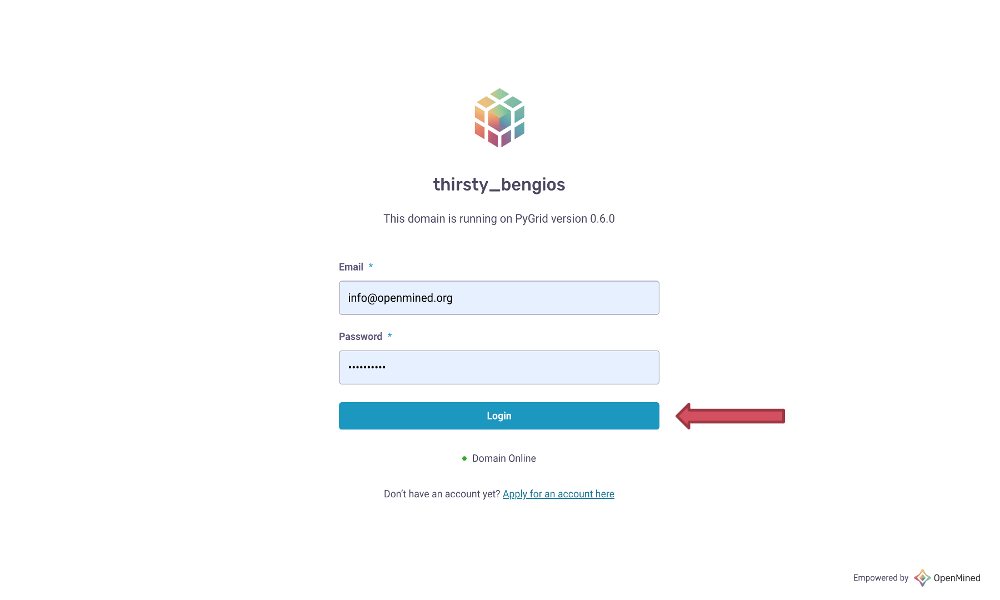

Creating User Accounts on your Domain Server
===============================================

**Data Owner Tutorials**

☑️ :doc:`00-deploy-domain <00-deploy-domain>`

☑️ :doc:`01-upload-data <01-upload-data>`

◻️ 02-create-account👈

HAGrid Quickstart Setup
---------------------------

To run this tutorial interactively in Jupyter Lab on your own machine type, 
you need to start a ``HAGrid Quickstart environment`` as follows:

:: 
   
   pip install -U hagrid
   hagrid quickstart data-owner

If you already have a HAGrid Quickstart environment operating, run the following to download the tutorials notebooks:

:: 

   from hagrid import quickstart
   quickstart.download(“data-owner”)

-----

Domain Owners can directly ``create`` user accounts for Data Scientists to use their 
domain nodes. When the domain owner creates a new user account, by default that user 
will have the lowest level of permissions to access that data (means data is highly private) 
and will be assigned ``0`` Privacy Budget.

In today's tutorial we will learn how to create a user account, how to check permissions, 
and how to assign a privacy budget to that user. Then we'll touch on why setting a privacy 
budget is important later in your workflow.
 

🚨 Pre-Requisites Steps
---------------------------

Before you can create user accounts on your domain, you have to first:

#. :ref:`Annotate your dataset with the appropriate DP metadata <step4>`
#. :ref:`Upload your dataset to Domain Server <step5>`

.. note:: 
   The above prerequisite steps are covered in the previous tutorial :doc:`How to upload private data to the Domain
   Node <01-upload-data>`. Please execute those steps before implementing this tutorial.

📒 Overview of this tutorial
------------------------------

#. **Import** Syft & **Login** to Domain Server
#. **Define** account credentials
#. **Check** account permissions  

|02-create-account-configure-pb-00|

Step 1: Import Syft & Login to Domain Server
~~~~~~~~~~~~~~~~~~~~~~~~~~~~~~~~~~~~~~~~~~~~~~

To utilize the privacy-enhancing features offered in PyGrid and to 
create an account for the user, you must first ``import`` OpenMined's 
``private`` deep learning library: PySyft.

Let's import Syft by running the below cell:

::

   In:

   # run this cell
   try:
      import syft as sy
      print("Syft is imported")
   except:
      print("Syft is not installed. Please use the 🧙🏽‍♂️ Install Wizard above.")

   Out: Syft is imported

To login to your Domain node, you will need to define which Domain you are logging into and who you are. In this case, it will take the form of:

* IP Address of the domain host
* Your user account Email and Password

.. WARNING::
   ``info@openmined.org`` and ``changethis`` are the default admin credentials for any domain node that is launched by
   the user in the documentation. Change the default email and password below to a more secure and 
   private combination of your preference.

::

   In:

   # run this cell
   try:
      domain_client = sy.login(
         port=8081,
         email="info@openmined.org",
         password="changethis"
      )
   except Exception as e:
      print("Unable to login. Please check your domain is up with `!hagrid check localhost:8081 --silent`")

   Out:

   Connecting to 20.253.155.183... done! Logging into openmined... done!

Lovely :) You have just logged in to your Domain.

Step 2: Create a User Account
~~~~~~~~~~~~~~~~~~~~~~~~~~~~~~~

After you have launched and logged into your domain as an ``admin``, you can create user accounts for others to use. 

.. WARNING:: 
   In this case, we will create an account for a Data Scientist from within our own team or organization.

.. note:: 
   You should only create direct user accounts on your domain node for those who have been 
   appropriately vetted and verified by your organization. To expand research done on your 
   datasets to those not directly within or verified by your organization, you should ``connect`` 
   your ``domain`` to one or more networks so that proper verification measures have been taken. 
   You can learn more about this in our "Connect Your Domain to a Network" tutorial.

There are ``three`` different ways for a new user account to be created on your domain.

* **Option A**, by a Domain Owner creating a new user account and specifying their 
  credentials directly through the notebook API.
* **Option B**, by a Domain Owner creating a new user account and specifying their credentials 
  through PyGrid’s default UI interface.
* **Option C**, by a potential user finding or being given the Domain node’s profile URL and 
  submitting an application that a Domain Owner can triage. (This functionality is currently in Beta).

.. note::
   In all three cases, the user of your domain will be assigned the role of Data Scientist by default.

A. Using PySyft: Create account from Domain Client
~~~~~~~~~~~~~~~~~~~~~~~~~~~~~~~~~~~~~~~~~~~~~~~~~~~~~~

To create a Data Scientist account for someone within your team or organization, you need to tell your Domain 4 things:

#. **Name**: Name of the individual
#. **Email**: Associated email address of the individual
#. **Password**: Password they would need to login into your domain (this can be changed later when they customize their ``account settings``)
#. **Budget**: When you specify a ``budget``, you assign this account with a ``privacy budget`` of ``0``. This privacy budget, set in units of ``epsilon``, is the limiter that blocks a data scientist from knowing too much about any one data subject in your dataset.

   **Note:** In future exercises, we will explore how privacy budget limits affect data subject visibility. 
   Still, for now, we will set the ``privacy budget`` to its default of ``0`` (means data is highly private), 
   the lowest level of permission to access the data. 
   Also, by default, the role assigned to a user is a Data Scientist.

::

   In:

   # run this cell
   data_scientist_details = domain_client.create_user(
      name="Jane Doe",
      email="jane@email.com",
      password="supersecurepassword",
      budget=0
   )

   Out: 

   User created successfully!

Once you have created an account, you can ``verify`` if the user account was made successfully.

::

   In:

   # list the users that have registered to the domain
   domain_client.users

Print the details of the account you created and share the ``credentials`` with the Data Scientists.

::

   In:

   # run the cell then copy the output
   print("Please give these details to the Data Scientists ⬇️")
   print(data_scientist_details)

   Out:

   Please give these details to the Data Scientists ⬇️
   {'name': 'Jane Doe', 'email': 'jane@email.com', 'password': 'supersecurepassword', 'url': '20.253.155.183'}

B. Using PySyft: Create account from Domain URL
~~~~~~~~~~~~~~~~~~~~~~~~~~~~~~~~~~~~~~~~~~~~~~~~~~~

A user can also ``sign-up`` or create an account on a Domain node if they have access to the ``URL`` to the Domain. 
Instead of creating an account individually for each Data Scientist, a Data Owner can ``share`` the URL to their 
Domain node and ask their team members to ``register`` to the Domain. 

To register to a Domain, you need the following details:

#. **Name**: Name of the individual
#. **Email**: Email of the individual that will be used to log into the Domain
#. **Password**: A secured password to log into the Domain
#. **Url**: Url to the domain node.
#. **Port**: Port number

::

   In:

   # run this cell
   import syft as sy
   domain_client = sy.register(
      name="Jane Doe",
      email="jane@email.com",
      password="supersecurepassword",
      url="localhost",
      port=8081
   )

On successful registration, the user is auto-logged into the domain. 

.. note:: 
   By default the role assigned to the registered user is of a ``Data Scientist`` and the assigned ``privacy budget`` is ``0``. The future tutorial series will cover a better explanation of `setting the privacy budget`.

C. Using PyGrid UI: Create account as a Domain Admin
~~~~~~~~~~~~~~~~~~~~~~~~~~~~~~~~~~~~~~~~~~~~~~~~~~~~~~~~

PyGrid's UI is meant to help Domain Owners get a bigger picture view of their domains and manage them. 

When we use the ``hagrid launch`` command to start our private data server, we define the ``port`` where 
we want to launch the server. By default, the port is launched at ``8081``.

   **Note:** Make sure your docker application is up and running in the background.

We will use this ``port number`` to visit the following UI interface at the URL:

:: 
   
   http://localhost:<port_number>
   
   e.g.
   
   http://localhost:8081

Once you are on PyGrid's web page, execute following steps to create an account for Data Scientist:

.. WARNING::
   ``info@openmined.org`` and ``changethis`` are the default admin credentials for any domain node that is launched by
   the user in the documentation. Change the default email and password below to a more secure and 
   private combination of your preference.

#. Login using your admin credentials (**Email:** info@openmined.org | **Password:** changethis)
#. Create a new user account by clicking on the ``+ Create User`` button
#. Specify the following fields
	* **Name**: Name of the individual
	* **Email**: Email of the individual that will be used to log into the Domain
	* **Password**: A secured password to log into the Domain
	* **Role**: Assign them the role of Data Scientist (By default user account will take the role with the lowest amount of permission which in this case is the **Data Scientist** role.)
#. Set appropriate Privacy Budget (By default, they have ``0e`` privacy budget)

|02-create-account-configure-pb-04|

Step 3: Check Permissions
~~~~~~~~~~~~~~~~~~~~~~~~~~~~~
Now that we have created an account for our Data Scientist, let's check to see if it 
was made and if we need to change any permissions.

.. note:: 
   Permissions are determined by the ``role`` a user has been assigned by the Data Owner. 
   By default a user will be created with the role with the ``lowest`` set of ``permissions``. 
   To simplify the concepts, let us consider the below scenario. 
   
Scenario
-----------

Let's login to our PyGrid's UI as we did earlier when we had to create an account 
for the user in the prior steps. On the homepage, go to the ``Permissions`` tab, 
where you will notice the different roles and associated permissions with them. 

.. note:: 
   Each role has a set of default ``permissions``, but they can be changed according to the norms of each organization.

|02-create-account-configure-pb-01|

#. **Data Scientist (default)**: This role is for users who will be performing computations on your datasets. They may be known users or those who found your domain through search and discovery. By default, this user can see a list of your datasets and can request to get results. This user will also be required to sign a Data Access Agreement if you have required one in the Domain Settings Configurations.
#. **Compliance Officer**: This role is for users who will help you manage requests made on your node. They should be users you trust. They cannot change domain settings or edit roles but are, by default, able to accept or deny user requests on behalf of the domain node.
#. **Administrator**: This role is for users who will help you manage your node. These should be users you trust. The main difference between this user and a Compliance Officer is that this user, by default, not only can manage requests but can also edit Domain Settings. This is the highest level of permission outside of an Owner.
#. **Owner**: Only one Owner account is assigned to any domain node. The owner account is the highest level permission and is a requirement for deploying a domain node. If you ever want to transfer ownership of your domain node to someone else, you can do so by following these steps.

Suppose you created a user account for a person named ``John Smith``; by default, 
the role assigned to John will be a ``Data Scientist``. But you want to change the 
role of John to ``Data Protection Officer`` instead of a Data Scientist. 

#. Select the user and click on its name.
#. Go to ``Change role``, and in the drop-down option, select ``Compliance Officer``.
#. You can see the permissions given to the Compliance Officer below their role. The default permissions can be changed in the ``Permissions`` tab, as shown in the above image.  
#. Click ``Change Role``, and the role of John Smith has now successfully changed to the Compliance Officer.

|02-create-account-configure-pb-02|

Now our domain node is available for the data scientists to use 👏
---------------------------------------------------------------------

