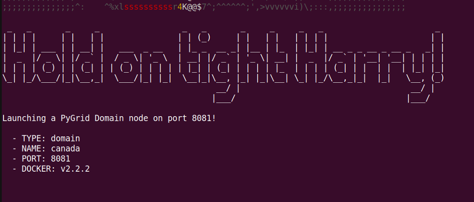
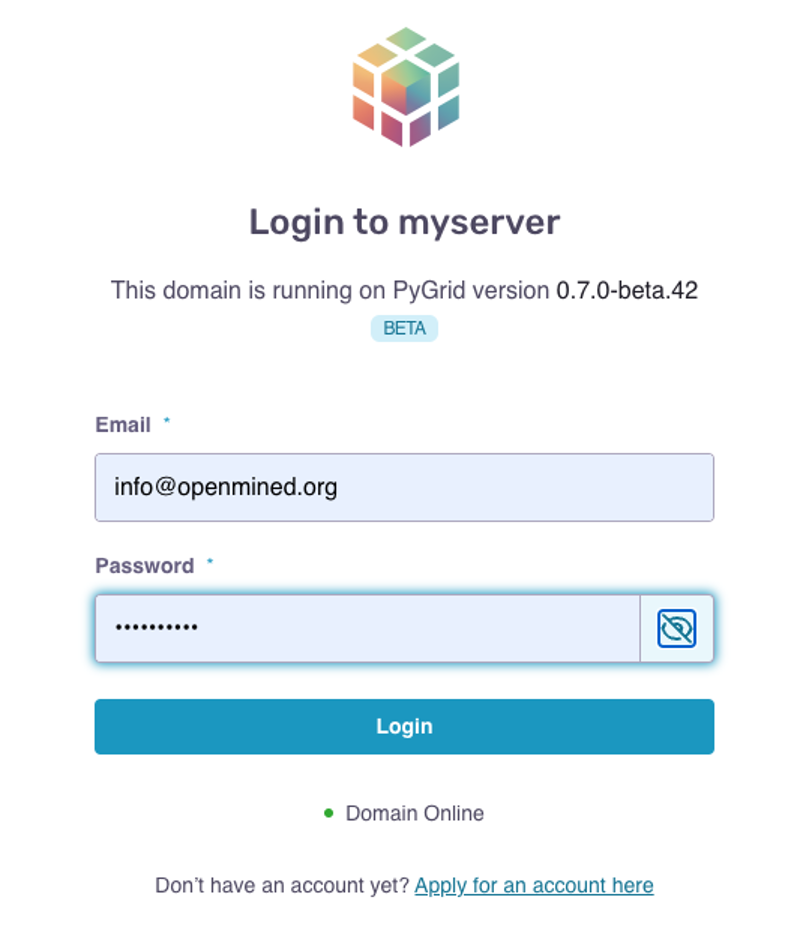
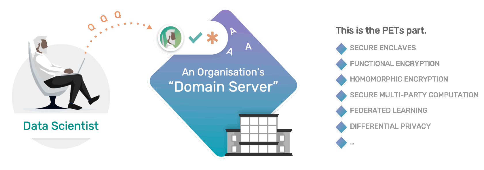
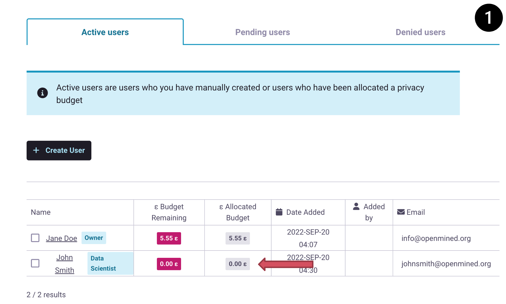

Configuring Privacy Budget on your Domain Server
==================================================

**Data Owner Tutorials**

☑️ 00-deploy-domain

☑️ 01-upload-data

☑️ 02-create-account

☑️ 03-join-network

◻️ 04-configure-pb👈

.. note:: 
   **TIP:** To run this tutorial interactively in Jupyter Lab on your own machine type:

:: 
   
   pip install -U hagrid
   hagrid quickstart data-owner

A privacy budget is a collection of quantitative measures through which a Data Owner can 
pre-determine the degree of information access they grant to a user using their domain server.
For PyGrid, you can think of a privacy budget as a specified limit to the ``visibility`` a user 
can have into any one data subject on your domain server. 
As we saw in the :doc:`creating user accounts tutorial <02-create-account-configure-pb>`, when you 
create a user account in PyGrid, by default that user is assigned the lowest level of ``permissions`` 
and is given a privacy budget of ``0`` which means that they have ``0`` visibility into your domain’s data subjects. 

In today's tutorial, you will discover the underlying concept behind Differential Privacy and 
how setting a privacy budget for a user determines how much can be learned from any data subject
 

🚨 Pre-Requisites Steps
---------------------------
Before you can specify a privacy budget for your domain users, you must first ``prepare`` the dataset, ``upload`` it, and 
``create`` a user account for your team members or Data Scientists.
The prerequisite steps are covered in the previous 
tutorial :doc:`Creating User Accounts on your Domain Server <02-create-account-configure-pb>` and
:ref:`Uploading Private Data to a Domain Server <step4a>`. 
Please execute those steps before implementing this tutorial.

📒 Overview of this tutorial
---------------------------

#. **Introduction** to Differential Privacy
#. **Login** to PyGrid UI as a Domain Admin
#. **Explore** different Privacy Budgets

Step 1: Introduction to Differential Privacy
~~~~~~~~~~~~~~~~~~~~~~~~~~~~~~~~~~~~~~~~~~~~~~~~~~
In this step, lets understand the concept behind differential privacy and privacy budget by considering a simple scenario.

A. Scenario
##############
Consider there are ``500`` patients represented in ``2`` different datasets. One dataset is 
about general ``medical history``; the other has some but not all of the ``500`` patients 
and is focused on patients who have had ``mammography`` images taken in the past year. Now 
let's say that ``Jane Doe`` is a patient in both and is open to being studied for 
``breast cancer research`` as long as she can remain unidentifiable in the study.

B. Quick Definition: Differential Privacy
############################################
A core feature of Syft is that Syft allows you to use a ``PET(Privacy Enhancing technology)`` called 
Differential Privacy to protect the ``Privacy`` of the individuals or data subjects 
within your datasets. In this case, Differential Privacy is maintained when a 
query across both datasets ``with`` Jane Doe in it versus that same query on both 
datasets ``without`` Jane Doe creates the ``same output``. Noise is added to help average 
out and make up the difference between having Jane there versus not. In other words, Jane Doe becomes a very 
difficult, if not impossible, straw to find within the haystack.

From a top-level view, this means a couple of things:

* Differential Privacy can help a Data Scientist see trends in data ``without`` being able to ``identify`` the participants.
* The more a specific data subject involved in the query ``stands out`` in a dataset, the more noise has to be added to ``obfuscate`` them.
* There is a natural ``tradeoff`` between how much ``Privacy`` is preserved versus how much ``Accuracy`` is given to the Data Scientist..
* You can set a privacy limit in PyGrid and trust that a Data Scientist will not be able to get answers to a query that surpasses that limit on any one ``Data Subject``. (see the image 👇 for reference)
* Data scientists can download answers that remain within specified ``privacy limits``, creating a streamlined flow where answering questions using an org's Domain Server will be as easy as going to the organization's public website. (see the image 👇 for reference)

|04-configure-pb-02|

C. Quick Definition: Epsilon or Privacy Budget
################################################
Differential Privacy in practice is an algorithm that obscures an individual data subject's 
contributions to the given ``results`` of a ``query``. Privacy Budget measured in units of ``Epsilon`` 
is a way to measure the potential ``privacy loss`` or ``visibility`` you are allowing into any one of those data subjects.

.. note::
   Syft specifically ``tracks`` privacy budgets against individual data subjects instead 
   of the ``dataset`` as a whole. This may be different from other tools that use 
   Differential Privacy. This allows more ``utility`` on the dataset. 

D. Takeaway
###############
When you assign a ``privacy budget`` in Syft, you specify a ``risk tolerance`` on what 
level of ``visibility`` you feel comfortable having that Data Scientist have on your 
data subjects. You are balancing this with keeping the ``accuracy`` they get on a 
helpful level and maximizing the benefit of your dataset(s). 

Let's say, in the above scenario, you allow your ``Data Scientist`` to have ``0.5e`` to 
conduct their Breast Cancer Research. You can interpret ``e`` to mean:

* That this Data Scientist will have ``0.5x`` more ``visibility`` into any one data subject like Jane Doe
* That this Data Scientist is ``0.5x`` more likely to ``learn`` something unique about Jane Doe
* That this Data Scientist can ``learn no more than 0.5e`` on Jane Doe

.. note::
   If a query would expose more than ``0.5e`` about ``Jane Doe``, then Jane Doe would get 
   dropped from the result, and noise would be used to mitigate the difference.

Step 2: Login to PyGrid UI as a Domain Admin
~~~~~~~~~~~~~~~~~~~~~~~~~~~~~~~~~~~~~~~~~~~~~~~
When we use the ``hagrid launch`` command to start our private data server, we define 
the ``port`` where we want to launch the server.

.. note:: 
   By default, the port is launched at ``8081``.

|04-configure-pb-00|

We will use this port number to visit the following UI interface at the ``URL``:

::

   http://localhost:<port_number>

   e.g.

   http://localhost:8081

|04-configure-pb-01|

The default email and password for the domain are:

* **email:** info@openmined.org
* **password:** changethis

Once we're logged in, you can move to the next section, which explores setting a privacy budget.

Step 3: Explore Different Privacy Budget
~~~~~~~~~~~~~~~~~~~~~~~~~~~~~~~~~~~~~~~~~~~~~~~

.. _step3a:

A. Assign Data Scientist Account with 0.5e Privacy Budget
##############################################################
When you create a user account on your domain server, the privacy budget assigned to the 
user is ``0e``, and the role assigned will be a data scientist by default. 

Follow the steps in the image below to change the privacy budget of our data scientist to ``0.5e``. 

.. note::
   John Smith is a Data Scientist whose account we created for demonstration purposes 
   in the :doc:`create user accounts tutorial <02-create-account-configure-pb>`. 

|04-configure-pb-03|

B. Make a Query With 0.5e Privacy Budget As a Data Scientist
#################################################################

After you have changed the privacy budget to ``0.5e``, it's time for Domain Owners to 
wear the hat of a Data Scientist. Let's make a ``query`` using 0.5e and then analyze the ``results`` 
to compare how close the value of the results is to the actual value.

Firstly, we should ``login`` to the domain as a data scientist using the same credentials through which 
we created a data scientist account in :doc:`creating user accounts tutorial <02-create-account-configure-pb>`.

The credentials to login as a Data Scientist are:

* **Email:** janedoe@email.com
* **Password:** supersecretpassword

.. WARNING::
   We will use the same ``age dataset`` defined in the previous tutorial to keep things simple. 
   So, before Data Scientists can make a ``query``, Domain Owners have 
   to :ref:`prepare the dataset and upload it to the Domain Servers<step4a>`. 
::

   In:

   # run this cell
   import syft as sy

   ds_domain_client = sy.login(
      email="janedoe@email.com", 
      password="supersecretpassword", 
      port=8081, 
      url="localhost"
   )

Now, as a Data Scientist, you can ``verify`` the privacy budget using the below command ⬇️

:: 

   In:

   # run this cell
   print("Allotted PB: ", ds_domain_client.privacy_budget)

   Out:

   Allotted PB:  0.5

Let's grab the age data from the domain and define a simple query to calculate the ``mean age``.

::

   In: 

   age_data = ds_domain_client.datasets[0]["Age_Data"]
   age_mean = age_data.mean()
   age_mean_public = age_mean.publish(sigma=20)

   # Check if mean data exists
   age_mean_public.exists

   # Download/Get mean age
   age_mean_public.get(delete_obj=False)

   print("Remaining PB: ", ds_domain_client.privacy_budget)

   Out:

   Remaining PB: 0.000120578321

.. note:: 
   Remember, sigma represents how much noise the user wants added to the result. 
   The noise is selected randomly from a Gaussian distribution with sigma as the 
   standard deviation and zero mean.

So the first thing we need to remember while setting ``sigma`` is that if we set a very low sigma 
compared to the published value, it might not add enough noise, and the user would require a 
large ``privacy budget`` to get the accurate result.

Now we want the noise to be picked randomly with a standard deviation of ``20``. 
Thus decreasing the value of ``sigma`` will result in more accurate results but at 
the expense of a more privacy budget being spent and leaking more information 
about private data.

**Example:** Let's assume the value being published is ``100000``, then adding a slight noise of ``20`` 
will result in ``100020``, which isn't significant noise comparatively and thus would require a large 
budget to be spent. Similarly, if the value being published is ``0.1`` and you add noise of ``20``, then 
the result value is ``20.1`` which is way off from the actual result and thus affects the accuracy of 
the result, although having spent low PB.

C. Make a Query With 7.5e Privacy Budget As a Data Scientist
#################################################################

The privacy budget is cumulative and doesn't represent the actual spent value. Once something is 
known, you can't remove that knowledge. Let us ``increase`` the ``privacy budget`` and perform again with 
the same query as above and compare the accuracy of the result and the privacy budget spent.

.. WARNING::
   You need to go to :ref:`Step 3.A <step3a>` and change the privacy budget to ``7.5e`` this time, as shown in the image.

After you have changed the privacy budget to ``7.5e``, we will again make a ``query`` and then ``analyze`` the results.

:: 

   In:

   import syft as sy

   ds_domain_client = sy.login(
      email="janedoe@email.com", 
      password="supersecretpassword", 
      port=8081, 
      url="localhost"
   )

   print("Allotted PB: ", ds_domain_client.privacy_budget)

   age_data = ds_domain_client.datasets[0]["Age_Data"]
   age_mean = age_data.mean()
   age_mean_public = age_mean.publish(sigma=20)

   # Check if mean data exists
   age_mean_public.exists

   # Download/Get mean age
   age_mean_public.get(delete_obj=False)

   print("Remaining PB: ", ds_domain_client.privacy_budget)

   Out:

   Allotted PB: 7.5
   Remaining PB: 1.0740261245118496

Now, if you try to view the variable `age_mean` in a new cell, you will notice three things about this pointer:

#. **PointerID:** ID of the pointer
#. **Status [Ready/ Processing]:** Tells if the results to the pointer have been calculated or not on the server side
#. **Representation:** This shows synthetic data/ values that the pointer could represent.

::

   In:

   print(age_mean)

   Out: 

   PointerId: da75693b1fd0439ab0a623dd183ff8ce
   Status: Ready
   Representation: array([64.31603086])

   (The data printed above is synthetic - it is an imitation of the real data.)

D. Make a Query With 10e Privacy Budget As a Data Scientist
#################################################################
For the last time, let us change the value of the ``privacy budget`` to ``10e``, perform again with the 
same query as above, and compare the accuracy of the result and the privacy budget spent.

.. WARNING::
   You need to go to :ref:`Step 3.A <step3a>` and change the privacy budget to ``10e`` this time, as shown in the image.

After you have changed the privacy budget to ``10e``, we will again make a ``query`` and then ``analyze`` the results.

:: 

   In:

   import syft as sy

   ds_domain_client = sy.login(
      email="janedoe@email.com", 
      password="supersecretpassword", 
      port=8081, 
      url="localhost"
   )

   print("Allotted PB: ", ds_domain_client.privacy_budget)

   age_data = ds_domain_client.datasets[0]["Age_Data"]
   age_mean = age_data.mean()
   age_mean_public = age_mean.publish(sigma=20)

   # Check if mean data exists
   age_mean_public.exists

   # Download/Get mean age
   age_mean_public.get(delete_obj=False)

   print("Remaining PB: ", ds_domain_client.privacy_budget)

   Out:

   Allocated PB: 10.0
   Remaining PB: 3.5740261245118496

Congratulations 👏 You have learned to configure your Privacy Budget on your Domain Server!!
----------------------------------------------------------------------------------------------

