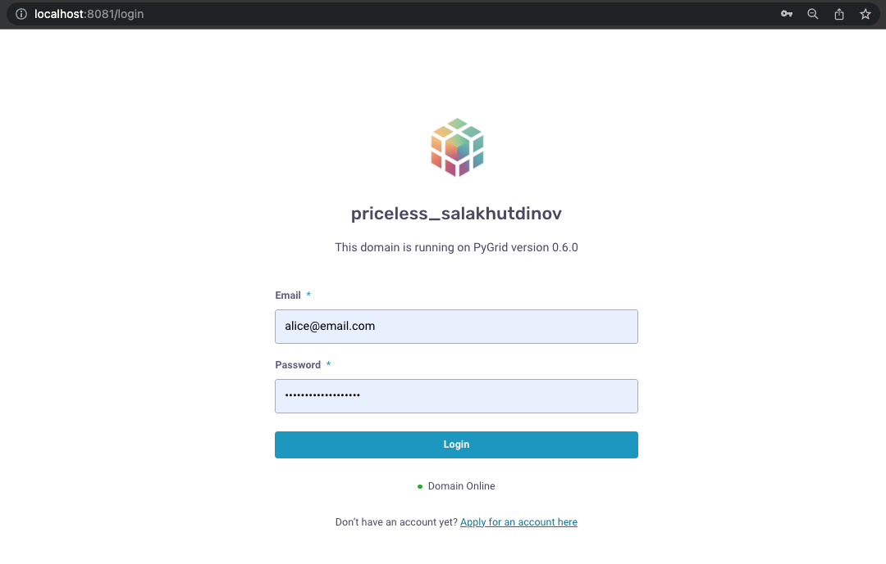
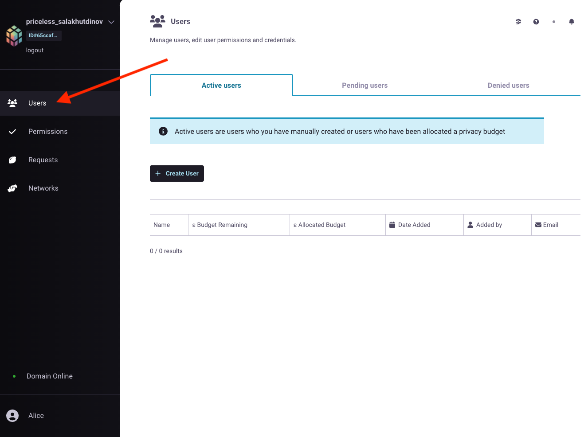
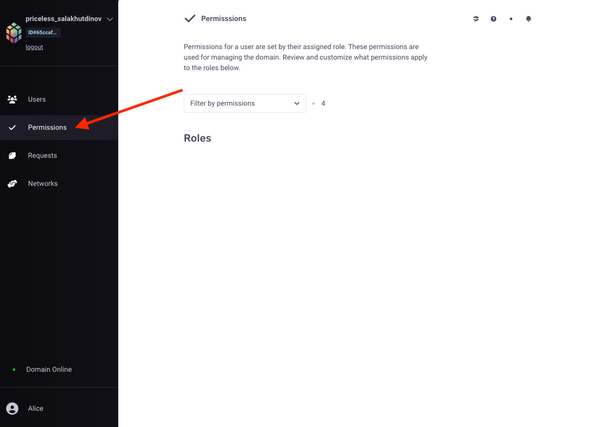
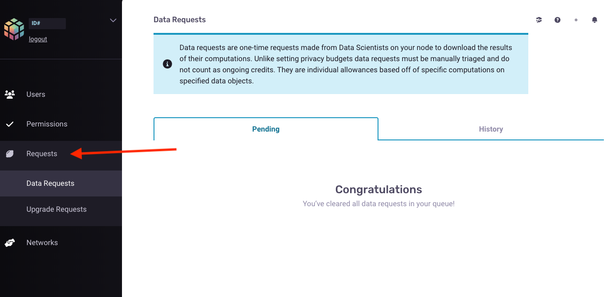
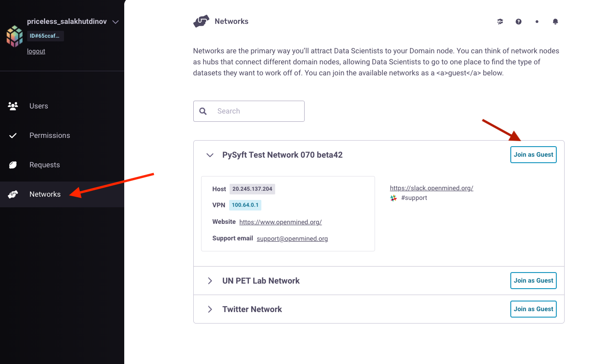

Connecting to a Domain Server
====================================

**Data Scientist Tutorials**

◻️ 00-connect-to-domain👈

◻️ 01-search-for-datasets
 
.. note:: 
   **TIP:** To run this tutorial interactively in Jupyter Lab on your own machine type:

:: 
   
   pip install -U hagrid
   hagrid quickstart data-scientist

Data Scientists are end users who desire to perform ``computations`` or ``answer`` a specific question 
using one or more data owners' datasets. The very first thing Data Scientists have to do is ``login`` 
and ``connect`` to the Domain Server of their organization's private data server. Today's tutorial shows 
how Data Scientists can connect to an organization's private data servers using ``PyGrids UI``.  

For connecting to a Domain Server, we will use PyGrid's UI interface with the login credentials 
assigned by the Domain Owners. By default, the Data Scientists have the lowest level of ``permission`` 
to access the data (which means data is highly private) and will be assigned a Privacy Budget of ``0``.

.. note::
   Check out this tutorial to understand how Domain Owners 
   can :doc:`create a user account <../data-owner/02-create-account-configure-pb>` on their Domain Servers.

   Throughout the tutorials, we also mean Data Scientists
   whenever we refer to users. Both are used interchangeably.

Steps to Connect to a Domain Server
-------------------------------------

📒 Overview of this tutorial:  

#. **Obtain** the Login Credentials
#. **Login** to your Server
#. **Explore** the User HomePage

.. _step-ds-1:

Step 1: Obtain the Login Credentials
~~~~~~~~~~~~~~~~~~~~~~~~~~~~~~~~~~~~~~

To utilize the ``privacy-enhancing`` features and play around with different ``privacy budgets``, 
Data Scientists must first get their login ``credentials``, using which they can login into their 
organization's private data servers. Here are a few points to follow to get your login credentials:

* If your account was created by the Domain Owners within your organization, you could ask them to 
  securely ``share`` the credentials with you. If you do not have a domain owner, you can ``create`` 
  one locally following the tutorials starting here: `Deploy your own Domain Server <../data-owner/00-deploy-domain.html>`_.
  
* You can also signup or create an account on a Domain node if you have access to the ``URL`` to the Domain. 
  To ``register`` yourself to the Domain, you need to run the following code:

.. WARNING::
   Change the default username and password below to a more secure and private combination of your preference.

::

   '''
   Name: Name of the Data Scientist
   Email: Email of the Data Scientist
   Password: A secured password to log into the Domain
   Url: Url to the domain node.
   Port: Port number
   '''

   In:

   # run this cell
   import syft as sy
   domain_client = sy.register(
      name="Alice",
      email="alice@email.com",
      password="supersecurepassword",
      url="localhost",
      port=8081
   )

.. note::
   By default, the role assigned to the registered user is of a Data Scientist, and the assigned privacy budget is 0.

Step 2: Login to your Server
~~~~~~~~~~~~~~~~~~~~~~~~~~~~~~~~

Once you have your login credentials, you can ask your Domain Owner to provide you with the link to the ``URL`` to access your Domain.

.. WARNING:: 
   If you do not have a domain owner, you can ``create`` one locally following the tutorials 
   starting here: `Deploy your own Domain Server <../data-owner/00-deploy-domain.html>`_.

Using the link, you can visit the Data Scientists ``login page``, as shown in the image below.

|00-connect-to-domain-01|

The ``Email`` and ``Password`` are your login credentials which you already have if you executed :ref:`Step 1 <step-ds-1>` above.

Once we're ``logged`` in, you can move to the next section, which ``explores`` the user homepage.

Step 3: Explore the User HomePage
~~~~~~~~~~~~~~~~~~~~~~~~~~~~~~~~~~~

When you login, the first page seen by the Data Scientists is the ``User`` homepage.

When on this page, you can ``create`` an account for other team members within your organization and 
check the requests for ``pending`` users and ``denied`` users. Also, it gives you information like privacy budget 
allocated, date added, email, and the name of other users in a table-like format.

|00-connect-to-domain-02|

In the next section, you can set ``permissions`` for a user by their assigned roles. There are different ``roles`` 
and their associated permissions, but you are restricted to managing the Domain as a user. You can ``review`` and 
``customize`` what permissions apply to the roles on this page. 

|00-connect-to-domain-03|

``Data requests`` are one-time requests made by Data Scientists on the organization's Domain Node 
to ``download`` the results of their computations. Unlike setting privacy budgets, data requests must 
be manually triaged and do not count as ongoing credits. They are individual ``allowances`` based off 
of specific computations on specified ``data objects``.

On this page, you can check the ``pending`` data requests in your queue and the ``status`` of users' past data requests.

|00-connect-to-domain-04|

``Networks`` are the primary way to ``connect`` Data Scientists to any organization's Domain Node. Users 
can join any public network and find the type of ``datasets`` they want to work on. They can search and 
approve bulk project requests to simultaneously participate in a project across groups of domains. 

Once the user agrees to the ``Network Agreements``, they can ``explore`` and ``analyze`` the ``datasets`` hosted 
by the Domain Owners. In the image below are the three public domains that Data Scientists can join as 
a ``guest``; alternatively, they can search for their preferred Domain using the search bar.

|00-connect-to-domain-05|

Awesome 👏 You have now successfully connected to a Domain Node !! 
~~~~~~~~~~~~~~~~~~~~~~~~~~~~~~~~~~~~~~~~~~~~~~~~~~~~~~~~~~~~~~~~~~~~~~

What's Next? 
---------------
Alright, now that you are connected to a Domain node, we would first like to look for the 
available datasets on the public network which users can join. 

   The following tutorial will show how Data Scientists can search for a dataset on the Domain Node. 

.. |00-connect-to-domain-00| image:: ../../_static/personas-image/data-scientist/00-connect-to-domain-00.png
   :width: 95%

