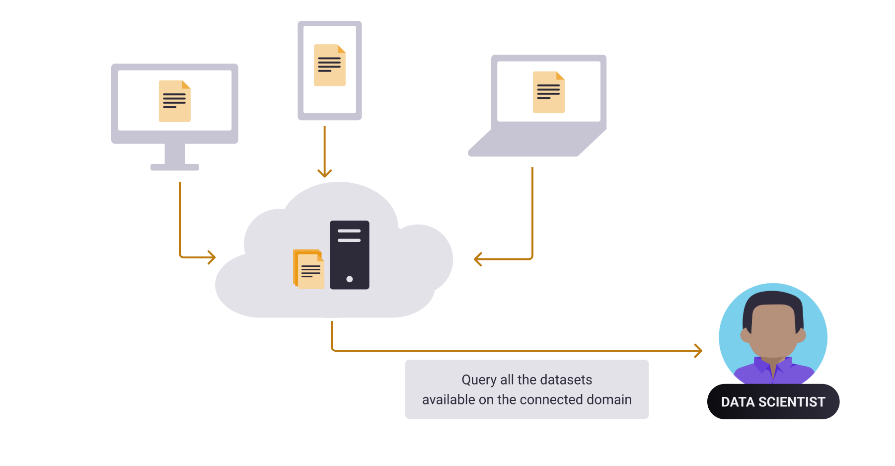
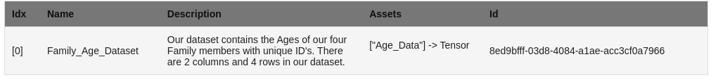

Search for Datasets a Domain Server
============================================================

**Data Scientist Tutorials**

☑️ 00-connect-to-domain

◻️ 01-search-for-datasets👈
 
.. note:: 
   **TIP:** To run this tutorial interactively in Jupyter Lab on your own machine type:

:: 
   
   pip install -U hagrid
   hagrid quickstart data-scientist

In the last tutorial, you learned :doc:`How to Connect to a Domain Server <00-deploy-domain>`
that allows us to connect to your organization’s private data servers.

Once we are connected to the data servers, the first thing that we 
would like to do is to look for the available datasets on it. This 
is exactly what we are going to cover in this tutorial.

After today’s tutorial, you will learn how to ``search for datasets`` 
on the ``domain node`` you are connected to. 

   **Note:** Throughout the tutorials, we mean Domain Servers
   whenever we refer to Domain Node. Both point to the same and are used
   interchangeably.

Steps to Search for Datasets on a Domain
---------------------------

📒 Overview of this tutorial:  

#. **Login** to the Domain 
#. **List** the Datasets on the Domain 
#. **Choose** a Dataset
#. **Preview** the Description of the chosen Dataset

|01-upload-data-00|

Step 1: Import Syft
~~~~~~~~~~~~~~~~~~~

To utilize the privacy-enhancing features offered in PyGrid and to 
communicate with your domain node, you must first ``import`` OpenMined's 
``private`` deep learning library: PySyft.

Let's import Syft by running the below cell:

::

   In:
   # run this cell

   import syft as sy
   print("Syft is imported")

   # If Syft is not installed. Please use the 🧙🏽‍♂️ Install Wizard above

   Out: Syft is imported

Step 2: Log into Domain
~~~~~~~~~~~~~~~~~~~~~~~~~~~~

Let's login to our Domain with the credentials provided to you by a domain owner. 
If you do not have a domain owner, you can create one locally for yourself following 
the tutorials starting here: `data-owner/00-deploy-domain <../data-owner/00-deploy-domain.html>`_.

To login to your Domain node, you will need to define which Domain you are logging into and who you are. 
In this case, it will take the form of:

* IP Address and Port of the domain host
* Your user account Email and Password

.. warning::
    Make sure to use the Data Scientist credentials provided to you.

::

   In:

   # Modify the port, email, and password accordingly! We are using the ones that will be generated for those who followed the Data-Owner tutorials and are now here.
   domain_client = sy.login(
      url="localhost",
      port=8081,
      email="jane@email.com",
      password="supersecurepassword"
   )

   Out:
    Connecting to <IP-Address>... done! Logging into <domain-name>... done!

Amazing :) You have just logged in to your Domain and have a domain client with us to explore further.

Step 3: Search for Datasets on the Domain
~~~~~~~~~~~~~~~~~~~~~~~

Now that we have an authenticated domain client with 
us, we will look out for the datasets available 
on this domain with the following command:

::

   In:
   domain_client.datasets

|01-upload-data-01-datasets|

This should show you all the available datasets 
on the domain node along with its own metadata for 
each of the datasets.

Step 4: Select a Dataset and Preview It
~~~~~~~~~~~~~~~~~~~~~~~~~~~~~~~~~~~~~~

Now that we can view the available datasets, we 
can fetch a dataset using the index within the 
datatsets list and store a pointer to (here 
called family_age_dataset) to refer to it easily afterwords.

::

   In: 

    family_age_dataset=domain_client.datasets[0]
    family_age_dataset

|01-upload-data-02-pointer-to-dataset|

.. note::
    Note: We are assuming that you are following the 
    data-owner tutorial hence we are naming as well 
    as selecting the family-age dataset. Feel free to 
    change the variable accordingly for easier 
    readability based on your use case.

Awesome 👏 !!
~~~~~~~~~~~~~~~~~~~~~~~~~~~~~~~~~~~~~~~~~~~~~~~~~~~~~~~~~~~~~~~~~~~~~~
You have fetched all the available datasets, created a pointer for one of them and preview it!

Now that we have a pointer to a dataset on the domain, we are one step 
close to performing remote data science and perform various methods.

What’s Next? 
------------
Alright, so now is the perfect time to utilize the pointer we just created 
to a dataset and explore it in detail and see the amazing operations that we 
can perfrom on it.

   In the following tutorial, we will see how Data Scientists can explore
   a dataset securely.

.. |01-upload-data-02-pointer-to-dataset| image:: ../../_static/personas-image/data-scientist/01-search-for-datasets-02-pointer-to-dataset.png
  :width: 95%
