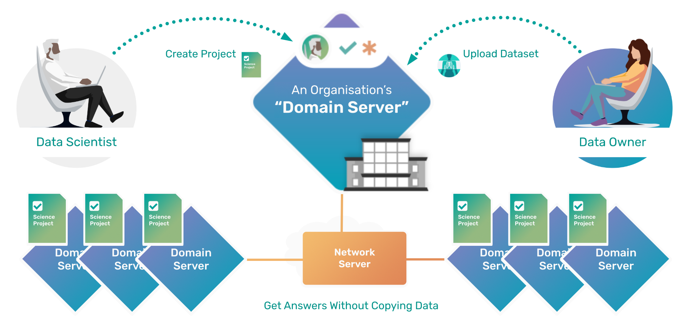

.. _resources:

.. toctree::
   :maxdepth: 3

How-to Guides
======================
``Syft`` is OpenMined's ``open source`` stack that provides ``secure`` and ``private`` Data Science 
in Python. Syft decouples ``private data`` from model training, using techniques 
like `Federated Learning <https://ai.googleblog.com/2017/04/federated-learning-collaborative.html>`_, 
`Differential Privacy <https://en.wikipedia.org/wiki/Differential_privacy>`_, and 
`Encrypted Computation <https://en.wikipedia.org/wiki/Homomorphic_encryption>`_. 
This is done with a ``numpy``-like interface and integration with ``Deep Learning`` 
frameworks, so that you as a ``Data Scientist`` can maintain your current workflow 
while using these new ``privacy-enhancing techniques``.

|index-00|

.. note:: 
   **TIP:** To run all the tutorials interactively in Jupyter Lab on your own machine, type:

:: 
   
   pip install -U hagrid
   hagrid quickstart

Once you have the installation completed, the best place to start is by ``identifying`` your role. 

A. Getting Started with Data Owner 👨🏻‍💼
--------------------------------------
Data Owners provide ``datasets`` which they would like to make available for ``study`` by 
an ``outside party`` they may or may not ``fully trust`` has good intentions.

You Will Learn ⬇️
""""""""""""""""""""
    
| :doc:`Part 1: Deploying your own Domain Server <data-owner/00-deploy-domain>`
| :doc:`Part 2: Uploading Private Data to a Domain Server <data-owner/01-upload-data>`
| :doc:`Part 3: Creating User Accounts on your Domain Server <data-owner/02-create-account-configure-pb>`
| :doc:`Part 4: Joining a Network <data-owner/03-join-network>`
| :doc:`Part 5: Creating a Network <04-create-network>`
| :doc:`Part 6: Configuring Privacy Budget on your Domain Server <05-configure-pb>`

B. Getting Started with Data Scientist 👩🏽‍🔬
------------------------------------------
Data Scientist's are end ``users`` who desire to perform ``computations`` or ``answer`` a 
specific ``question`` using one or more data owners' ``datasets``.

You Will Learn ⬇️
""""""""""""""""""""

| :doc:`Part 7: Connect to a Domain`
| :doc:`Part 8: Searching for Datasets on the Domain`
| :doc:`Part 9: Exploring a Dataset in the Domain`
| :doc:`Part 10: Training a Model`
| :doc:`Part 11: Retrieving Secure Results <>`

.. dropdown:: More Tutorials 📝
    :animate: fade-in
    This set of tutorials is for ``Data Engineers`` 👩‍💻 who want to learn to ``deploy`` Syft for ``production``.

    | :doc:`Part 12: How to setup development mode locally`
    | :doc:`Part 13: How to deploy Syft to the Microsoft Azure Platform`
    | :doc:`Part 14: How to deploy Syft to Google Cloud Platform (GCP)`
    | :doc:`Part 15: How to deploy Syft to Kubernetes Cluster`

