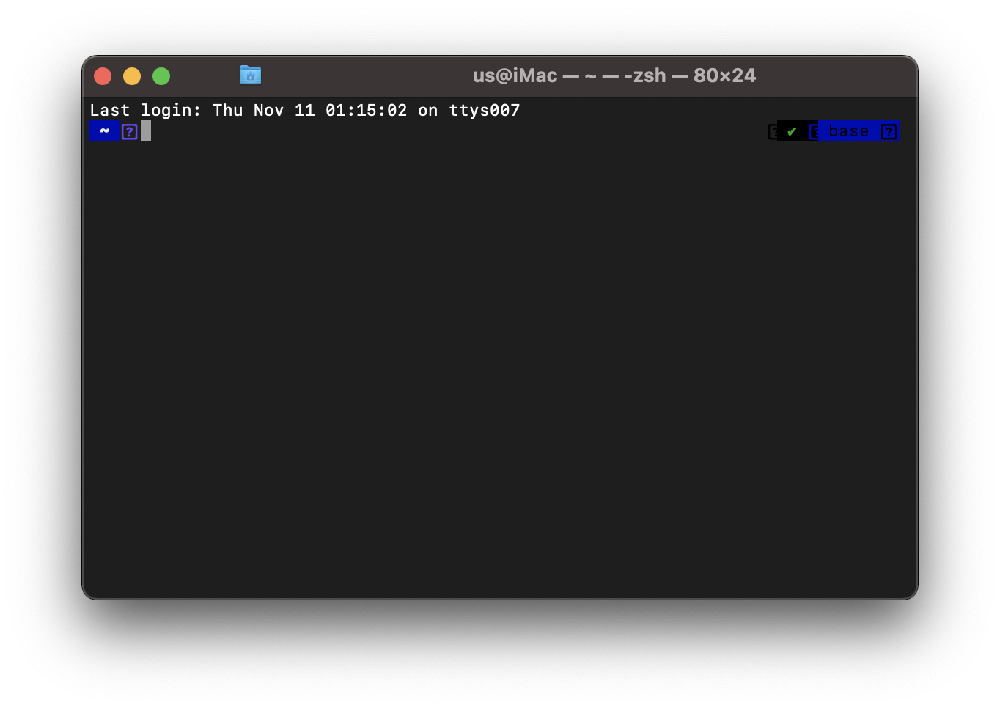

OSX Tutorial (Big Sur - 11.5.1)
*******************************

Welcome to the beginner installation tutorial for domain deployment on your personal OSX machine!

Step 1: Double check OSX version (optional)
===========================================
Before you complete this tutorial, let's make sure you're running the right version of
OSX. Click the Apple logo at the top left corner, then click "About this Mac" and you'll
see something like:

|find_osx_version|

See where this image says "11.5.1"? Yours should say the same! If it does, then you're
ready to begin!

Step 2: Open Terminal
=====================

Almost every step of this tutorial will be ocurring within the Terminal app of OSX. Start by
opening up the Terminal application by typing <Command-Space> and typing "Terminal". Then hit <Enter>.
When Terminal opens, it should look something like this (colors may differ).

|osx_terminal|

If you see something like this (again... colors my differ), then you're all set to proceed to the next step!

Step 3: Open Terminal
=====================

.. |find_osx_version| image:: ../_static/install_tutorials/find_osx_version.png
   :width: 50%