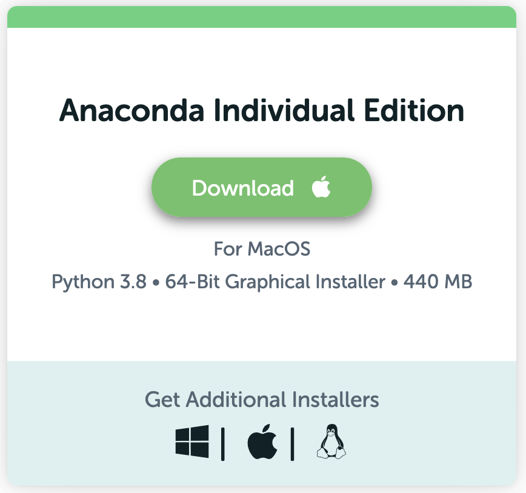
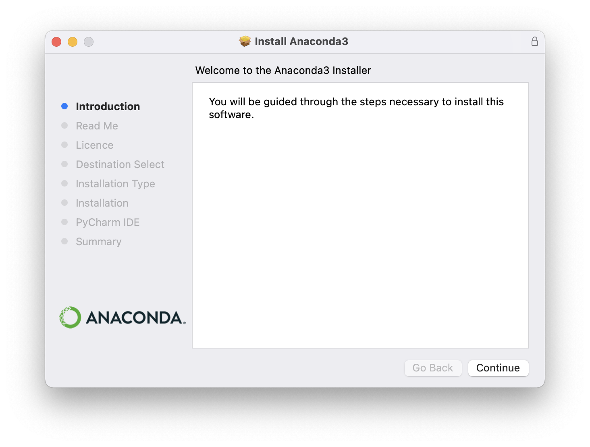
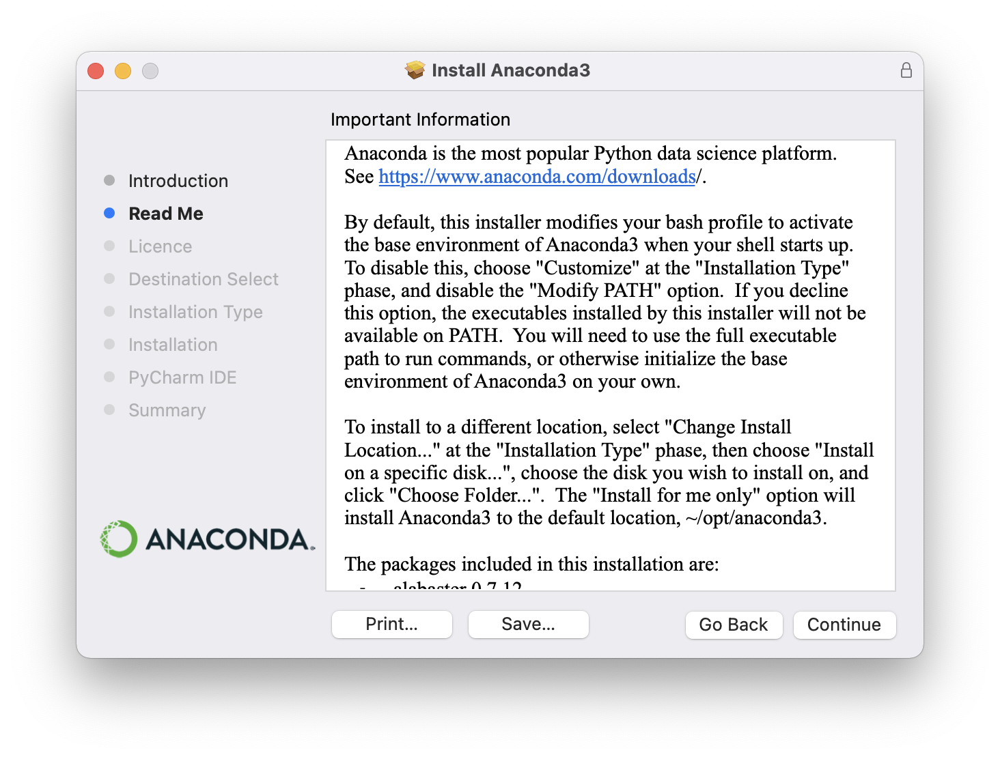
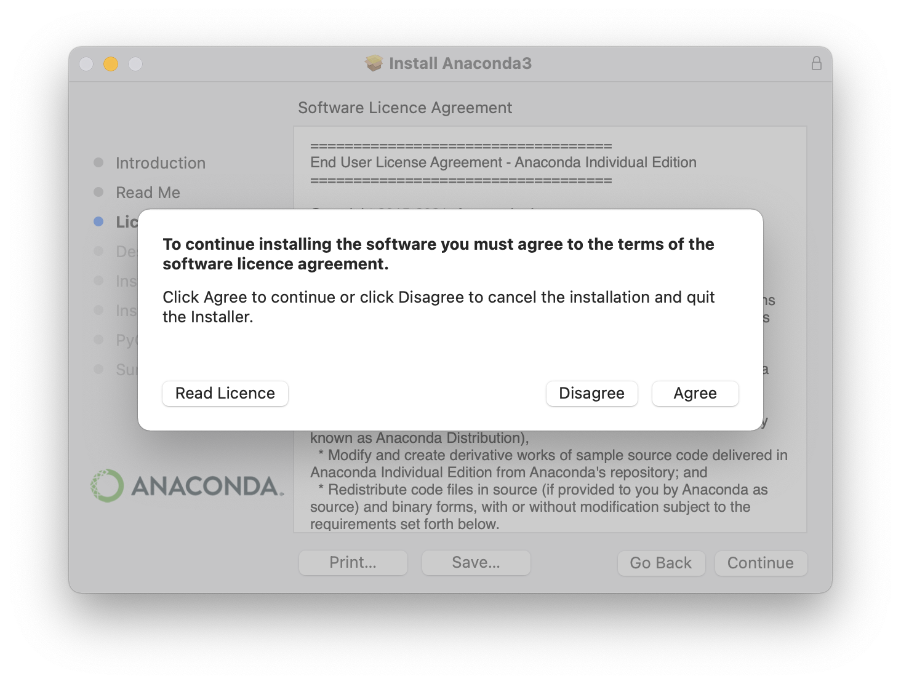
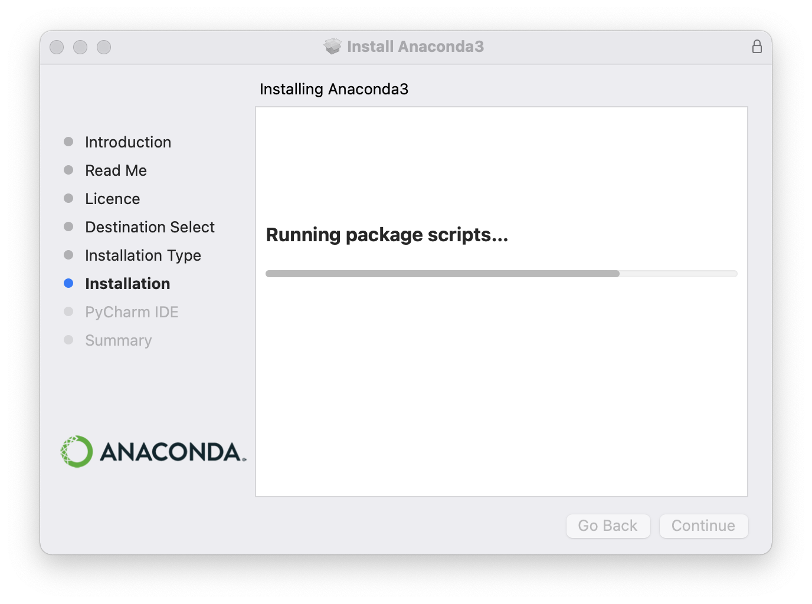
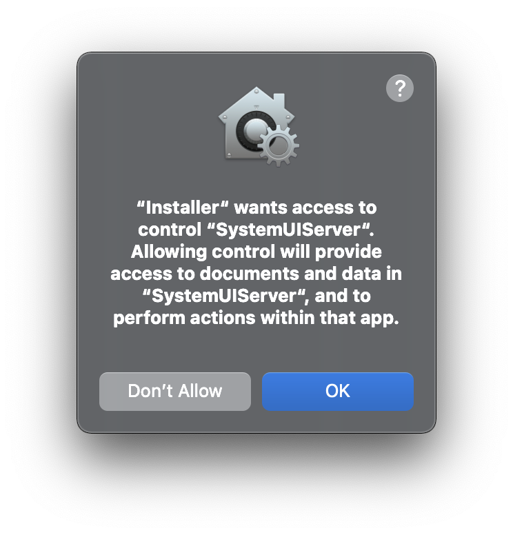
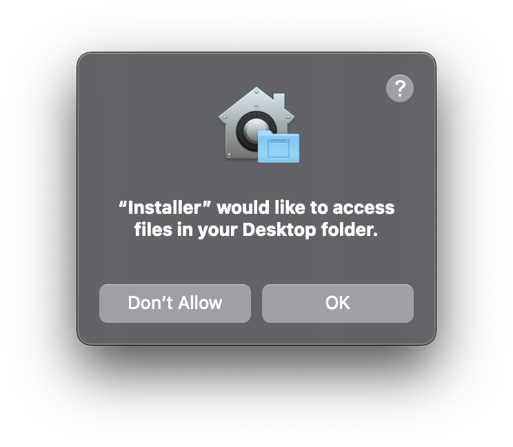

OSX Tutorial (Big Sur - 11.5.1)
*******************************

Welcome to the beginner installation tutorial for domain deployment on your personal OSX machine!

Step 1: Double check OSX version (optional)
===========================================
Before you complete this tutorial, let's make sure you're running the right version of
OSX. Click the Apple logo at the top left corner, then click "About this Mac" and you'll
see something like:

|find_osx_version|

See where this image says "11.5.1"? Yours should say the same! If it does, then you're
ready to begin!

Step 2: Open Terminal
=====================

Almost every step of this tutorial will be ocurring within the Terminal app of OSX. Start by
opening up the Terminal application by typing <Command-Space> and typing "Terminal". Then hit <Enter>.
When Terminal opens, it should look something like this (colors may differ).

|osx_terminal|

If you see something like this (again... colors my differ), then you're all set to proceed to the next step!

Step 3: Install Conda
=====================

(These steps are from https://docs.anaconda.com/anaconda/install/mac-os/ and are copied here
for your convenience and clarity. If any part of your installation doesn't work, please fall
back on the official documentation page.).

* Step 3.1: Open Anaconda Installer download page by clicking `here <https://www.anaconda.com/products/individual#macos#>`__.
* Step 3.2: Find the big green "Download" button and click it. It looks like this:

    |conda_button|

* Step 3.3: When prompted with the download, click 'Save' (saving to your Desktop is fine)

    |click_save|

* Step 3.4: Navigate to where you saved the file (probably either your Desktop or Downloads folder), and double click the icon.

    When you do so, you might see a warning like the following:

    |conda_icon|

    If so, just click 'Allow' and then you'll see a screen like:

    |conda_install_1|

* Step 3.5: Click "Continue" and you'll see a screen like this:

    |conda_install_2|

* Step 3.6: Click "Continue" and you'll see a screen like this:

    |conda_install_3|

* Step 3.6: Click "Continue" and you'll see a screen like this:

    |conda_install_4|

* Step 3.6: Click "Accept" and you'll see a screen like this:

    |conda_install_5|

* Step 3.6: Click "Install" and you'll see a screen like this:

    |conda_install_6|

    After a moment or two a popup will appear like this:

    |conda_install_6_popup|

    Click "OK" and keep waiting...

    After a moment or two a popup *might* appear like this:

    |conda_install_6_popup_access|

    Click "OK" and keep waiting...

    While you wait... if you see a dialog like this...

    |conda_install_6_popup_already_installed|

    Then you already have conda installed. Click "OK" and then click "Continue"
    until the installation dialog finishes (It'll tell you the installation "Failed"
    but that's only because you already have conda installed. ) and then proceed to
    Step 4 of this tutorial.

    If, however, you didn't get a warning saying that conda was already installed,
    proceed to step 3.7.

* Step 3.7: Keep waiting until the window changes to this:

    |conda_install_7|

* Step 3.8: Click "Continue" and you'll see a screen like this:

    |conda_install_8|

    CONGRATULATIONS!!!! You installed Anaconda!!! You may click the "Close" button and
    proceed to Step 4.

Step 4: Activate Conda Environment
==================================

* Step 4.1: If you have the 'Terminal' app open from Step 2. Quit it (CMD-Q) and re-open it using the same
technique you used in Step 2 to open the application. (This is to ensure that Terminal is
aware of your new conda installation.)

* Step 4.2: 

.. |osx_terminal| image:: ../_static/install_tutorials/osx_11_5_1_empty_terminal.png
   :width: 50%

.. |find_osx_version| image:: ../_static/install_tutorials/find_osx_version.png
   :width: 50%

.. |click_save| image:: ../_static/install_tutorials/osx_11_5_1_click_save.png
   :width: 50%

.. |conda_icon| image:: ../_static/install_tutorials/osx_11_5_1_conda_icon.png
   :width: 50%

.. |conda_install_3| image:: ../_static/install_tutorials/osx_11_5_1_conda_install_3.png
   :width: 50%

.. |conda_install_5| image:: ../_static/install_tutorials/osx_11_5_1_conda_install_5.png
   :width: 50%

.. |conda_install_6_popup_already_installed| image:: ../_static/install_tutorials/osx_11_5_1_conda_install_6_popup_already_installed.png
   :width: 50%

.. |conda_install_7| image:: ../_static/install_tutorials/osx_11_5_1_conda_install_7.png
   :width: 50%

.. |conda_install_8| image:: ../_static/install_tutorials/osx_11_5_1_conda_install_8.png
   :width: 50%