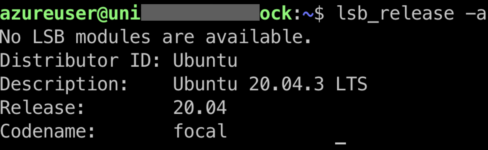

Beginner-level PySyft and PyGrid Installation Tutorials
*******************************************************

.. toctree::
   :maxdepth: 3

Welcome to the domain deployment installation tutorials!
This section of our documentation is designed to be the
simplest way to get you started deploying a PyGrid Domain
to an OSX, Linux, or Windows machine and interacting with it
as a data scientist using PySyft. If you're looking
for cloud deployment, or more advanced tutorials such as
ansible, vagrant, kubernetes, or virtualbox deployment, please see the
`advanced deployment documentation <https://openmined.github.io/PySyft/deployment/index.html#>`__.

The purpose of these tutorials is to help you install everything
you need to run a Domain node from your personal machine (such
as if you're running through OpenMined
`courses <https://courses.openmined.org/#>`__
or
`tutorials <https://github.com/OpenMined/PySyft/tree/dev/notebooks#>`__).
To that end, we will also be installing everything you might need to run Jupyter
notebooks with PySyft installed, such as if you're pretending to be
both Data Owner and Data Scientist as a part of a tutorial or course.

Step 1: Are you on OSX, Windows, or Linux?
==========================================

Installation differs greatly depending on whether your personal machine is
running OSX, Linux, or Windows. PySyft and PyGrid are relatively new pieces
of software so not all versions of these are supported. However, the first
step of your journey is to figure out which operating system you are running
and choose the right tutorial for installation. Then within the dropdowns below,
choose which version is right for you. Once you've found the right version,
and completed the tutorial for that version, you'll be all done!!! Good luck!

There are 3 types of operating systems for you to choose from: OSX, Linux, and Windows.

OSX Tutorials
~~~~~~~~~~~~~

If you know you're running OSX but you're not sure what version you're running,
click the Apple logo at the top left corner, then click "About this Mac" and you'll
see something like:

|find_osx_version|

See where this image says "11.5.1"? Figure out what number yours says in that place
and use that number to determine which of these installation tutorials you should
follow to complete your installation. If you don't see your number, choose the
closest that you can.

#. `Big Sur (11.5.1) <https://openmined.github.io/PySyft/install_tutorials/osx_11_5_1.html#>`__.

Linux Tutorials
~~~~~~~~~~~~~~~

If you know that you're running Linux but you're not sure what version you're running,
open up a command line and type:

.. code-block:: bash

  $ lsb_release -a

Which should print something like the following:

|find_ubuntu_version|

See where this image says "20.04.3"? Figure out what number yours says in that place

#. `Ubuntu (20.04.3 - Focal Fossa) <https://openmined.github.io/PySyft/install_tutorials/linux.html##>`__.

Windows Tutorials
~~~~~~~~~~~~~~~~~

If you know that you're running Windows but you're not sure what version you're running,
press (Windows Key + R) and then in the text box that appears type:

.. code-block:: bash

  $ winver

and hit (Enter)! This should print something like the following:

|find_windows_version|

See where this image says "Windows 10" and "20H2"? Figure out what numbers yours says in those place
and use those number to determine which of these installation tutorials you should
follow to complete your installation. If you don't see one of your numbers, choose the
closest that you can.

#. `Windows 10 (20H2) <https://openmined.github.io/PySyft/install_tutorials/windows.html>`__.

Best of luck on your journey!

.. |find_osx_version| image:: ../_static/install_tutorials/find_osx_version.png
   :width: 50%

.. |find_windows_version| image:: ../_static/install_tutorials/find_windows_version.png
   :width: 50%
