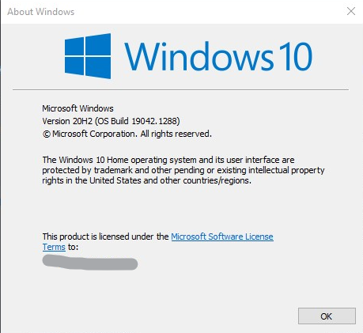

Windows Tutorials
*****************

If you know that you're running Windows but you're not sure what version you're running,
press (Windows Key + R) and then in the text box that appears type:

.. code-block:: bash

  $ winver

and hit (Enter)! This should print something like the following:

|find_windows_version|

See where this image says "Windows 10" and "20H2"? Figure out what numbers yours says in those place
and use those number to determine which of these installation tutorials you should
follow to complete your installation. If you don't see one of your numbers, choose the
closest that you can.

#. Windows 10 (20H2)
#. Older versions

