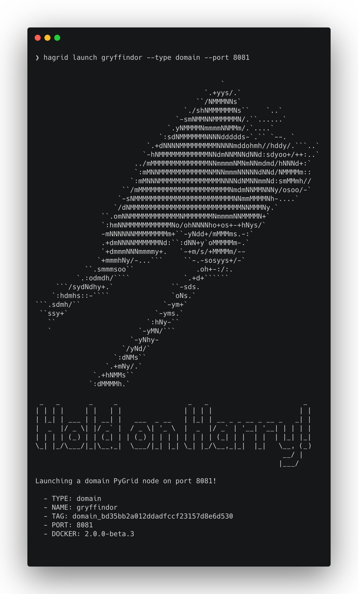

# hagrid

Use this cli to deploy PyGrid Domain and Network nodes on your local machine.

A Hagrid is a HAppy GRID!

## Installation Linux and MacOS

Python

```
$ pip install hagrid
```

Docker

```
$ docker run -it -v ~/:/root openmined/hagrid:latest hagrid
```

Then simply run hagrid as you would normally:

```
$ docker run -it -v ~/:/root openmined/hagrid:latest hagrid launch slytherin to azure
```

## Installation Windows

Requirements:

- docker
- git
- ssh-keygen

### Docker

You can manually install Docker Desktop: https://www.docker.com/products/docker-desktop

or alternatively use the windows package manager `chocolatey`.

### Chocolatey

To install `chocolatey` you need to open "Windows PowerShell" in Administrator mode.
You can type `powershell` into the search bar and right-click and select "Run as administrator".
Then copy and paste this command and run it.

Run this inside PowerShell (Admin Mode):

```powershell
Set-ExecutionPolicy Bypass -Scope Process -Force; [System.Net.ServicePointManager]::SecurityProtocol = [System.Net.ServicePointManager]::SecurityProtocol -bor 3072; iex ((New-Object System.Net.WebClient).DownloadString('https://chocolatey.org/install.ps1'))
```

You should now be able to type: `choco` in PowerShell terminal to use the tool.

### Docker with Chocolatey

To install Docker Desktop with chocolatey run this inside PowerShell (Admin Mode):

```powershell
choco install docker-desktop -y
```

You will likely need to restart after installing Docker Desktop for the first time.

### Docker Backend

Docker on Windows has two possible backends, one which uses a virtual machine and the other which uses Windows Subsystem for Linux 2.

Try running Docker Desktop and seeing that it starts.
If you get an error saying "Docker failed to initialize" you may not have Virtualization enabled.
Either have it enabled in your BIOS if your CPU supports it, or you may need to use the Windows Subsystem for Linux 2 backend.

To install WSL2 with chocolately run this inside PowerShell (Admin Mode):

```powershell
choco install wsl2 -y
```

After this you should be able to start Docker Desktop.

### Enable Docker Compose v2

Inside Docker Desktop click on the settings wheel in the top right.
Click on the menu item "Experimental Features" on the left.
Check the box that says: "Use Docker Desktop V2".

## SSH Keys

HAGrid allows you to select an SSH key, to setup a remote node. When using Docker on Windows we recommend you mount your Users %USERPROFILE% directory into the container so that any keys you already have can be accessed. If you have a key inside C:\Users\John Smith\.ssh\mykey.pem then when asked for the path to your key you would enter: `~/mykey.pem`.

If HAGrid complains that you have no key, you can always generate one using the ssh-keygen.exe tool.

To generate a key using ssh-keygen run in a Powershell:

```
ssh-keygen
```

Unless you know what the options are simply pressing enter and going with the defaults is perfectly fine.
This will create a file called `~/.ssh/id_rsa` which is also the default that HAGrid asks you if you want to use.

## Run HAGrid Docker Container

```powershell
docker run -it -v "$($env:USERPROFILE):/root" openmined/hagrid:latest hagrid
```

Then simply run hagrid as you would normally:

```powershell
docker run -it -v "$($env:USERPROFILE):/root" openmined/hagrid:latest hagrid launch slytherin to azure
```

## Development

#### Step 1 Dev Setup

If you want hagrid to launch nodes based on your live-updating codebase, then install it using one of the live-updating install commands. This will mean that the codebase will hot-reload based on the current project.

```bash
pip install -e .
```

## Launch a Node



## A Few Example Commands

Start a node with:

```bash
hagrid launch slytherin
```

... and then stop it with:

```bash
hagrid land slytherin
```

You can specify ports if you want to:

```bash
hagrid launch hufflepuff_house to docker:8081+
```

... but if you don't it'll find an open one for you

```bash
// finds hufflepuff already has 8081... tries 8082
hagrid launch ravenclaw
```

You can also specify the node type (domain by default)

```bash
hagrid launch gryffendor network to docker
```

## Credits

**Super Cool Code Images** by [Carbon](https://carbon.now.sh/)
