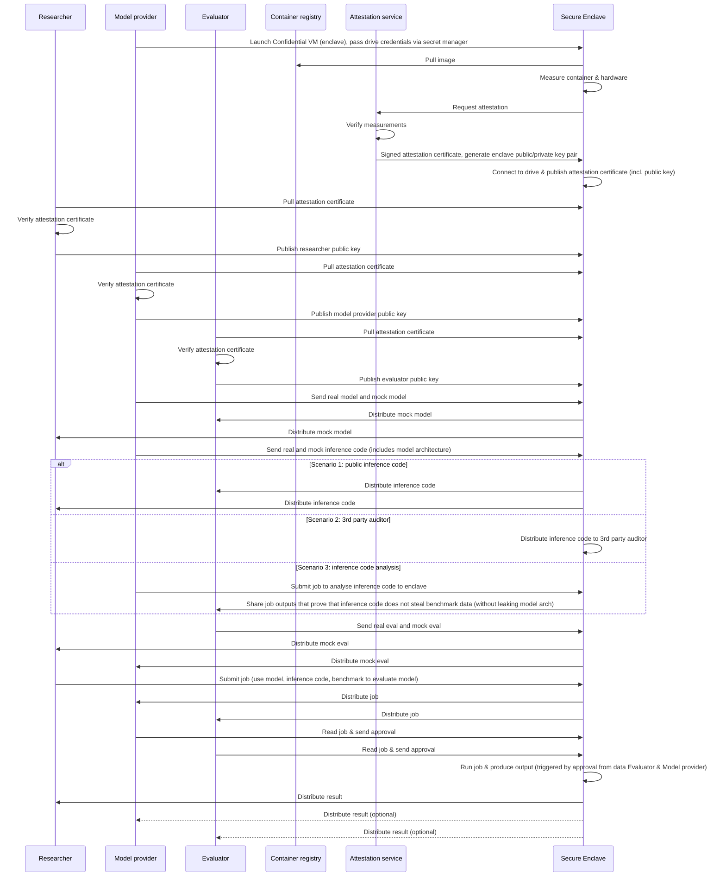

# Enclave full flow sequence diagram

```mermaid
sequenceDiagram
    participant R as Researcher
    participant MP as Model provider
    participant EV as Evaluator
    participant CR as Container registry
    participant AS as Attestation service
    participant SE as Secure Enclave

    %% --- Enclave launch & attestation ---
    MP->>SE: Launch Confidential VM (enclave), pass drive credentials via secret manager
    SE->>CR: Pull image
    SE->>SE: Measure container & hardware
    SE->>AS: Request attestation
    AS->>AS: Verify measurements
    AS->>SE: Signed attestation certificate, generate enclave public/private key pair
    SE->>SE: Connect to drive & publish attestation certificate (incl. public key)

    %% --- Parties verify attestation & publish their public keys ---
    R->>SE: Pull attestation certificate
    R->>R: Verify attestation certificate
    R->>SE: Publish researcher public key

    MP->>SE: Pull attestation certificate
    MP->>MP: Verify attestation certificate
    MP->>SE: Publish model provider public key

    EV->>SE: Pull attestation certificate
    EV->>EV: Verify attestation certificate
    EV->>SE: Publish evaluator public key

    %% --- Model provider submits model & inference code ---
    MP->>SE: Send real model and mock model
    SE->>EV: Distribute mock model
    SE->>R: Distribute mock model
    MP->>SE: Send real and mock inference code (includes model architecture)

    alt Scenario 1: public inference code
        SE->>EV: Distribute inference code
        SE->>R: Distribute inference code
    else Scenario 2: 3rd party auditor
        SE->>SE: Distribute inference code to 3rd party auditor
    else Scenario 3: inference code analysis
        MP->>SE: Submit job to analyse inference code to enclave
        SE->>EV: Share job outputs that prove that inference code does not steal benchmark data (without leaking model arch)
    end

    %% --- Evaluator submits eval ---
    EV->>SE: Send real eval and mock eval
    SE->>R: Distribute mock eval
    SE->>MP: Distribute mock eval

    %% --- Researcher job: model + inference code + benchmark ---
    R->>SE: Submit job (use model, inference code, benchmark to evaluate model)
    SE->>MP: Distribute job
    SE->>EV: Distribute job
    MP->>SE: Read job & send approval
    EV->>SE: Read job & send approval
    SE->>SE: Run job & produce output (triggered by approval from data Evaluator & Model provider)
    SE->>R: Distribute result
    SE-->>MP: Distribute result (optional)
    SE-->>EV: Distribute result (optional)
```
