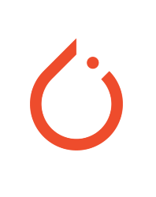
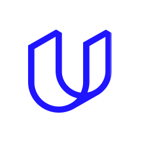
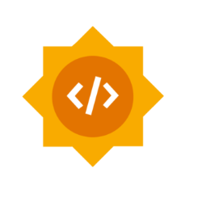
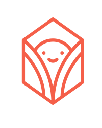

<h1 align="center">

   
  
   
  A library for computing on data  you do not own and cannot see
   

</h1>

     
 
  

  

# PySyft is a Python library for secure and private Deep Learning.

PySyft decouples private data from model training, using
[Federated Learning](https://ai.googleblog.com/2017/04/federated-learning-collaborative.html),
[Differential Privacy](https://en.wikipedia.org/wiki/Differential_privacy),
and Encrypted Computation (like
[Multi-Party Computation (MPC)](https://en.wikipedia.org/wiki/Secure_multi-party_computation)
and [Homomorphic Encryption (HE)](https://en.wikipedia.org/wiki/Homomorphic_encryption))
within the main Deep Learning frameworks like PyTorch and TensorFlow. Join the movement on
[Slack](http://slack.openmined.org/).

---

Most software libraries let you compute over the information you own and see inside of machines you control. However, this means that you cannot compute on information without first obtaining (at least partial) ownership of that information. It also means that you cannot compute using machines without first obtaining control over those machines. This is very limiting to human collaboration and systematically drives the centralization of data, because you cannot work with a bunch of data without first putting it all in one (central) place.

The Syft ecosystem seeks to change this system, allowing you to write software which can compute over information you do not own on machines you do not have (total) control over. This not only includes servers in the cloud, but also personal desktops, laptops, mobile phones, websites, and edge devices. Wherever your data wants to live in your ownership, the Syft ecosystem exists to help keep it there while allowing it to be used privately for computation.

# Quickstart

✅ `Linux` ✅ `macOS`\* ✅ `Windows`†‡

1. Install our handy 🛵 cli tool which makes deploying a Domain or Network server a one-liner:  
   `pip install -U hagrid`

2. Then run our interactive jupyter Install 🧙🏽‍♂️ WizardBETA:  
   `hagrid quickstart`

- In the tutorial you will learn how to install and deploy:  
  `PySyft` = our `numpy`-like 🐍 Python library for computing on `private data` in someone else's `Domain`

  `PyGrid` = our 🐳 `docker` / `k8s` / 🐧 `vm` `Domain` & `Network` Servers where `private data` lives

- During quickstart we will deploy `PyGrid` to localhost with 🐳 `docker`, however 🛵 HAGrid can deploy to `k8s` or a 🐧 `ubuntu` VM on `azure` / `gcp` / `ANY_IP_ADDRESS` by using 🔨 `ansible`†

3. Read our 📚 <a href="https://openmined.github.io/PySyft/">Docs</a>
4. Ask Questions ❔ in `#support` on <a href="https://slack.openmined.org/">Slack</a>

# Install Notes

- HAGrid Requires: 🐍 `python` 🐙 `git` - Run: `pip install -U hagrid`
- Interactive Install 🧙🏽‍♂️ WizardBETA Requires 🛵 `hagrid`: - Run: `hagrid quickstart`  
  †`Windows` does not support `ansible`, preventing some remote deployment targets
- PySyft Requires: 🐍 `python 3.7+` - Run: `pip install -U syft --pre`  
  \*`macOS` Apple Silicon users need cmake: `brew install cmake`  
  ‡`Windows` users must run this first: `pip install jaxlib==0.3.14 -f https://whls.blob.core.windows.net/unstable/index.html`
- PyGrid Requires: 🐳 `docker` / `k8s` or 🐧 `ubuntu` VM - Run: `hagrid launch ...`

## Contributing

The guide for contributors can be found [here](https://github.com/OpenMined/PySyft/blob/main/packages/syft/CONTRIBUTING.md).
It covers all that you need to know to start contributing code to PySyft today.

# Supporters

<table border="0">
<tr>
<th align="center">

</th>
<th align="center">

</th>
<th align="center">

</th>
<th align="center">

</th>
<th align="center">

</th>
<th align="center">

</th>
<th align="center">

</th>
<th align="center">

</th>
<th align="center">

</th>
</tr>
</table>

# Open Collective

`OpenMined` is a registered `501(c)(3)` in the USA. We are funded by our gracious supporters on <a href="https://opencollective.com/openmined">Open Collective</a>.   

# Disclaimer

Syft is under active development and is not yet ready for pilots on private data without our assistance. As early access participants, please contact us via [Slack](https://slack.openmined.org/) or email if you would like to ask a question or have a use case that you would like to discuss.

# License

[Apache License 2.0](LICENSE) 
<a href="https://www.flaticon.com/free-icons/person" title="person icons">Person icons created by Freepik - Flaticon</a>
